# Shop11 清洗器详细流程说明

> 文件路径: `AppleStockChecker/utils/external_ingest/shop_cleaners_split/shop11_cleaner.py`
> 店铺名称: モバステ

---

## 一、总流程图

整个 shop11 清洗器的核心入口是 `clean_shop11(df, debug, debug_limit)` 函数，从原始爬取的 DataFrame 到输出标准化的买取价格 DataFrame。与 shop17 不同的是，shop11 同时对**型号/容量**和**颜色差额**使用 LLM 解析，且两处均有正则回退。

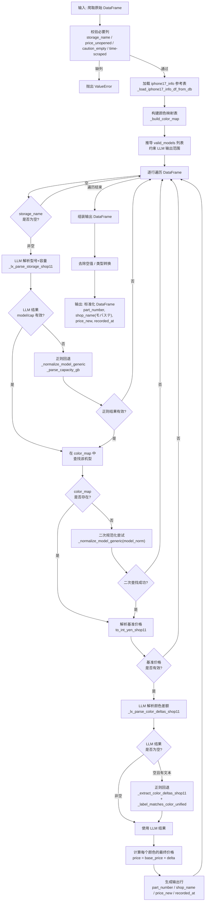

---

## 二、函数流程图

### 2.1 函数调用关系总览

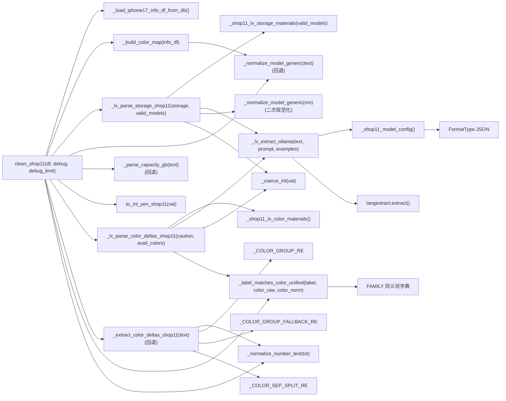

### 2.2 核心函数详细说明

#### `clean_shop11(df: pd.DataFrame, debug: bool = True, debug_limit: int = 30) -> pd.DataFrame`
- **作用**: 清洗器主入口，将原始爬取数据转化为标准四列输出
- **输入**: 包含 `storage_name`, `price_unopened`, `caution_empty`, `time-scraped` 列的 DataFrame
- **输出**: 包含 `part_number`, `shop_name`, `price_new`, `recorded_at` 列的 DataFrame
- **debug 模式**: 根据 `caution_empty` 中的颜色关键词匹配，选取最多 `debug_limit` 行打印详细调试信息

#### `_lx_parse_storage_shop11(storage: str, valid_models: Tuple[str, ...]) -> Tuple[str, Optional[int], trace]`
- **作用**: LLM 解析型号名与容量（第一次 LLM 调用）
- **缓存**: `@lru_cache(maxsize=4096)`
- **输入文本格式**: `"STORAGE: {storage}"`
- **extraction_classes**: `device_model`（属性: `model_norm`）、`storage_capacity`（属性: `capacity_gb`）
- **流程**:

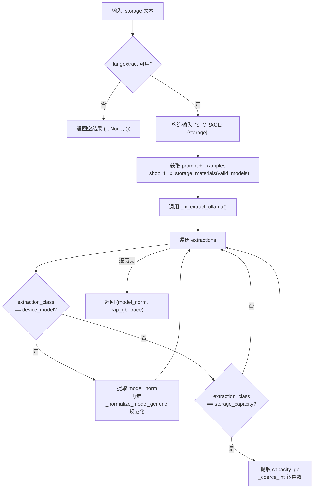

#### `_lx_parse_color_deltas_shop11(caution: str, available_colors: Tuple[str, ...]) -> Tuple[deltas_items, trace]`
- **作用**: LLM 解析颜色差额（第二次 LLM 调用）
- **缓存**: `@lru_cache(maxsize=4096)`
- **输入文本格式**: `"CAUTION: {caution}\nAVAILABLE_COLORS: {c1 | c2 | ...}"`
- **extraction_class**: `color_delta`（属性: `delta_yen`）
- **流程**:

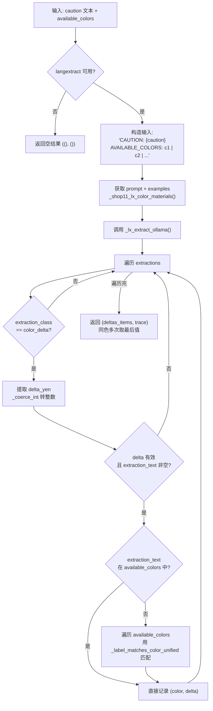

#### `_lx_extract_ollama(text: str, prompt: str, examples: list)`
- **作用**: LangExtract 调用封装，兼容新旧两种 API
- **策略**:

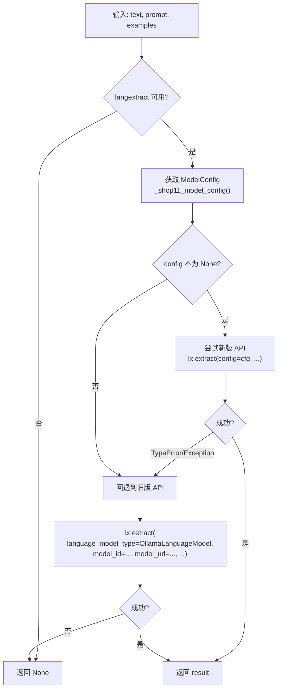

#### `_shop11_model_config()`
- **作用**: 构建 LangExtract `ModelConfig` 对象
- **缓存**: `@lru_cache(maxsize=1)`
- **配置**: `model_id`, `model_url`, `temperature`, `timeout`, `max_tokens`, `FormatType.JSON`

#### `_shop11_lx_storage_materials(valid_models: Tuple[str, ...]) -> (prompt, examples)`
- **作用**: 构建 storage 解析的 LLM prompt 和 3 个 few-shot 示例
- **缓存**: `@lru_cache(maxsize=8)`
- **prompt 特征**: 要求 `model_norm` 必须严格等于 `valid_models` 列表中的值
- **示例**:
  1. `"iPhone17 Pro Max 256GB"` -> device_model + storage_capacity
  2. `"17pro 1TB"` -> 1TB 换算为 1024GB
  3. `"iPhone17 プロ 512GB"` -> 日文别名处理

#### `_shop11_lx_color_materials() -> (prompt, examples)`
- **作用**: 构建颜色差额解析的 LLM prompt 和 3 个 few-shot 示例
- **缓存**: `@lru_cache(maxsize=1)`
- **prompt 特征**: 输入包含 `AVAILABLE_COLORS` 行；支持 `全色`/`すべて`/`全カラー` 全色规则；同色多次取最后值
- **示例**:
  1. `"ブルー、ブラック：-2,000円(未開封)"` -> 两色各 -2000
  2. `"全色:+1,000円"` -> 所有颜色 +1000
  3. `"シルバー・ブルー：-１０００円"` -> 全角数字处理

#### `_normalize_model_generic(text: str) -> str`
- **作用**: 将各种型号写法统一为标准格式
- **处理**: 日文别名转英文 (プロ->Pro, エア->Air) / 紧凑写法展开 (17pro->17 Pro) / 去噪 (容量/SIM信息)
- **输出**: 如 `"iPhone 17 Pro Max"`, `"iPhone Air"`, `"iPhone 16 Plus"`

#### `_parse_capacity_gb(text: str) -> Optional[int]`
- **作用**: 从文本中提取容量 (GB)
- **处理**: 支持 TB->GB 换算 (1TB=1024GB)，支持 `"256GB"`, `"1TB"` 等格式

#### `_extract_color_deltas_shop11(text: str) -> List[Tuple[str, int]]`
- **作用**: 正则版颜色差额提取（LLM 失败时的回退方案）
- **流程**:

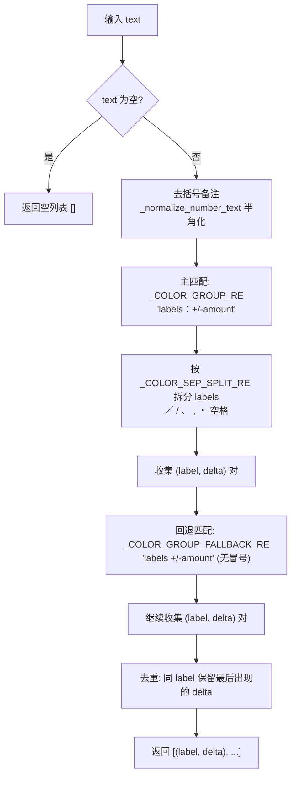

#### `_label_matches_color_unified(label_raw, color_raw, color_norm) -> bool`
- **作用**: 判断提取到的颜色标签是否匹配 info 表中的某个颜色
- **匹配策略** (四级宽松匹配):

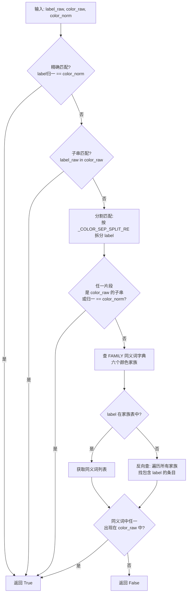

#### `_build_color_map(info_df) -> Dict`
- **作用**: 构建 `(model_norm, capacity_gb) -> {color_norm: (part_number, color_raw)}` 映射
- **数据源**: iphone17_info 参考表

#### `to_int_yen_shop11(v) -> Optional[int]`
- **作用**: 将各种形式的日元表示解析为 int
- **支持**: `"1,000"`, `"1,000円"`, `"¥1,000"`, `"１，０００"`, 全角数字、带括号备注等

#### `_normalize_number_text(txt: str) -> str`
- **作用**: 全角数字/标点转半角
- **映射**: `０-９` -> `0-9` / `，` -> `,` / `：` -> `:` / `－` -> `-` / `＋` -> `+` / `¥￥` -> 删除

#### `_coerce_int(v) -> Optional[int]`
- **作用**: 安全地将各种类型值转换为 int
- **支持**: `"1,000"`, `"-1000"`, float, int

---

## 三、数据流程图

### 3.1 整体数据流

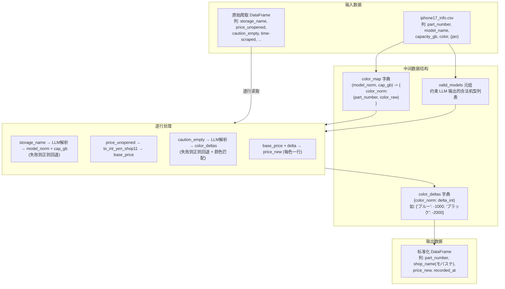

### 3.2 单行数据处理示例

以一行实际数据为例，展示完整的数据转换过程:

```
输入行:
  storage_name   = "iPhone17 Pro Max 256GB"
  price_unopened = "206,000"
  caution_empty  = "シルバー・ブルー：-1,000円(未開封)"
  time-scraped   = "2025-06-01 12:00:00"
```

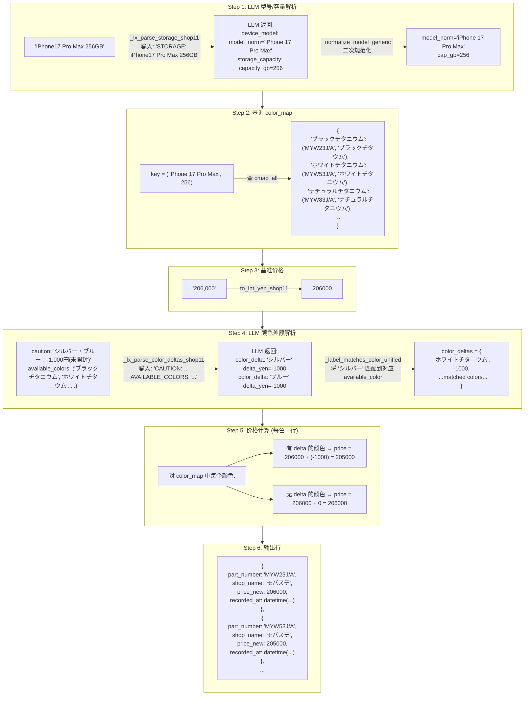

### 3.3 型号/容量解析 - LLM vs 正则策略

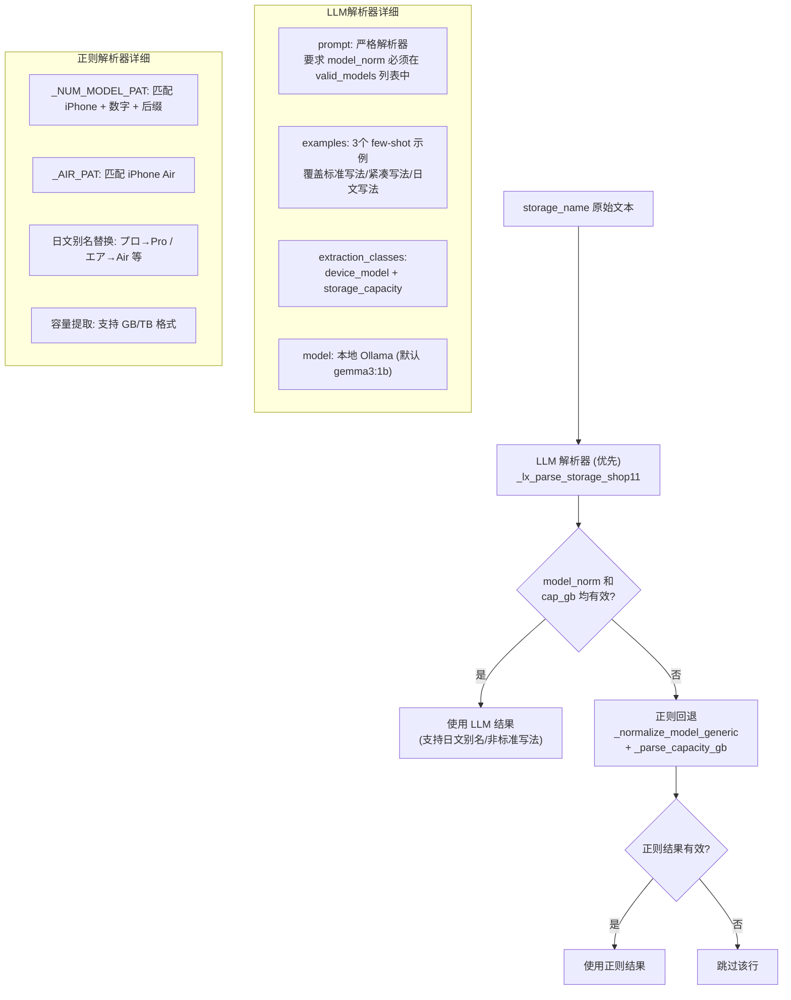

### 3.4 颜色差额解析 - LLM vs 正则策略

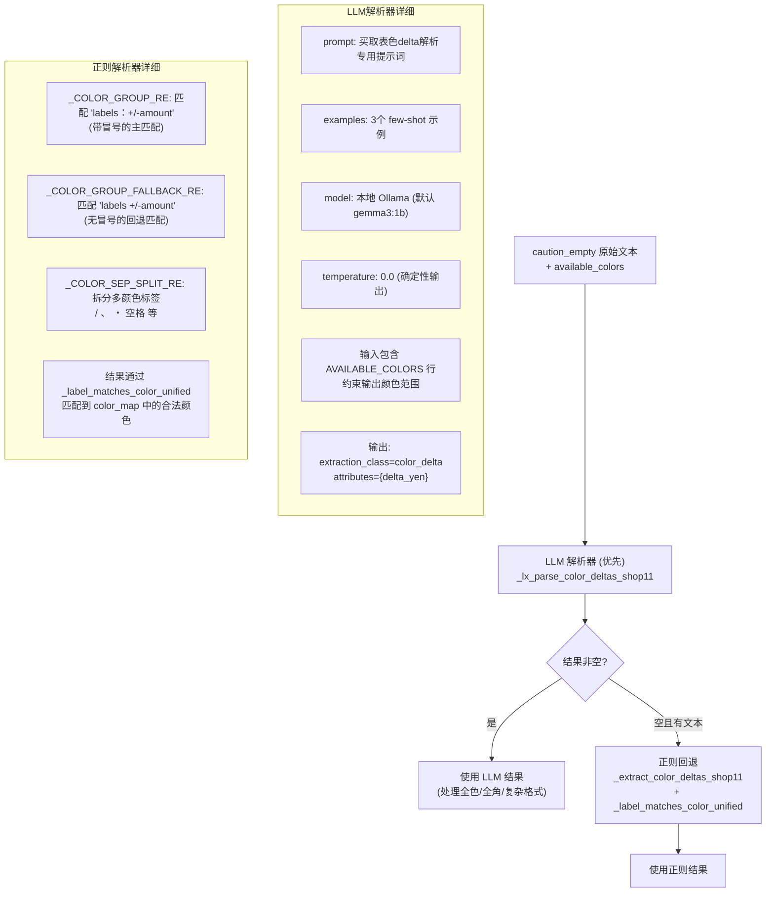

### 3.5 颜色家族匹配机制

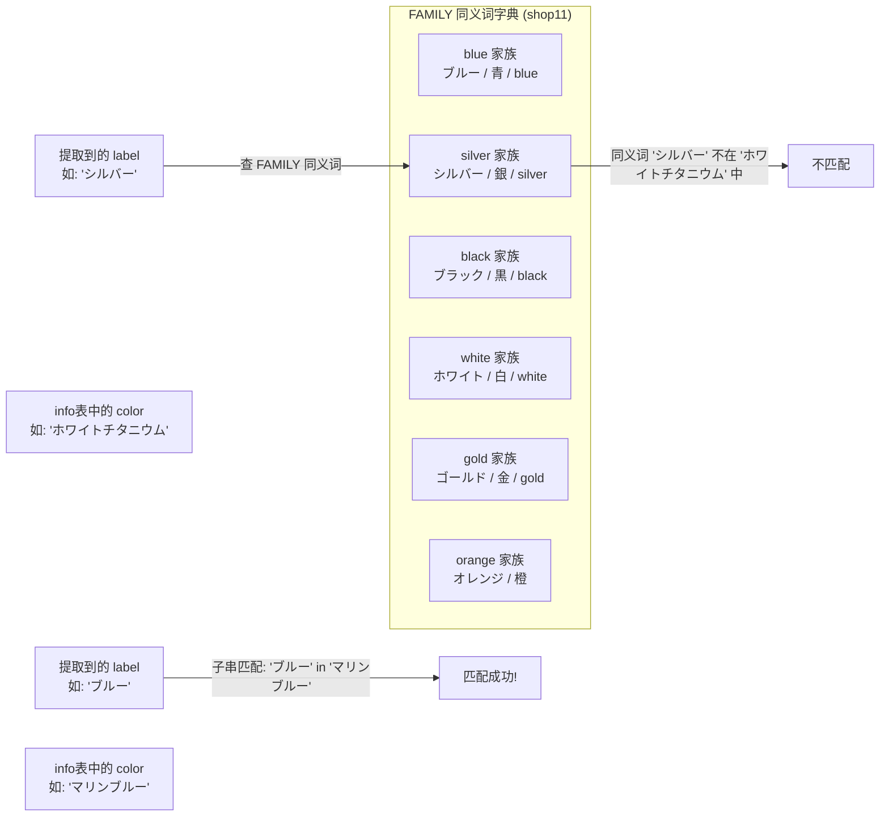

---

## 四、配置项说明

OLLAMA 与 EXTRACTION_MODE 配置已统一迁移至 `cleaner_tools.py`。shop11 专用 LLM 参数保留。

| 环境变量 | 默认值 | 说明 |
|---------|--------|------|
| `EXTRACTION_MODE` | `"regex"` | regex / llm / auto（cleaner_tools） |
| `OLLAMA_URL` / `OLLAMA_HOST` | `"http://localhost:11434"` | Ollama 服务地址（cleaner_tools） |
| `OLLAMA_MODEL_ID` | `"gemma3:1b"` | Ollama 模型 ID（cleaner_tools） |
| `SHOP11_OLLAMA_TEMPERATURE` | `"0.0"` | LLM 推理温度 |
| `SHOP11_OLLAMA_TIMEOUT` | `"180"` | LLM 请求超时时间 (秒) |
| `SHOP11_OLLAMA_MAX_TOKENS` | `"512"` | LLM 最大输出 token 数 |
| `IPHONE17_INFO_CSV` | 自动推断路径 (`data/iphone17_info.csv`) | iphone17_info 文件路径 |

**ModelConfig 参数汇总** (`_shop11_model_config`):

| 参数 | 值来源 | 说明 |
|------|--------|------|
| `model_id` | `SHOP11_OLLAMA_MODEL_ID` | 模型标识 |
| `model_url` | `SHOP11_OLLAMA_URL` | 服务端点 |
| `temperature` | `SHOP11_OLLAMA_TEMPERATURE` | 推理温度 |
| `timeout` | `SHOP11_OLLAMA_TIMEOUT` | 超时 (秒) |
| `max_tokens` | `SHOP11_OLLAMA_MAX_TOKENS` | 最大输出 token |
| `format_type` | `FormatType.JSON` | 强制 JSON 输出格式，减少解析失败 |

---

## 五、关键正则表达式

| 名称 | 模式 | 用途 | 示例匹配 |
|------|------|------|---------|
| `_NUM_MODEL_PAT` | `(iPhone)\s*(\d{2})(?:\s*(Pro\s*Max\|Pro\|Plus\|mini))?` | 匹配数字代号机型 | `iPhone 17 Pro Max`, `iPhone17Pro` |
| `_AIR_PAT` | `(iPhone)\s*(Air)(?:\s*(Pro\s*Max\|Pro\|Plus\|mini))?` | 匹配 iPhone Air | `iPhone Air` |
| `_COLOR_GROUP_RE` | `labels[：:]\s*sign?\s*amount` | 主颜色差额匹配 (带冒号) | `シルバー・ブルー：-1,000円` |
| `_COLOR_GROUP_FALLBACK_RE` | `labels\s*sign\s*amount` | 回退颜色差额匹配 (无冒号) | `ブルー -4000` |
| `_COLOR_SEP_SPLIT_RE` | `[／/、，,・\s]+` | 拆分多颜色标签 | `シルバー・ブルー` -> `['シルバー', 'ブルー']` |
| 容量 TB 匹配 | `(\d+(?:\.\d+)?)\s*TB` | 提取 TB 容量 (换算为 GB) | `1TB` -> `1024` |
| 容量 GB 匹配 | `(\d{2,4})\s*GB` | 提取 GB 容量 | `256GB` -> `256` |
| 数字后补空格 | `(\d{2})(?=[A-Za-z])` | 紧凑写法展开 | `17pro` -> `17 pro` |
| 日元金额提取 | `([+\-−－]?)\s*(?:¥\|￥)?\s*([\d][\d,]*)` | `to_int_yen_shop11` 金额解析 | `¥206,000`, `-1,000円` |
| 括号备注去除 | `\（.*?\）\|\(.*?\)` | 去除括号内注释 | `(未開封)` -> 删除 |
| SIM 信息去除 | `SIMフリ[ーｰ–-]?\|シムフリ[ーｰ–-]?\|sim\s*free` | 去除 SIM 噪声 | `SIMフリー` -> 删除 |
