# Shop12 清洗器详细流程说明

> 文件路径: `AppleStockChecker/utils/external_ingest/shop_cleaners_split/shop12_cleaner.py`
> 店铺名称: トゥインクル (Twinkle)

---

## 一、总流程图

整个 shop12 清洗器的核心入口是 `clean_shop12(df)` 函数，从原始爬取的 DataFrame 到输出标准化的买取价格 DataFrame。

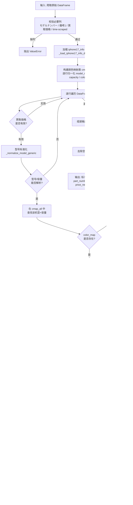

---

## 二、函数流程图

### 2.1 函数调用关系总览

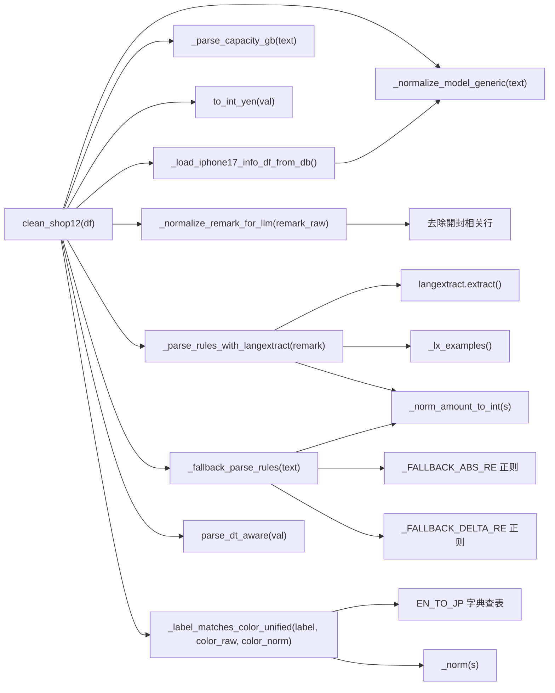

### 2.2 核心函数详细说明

#### `clean_shop12(df: pd.DataFrame) -> pd.DataFrame`
- **作用**: 清洗器主入口，将原始爬取数据转化为标准四列输出
- **输入**: 包含 `モデルナンバー`, `備考1`, `買取価格`, `time-scraped` 列的 DataFrame
- **输出**: 包含 `part_number`, `shop_name`("トゥインクル"), `price_new`, `recorded_at` 列的 DataFrame
- **价格输出策略**: ALL差额优先 > 绝对价覆盖 > 普通差额

#### `_normalize_model_generic(text: str) -> str`
- **作用**: 将各种型号写法统一为标准格式
- **处理**: 日文别名转英文 (プロ→Pro, エア→Air) / 紧凑写法展开 (17pro→17 Pro) / 去噪 (容量/SIM信息)
- **输出**: 如 `"iPhone 17 Pro Max"`, `"iPhone Air"`, `"iPhone 16 Plus"`

#### `_parse_capacity_gb(text: str) -> Optional[int]`
- **作用**: 从文本中提取容量 (GB)
- **处理**: 支持 TB→GB 换算 (1TB=1024GB)，支持 `"256GB"`, `"1TB"` 等格式

#### `_normalize_remark_for_llm(remark_raw: str) -> str`
- **作用**: 对備考1原始文本进行预处理，去除開封相关内容，只保留新品价规则文本
- **流程**:

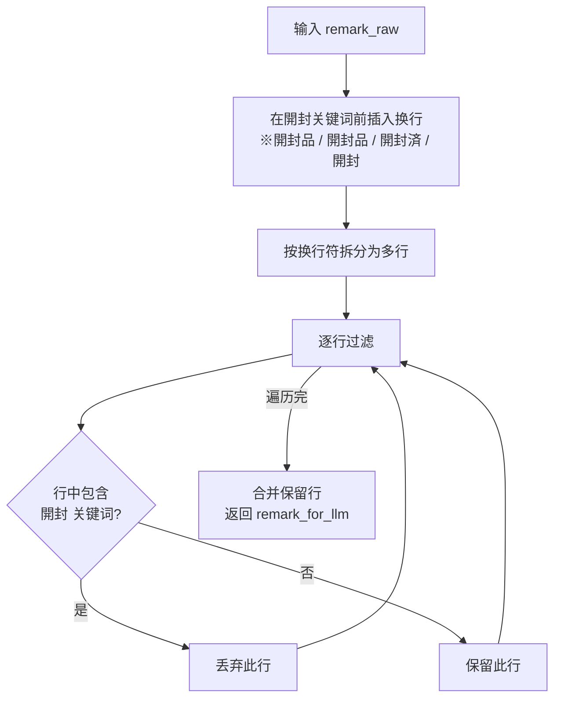

#### `_parse_rules_with_langextract(remark_for_llm: str) -> Tuple[abs_list, delta_list, llm_dbg]`
- **作用**: 使用 LangExtract + Ollama 从備考1文本中提取颜色价格规则，带 `@lru_cache(maxsize=8192)` 缓存
- **返回**:
  - `abs_list`: `[(label_raw, absolute_price_yen), ...]` 绝对价列表
  - `delta_list`: `[(label_raw, delta_yen), ...]` 差额列表
  - `llm_dbg`: `[(effective_class, extraction_text, attrs), ...]` 调试信息
- **两种提取类型**:
  - `"delta"`: 颜色±金额，如 `orange-1000円`
  - `"abs_price"`: 颜色绝对价，如 `Silver ¥230,500`
- **流程**:

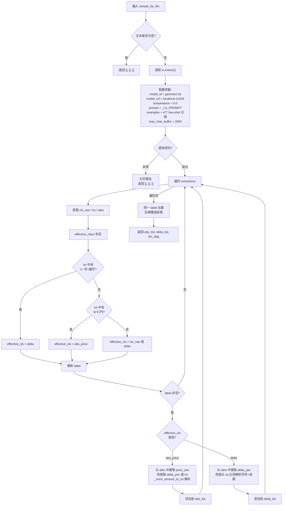

#### `_fallback_parse_rules(text: str) -> Tuple[abs_list, delta_list]`
- **作用**: LLM 提取为空时的正则回退解析器
- **流程**:

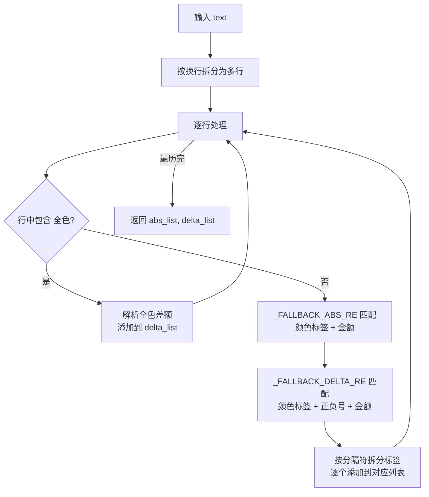

#### `_label_matches_color_unified(label_raw, color_raw, color_norm) -> bool`
- **作用**: 判断提取到的颜色标签是否匹配 info 表中的某个颜色
- **匹配策略** (多级宽松匹配):

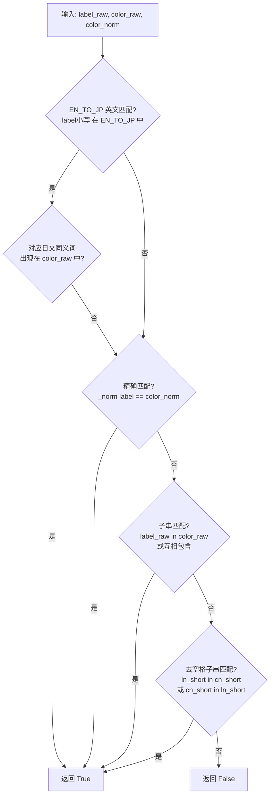

#### `_normalize_remark_for_llm(remark_raw: str) -> str`
- **作用**: 去除備考1中与"開封"相关的行，只保留新品价规则文本供 LLM 处理
- **处理**: 在開封关键词前强行插入换行 → 按行过滤掉包含開封的行 → 合并剩余行

#### `_norm_amount_to_int(s: str) -> Optional[int]`
- **作用**: 将包含全角数字、货币符号的金额字符串统一转为整数
- **处理**: 全角→半角 / 去除 ¥/￥ 符号 / 去除逗号 / 提取数字

#### `_load_iphone17_info_df_from_db() -> pd.DataFrame`
- **作用**: 加载 iphone17_info 参考表 (CSV 或 Excel)
- **数据源**: Django settings 路径 > 环境变量 `IPHONE17_INFO_CSV` > 默认推断路径

---

## 三、数据流程图

### 3.1 整体数据流

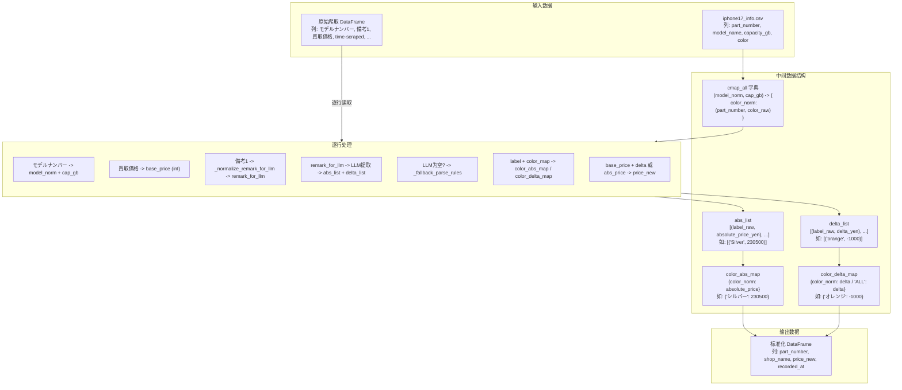

### 3.2 单行数据处理示例

以一行实际数据为例，展示完整的数据转换过程:

```
输入行:
  モデルナンバー = "iPhone17 Pro Max 256GB SIMフリー"
  備考1          = "orange-1000円※開封品は-5000円"
  買取価格       = "180,000"
  time-scraped   = "2025-06-01 12:00:00"
```

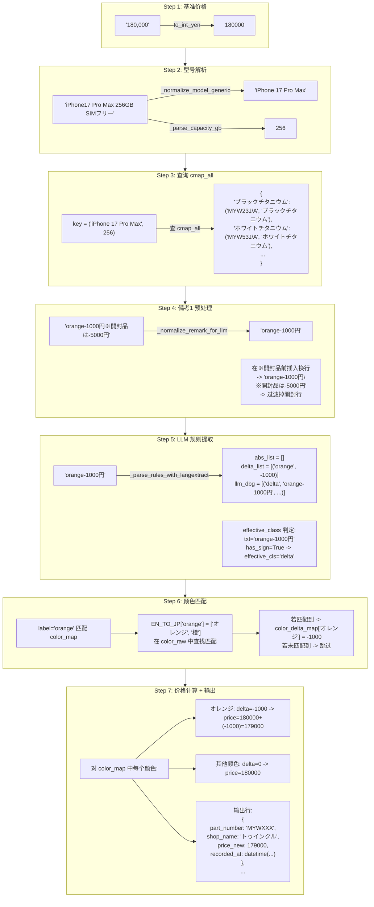

### 3.3 LLM 提取 + 正则回退策略

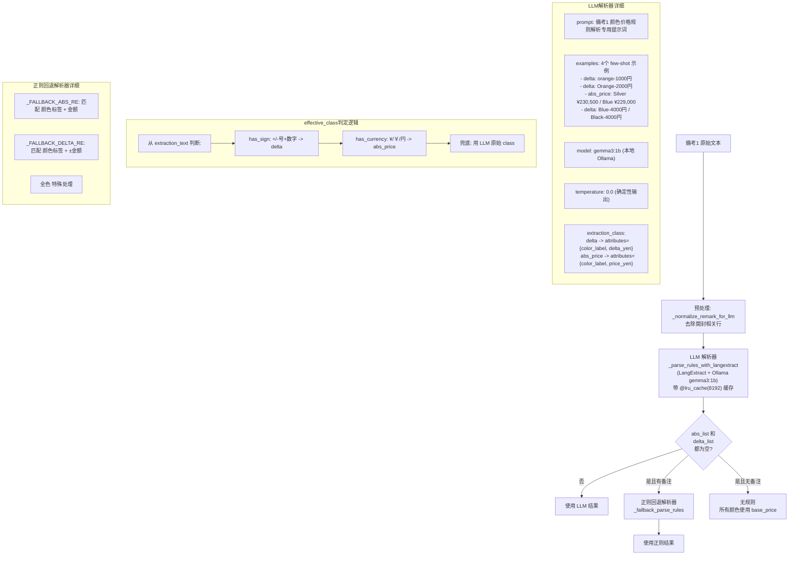

### 3.4 价格输出优先级策略

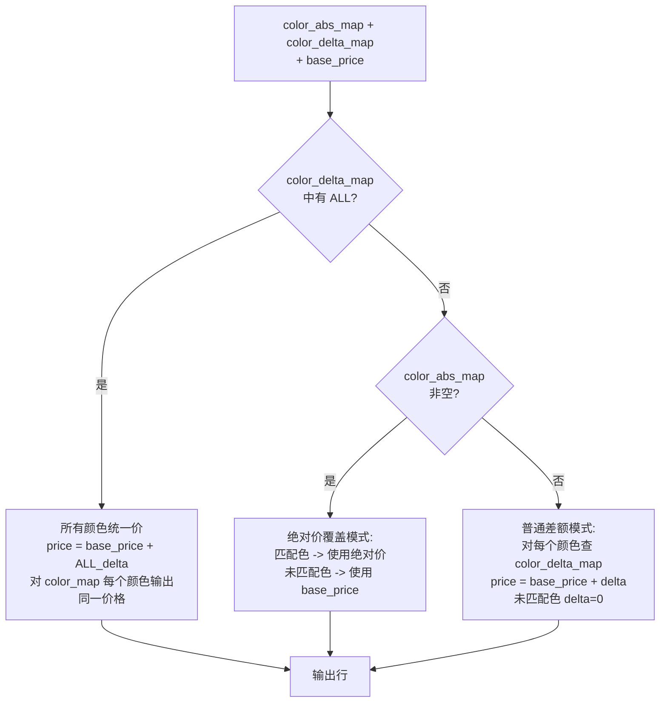

### 3.5 颜色标签匹配机制 (EN_TO_JP + 多级匹配)

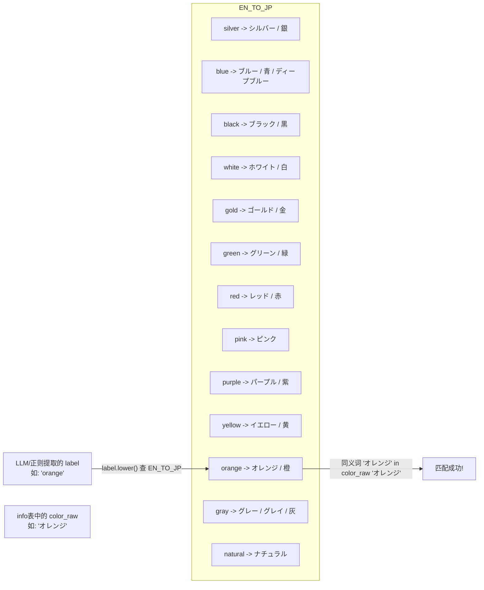

---

## 四、配置项说明

OLLAMA 与 EXTRACTION_MODE 配置已统一迁移至 `cleaner_tools.py`。

| 环境变量 | 默认值 | 说明 |
|---------|--------|------|
| `EXTRACTION_MODE` | `"regex"` | regex / llm / auto（cleaner_tools） |
| `OLLAMA_MODEL_ID` | `"gemma3:1b"` | Ollama 模型 ID（cleaner_tools） |
| `OLLAMA_URL` / `OLLAMA_HOST` | `"http://localhost:11434"` | Ollama 服务地址（cleaner_tools） |
| `SHOP12_DEBUG` | `"1"` (启用) | 是否启用 debug 打印 |
| `SHOP12_LLM_TEMPERATURE` | `"0.0"` | LLM 推理温度 (确定性输出) |
| `SHOP12_LLM_TIMEOUT` | `"120"` | LLM 请求超时秒数 |
| `SHOP12_LLM_NUM_CTX` | `"4096"` | LLM 上下文窗口大小 |
| `IPHONE17_INFO_CSV` | 自动推断路径 | iphone17_info 参考文件路径 |
| `EXTERNAL_IPHONE17_INFO_PATH` | (Django settings) | Django 环境下的参考文件路径 |

---

## 五、关键正则表达式

| 名称 | 模式 | 用途 | 示例匹配 |
|------|------|------|---------|
| `_FALLBACK_ABS_RE` | `(?P<labels>[^\d¥￥円:：/、，,;；※]+?)\s*(?:[:：]?\s*)?(?:¥\|￥)?\s*(?P<amount>[０-９0-9][０-９0-9,，]*)\s*(?:円)?` | 回退: 匹配颜色标签+绝对金额 | `Silver ¥230,500`, `シルバー230500円` |
| `_FALLBACK_DELTA_RE` | `(?P<labels>[^+\-−－\d¥￥円/、，,;；※]+?)\s*(?P<sign>[+\-−－])\s*(?P<amount>[０-９0-9][０-９0-9,，]*)\s*(?:円)?` | 回退: 匹配颜色标签±差额 | `orange-1000円`, `Blue+2000円` |
| `_SPLIT_SEPS` | `[／/、，,・\s]+` | 分隔多个颜色标签 | `Silver／Blue`, `シルバー、ブルー` |
| `_NUM_MODEL_PAT` | `(iPhone)\s*(\d{2})(?:\s*(Pro\s*Max\|Pro\|Plus\|mini))?` | 匹配数字代号机型 | `iPhone 17 Pro Max`, `iPhone16Plus` |
| `_AIR_PAT` | `(iPhone)\s*(Air)(?:\s*(Pro\s*Max\|Pro\|Plus\|mini))?` | 匹配 iPhone Air | `iPhone Air` |
| 開封分割正则 | `(※\s*開封品\|※\s*開封\|開封品\|開封済\|開封)` | 在開封关键词前插入换行 | `※開封品は-5000円` |
| effective_class: has_sign | `[+\-−－]\s*[０-９0-9]` | 判断文本中是否有正负号+数字 → delta | `orange-1000円` |
| effective_class: has_currency | `[¥￥円]` | 判断文本中是否有日元符号 → abs_price | `Silver ¥230,500` |
| 全色解析 | `全色\s*[：:\-]?\s*([+\-−－])?\s*([０-９0-9][０-９0-9,，]*)?` | 回退: 解析全色差额 | `全色-2000円`, `全色：+1000` |
