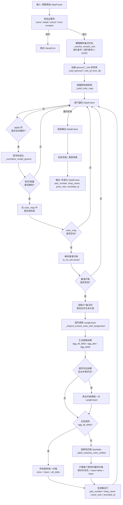
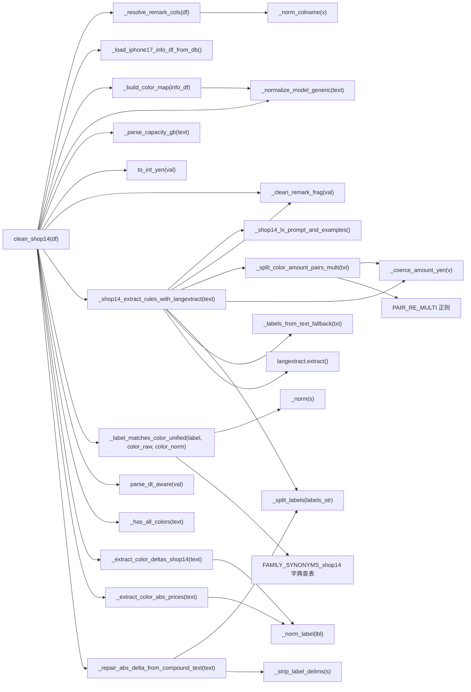
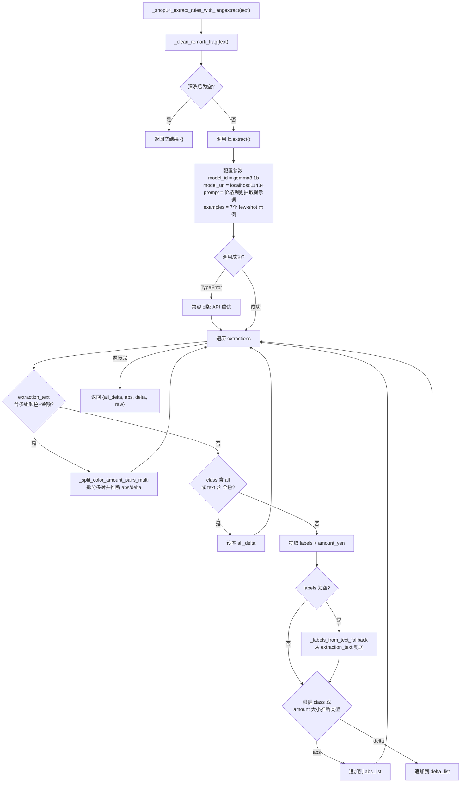
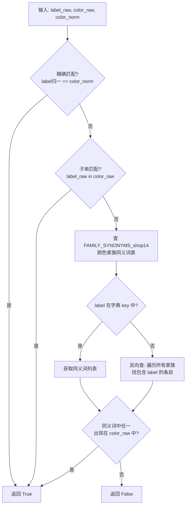
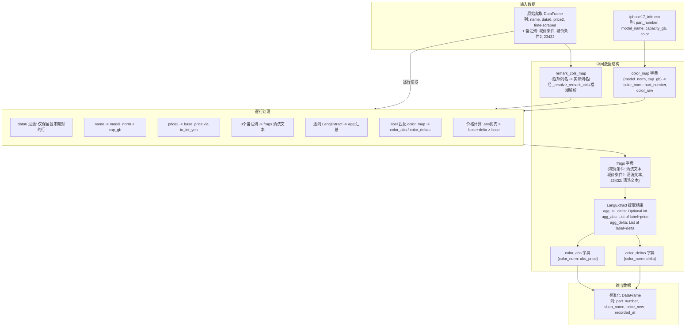
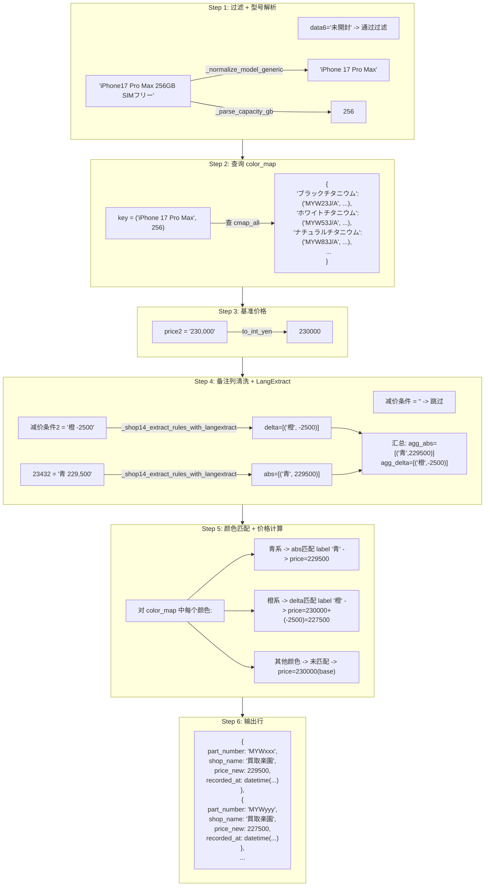
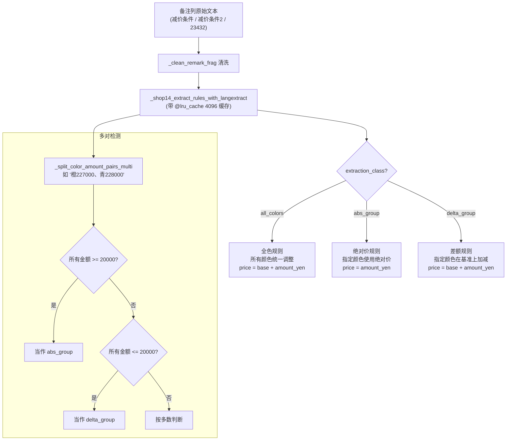
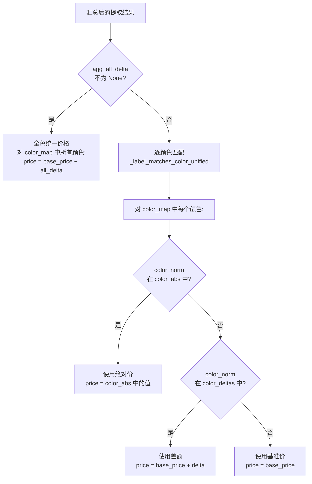
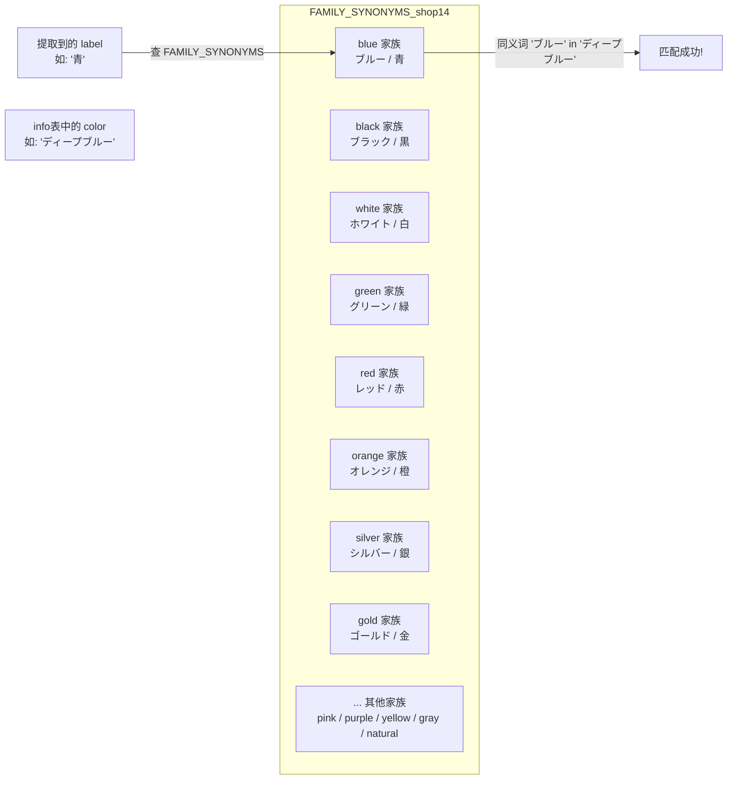

# Shop14 清洗器详细流程说明

> 文件路径: `AppleStockChecker/utils/external_ingest/shop_cleaners_split/shop14_cleaner.py`
> 店铺名称: 買取楽園

---

## 一、总流程图

整个 shop14 清洗器的核心入口是 `clean_shop14(df)` 函数，从原始爬取的 DataFrame 到输出标准化的买取价格 DataFrame。



---

## 二、函数流程图

### 2.1 函数调用关系总览



### 2.2 核心函数详细说明

#### `clean_shop14(df: pd.DataFrame) -> pd.DataFrame`
- **作用**: 清洗器主入口，将原始爬取数据转化为标准四列输出
- **输入**: 包含 `name`, `data6`, `price2`, `time-scraped` 列的 DataFrame，以及可选的备注列 (`减价条件`, `减价条件2`, `23432`)
- **输出**: 包含 `part_number`, `shop_name`("買取楽園"), `price_new`, `recorded_at` 列的 DataFrame
- **关键逻辑**: 逐行遍历，先过滤 `data6` 含"未開封"的行，再对每个备注列分别调用 LangExtract 提取规则，最后按"全色优先 > 绝对价优先 > base+delta > base"策略计算价格

#### `_resolve_remark_cols(df: pd.DataFrame) -> Dict[str, Optional[str]]`
- **作用**: 模糊匹配备注列名，兼容 BOM 前缀、全角空格等列名差异
- **策略**: 先精确匹配（去 BOM/空格归一化后），再包含匹配（fuzzy）
- **返回**: `{"减价条件": 实际列名或None, "减价条件2": ..., "23432": ...}`

#### `_normalize_model_generic(text: str) -> str`
- **作用**: 将各种型号写法统一为标准格式
- **处理**: 日文别名转英文 (プロ->Pro) / 紧凑写法展开 (17pro->17 Pro) / 去噪 (容量/SIM信息)
- **输出**: 如 `"iPhone 17 Pro Max"`, `"iPhone Air"`, `"iPhone 16 Plus"`

#### `_parse_capacity_gb(text: str) -> Optional[int]`
- **作用**: 从文本中提取容量 (GB)
- **处理**: 支持 TB->GB 换算 (1TB=1024GB)，支持 `"256GB"`, `"1TB"` 等格式

#### `_shop14_extract_rules_with_langextract(text: str) -> Dict`
- **作用**: 使用 LangExtract(Ollama) 从文本中抽取价格规则，带 `@lru_cache(maxsize=4096)` 缓存
- **返回结构**:
  ```python
  {
      "all_delta": Optional[int],      # 全色统一调整额
      "abs":   List[(label, price)],    # 绝对价规则
      "delta": List[(label, delta)],    # 差额规则
      "raw":   List[dict],              # 原始 extraction 列表
  }
  ```
- **三类 extraction_class**: `all_colors`, `abs_group`, `delta_group`
- **流程**:



#### `_shop14_lx_prompt_and_examples() -> Tuple[str, List]`
- **作用**: 返回 LangExtract 的 prompt 和 7 个 few-shot 示例（带 `@lru_cache(maxsize=1)` 只初始化一次）
- **7 个 few-shot 示例**:
  1. `"青 229,500"` -> abs_group
  2. `"橙 -2500"` -> delta_group
  3. `"全色 -3,000円"` -> all_colors
  4. `"青/銀 229,500"` -> abs_group (多标签)
  5. `"橙/銀 -2,500円"` -> delta_group (多标签)
  6. `"青 229,500\n橙 -2500"` -> abs_group + delta_group (混合)
  7. `"全色"` -> all_colors (无金额, amount_yen=0)

#### `_split_color_amount_pairs_multi(txt: str) -> List[Tuple[str, int]]`
- **作用**: 处理复合文本如 `"橙227000、青228000"`，拆分为多个 (label, amount) 对
- **返回条件**: 仅当检测到 >=2 个"颜色+金额"对时返回非空列表
- **示例**:
  - `"橙227000、青228000"` -> `[("橙", 227000), ("青", 228000)]`
  - `"青229500/銀228000"` -> `[("青", 229500), ("銀", 228000)]`

#### `_repair_abs_delta_from_compound_text(text: str) -> Tuple[List, List]`
- **作用**: 从复合文本串中恢复绝对价和差额列表
- **判断逻辑**: 有显式正负号 -> delta_list；无符号 -> abs_list
- **返回**: `(abs_list, delta_list)`

#### `_extract_color_deltas_shop14(text: str) -> List[Tuple[str, int]]`
- **作用**: 从备注文本中提取 (label_raw, delta_int) 差额对
- **分隔策略**: 使用安全切分 `_SPLIT_TOKENS_SAFE_RE`，避免拆千位分隔符 (如 `2,000`)

#### `_extract_color_abs_prices(text: str) -> List[Tuple[str, int]]`
- **作用**: 从文本中抽取绝对价格 (label_raw, abs_price)
- **特殊处理**: 跳过含 +/- 符号的片段（留给差额解析器处理）；支持多标签共用一个金额（如 `"青/銀327000"`）

#### `_has_all_colors(text: str) -> Optional[int]`
- **作用**: 检测文本是否包含"全色"关键词
- **返回**: 含金额返回 delta 整数，仅含"全色"返回 0，未出现返回 None

#### `_label_matches_color_unified(label_raw, color_raw, color_norm) -> bool`
- **作用**: 判断提取到的颜色标签是否匹配 info 表中的某个颜色
- **匹配策略** (三级宽松匹配):



#### `_build_color_map(info_df) -> Dict`
- **作用**: 构建 `(model_norm, capacity_gb) -> {color_norm: (part_number, color_raw)}` 映射
- **数据源**: iphone17_info 参考表

#### `_clean_remark_frag(x) -> str`
- **作用**: 清洗单个备注字段：去 BOM/全角空格/NBSP，合并多余空白，过滤 nan

#### `_norm_colname(x) -> str`
- **作用**: 归一化列名：去 BOM 前缀、全角空格转半角、去两端空白

#### `_coerce_amount_yen(v) -> Optional[int]`
- **作用**: 将 LLM attributes 或文本中的金额字符串转为整数（支持符号、逗号、円、¥ 等格式）

#### `_split_labels(labels: str) -> List[str]`
- **作用**: 将 `"青/銀"` / `"青、銀"` / `"青 銀"` 等拆为列表 `["青", "銀"]`

#### `_labels_from_text_fallback(extraction_text: str) -> str`
- **作用**: 当 LLM 未返回 labels 属性时，从 extraction_text 中去掉金额部分和"全色"，剩余部分当作颜色标签

---

## 三、数据流程图

### 3.1 整体数据流



### 3.2 单行数据处理示例

以一行实际数据为例，展示完整的数据转换过程:

```
输入行:
  name         = "iPhone17 Pro Max 256GB SIMフリー"
  data6        = "未開封"
  price2       = "230,000"
  time-scraped = "2025-06-01 12:00:00"
  减价条件      = ""
  减价条件2     = "橙 -2500"
  23432        = "青 229,500"
```



### 3.3 LangExtract 三类提取策略



### 3.4 价格计算优先级策略



### 3.5 颜色家族匹配机制



---

## 四、配置项说明

OLLAMA 与 EXTRACTION_MODE 配置已统一迁移至 `cleaner_tools.py`。

| 配置项/环境变量 | 默认值 | 说明 |
|---------|--------|------|
| `EXTRACTION_MODE` | `"regex"` | regex / llm / auto（cleaner_tools） |
| `OLLAMA_URL` | `"http://localhost:11434"` | Ollama 服务地址（cleaner_tools） |
| `OLLAMA_MODEL_ID` | `"gemma3:1b"` | Ollama 模型 ID（cleaner_tools） |
| `SHOP14_DEBUG` | `"True"` (启用) | 是否启用 debug 打印输出 |
| `IPHONE17_INFO_CSV` | 自动推断路径 (从 `__file__` 往上两级的 `data/iphone17_info.csv`) | iphone17_info 参考文件路径 |
| `lru_cache(maxsize=4096)` | 4096 | `_shop14_extract_rules_with_langextract` 的缓存大小 |
| `lru_cache(maxsize=1)` | 1 | `_shop14_lx_prompt_and_examples` 的缓存大小（只初始化一次） |

---

## 五、关键正则表达式

| 名称 | 模式 | 用途 | 示例匹配 |
|------|------|------|---------|
| `_NUM_MODEL_PAT` | `(iPhone)\s*(\d{2})(?:\s*(Pro\s*Max\|Pro\|Plus\|mini))?` | 匹配数字代号机型 | `iPhone 17 Pro Max`, `iPhone16Plus` |
| `_AIR_PAT` | `(iPhone)\s*(Air)(?:\s*(Pro\s*Max\|Pro\|Plus\|mini))?` | 匹配 iPhone Air | `iPhone Air` |
| `COLOR_DELTA_RE_shop14` | `(?P<label>[^：:\-\s/、／]+)\s*(?P<sep>[：:\-])\s*(?P<sign>[+\-−－])?\s*(?P<amount>\d[\d,]*)\s*(円)?` | 匹配"颜色±金额"差额 | `ブルー：-2,000円`, `青-3000`, `銀+1000` |
| `_SPLIT_TOKENS_SAFE_RE` | `[／/、，]\|(?<!\d),(?!\d)\|(?:\s+\+\s+)\|(?:\s*;\s*)` | 安全拆分多条目（避免拆千位逗号） | `青-3000、橙+1000` |
| `_COLOR_ABS_PRICE_RE` | `(?P<label>...)(?:¥\|￥)?\s*(?P<amount>\d{1,3}(?:[,]\d{3})*\|\d+)\s*(?:円)?` | 匹配"颜色+绝对价格" | `青229,500`, `コズミックオレンジ227000` |
| `PAIR_RE_MULTI` | `([^\d¥円,，＋+－\-−\s]+)\s*([+\-−－]?\s*\d[\d,，]*)` | 从复合文本中拆多个颜色+金额对 | `橙227000、青228000` |
| `_PAIR_GROUP_RE_shop14` | `(?P<labels>[^\d¥￥円:+\-−－＋]+?)\s*(?P<sign>[+\-−－＋])?\s*(?P<amount>...)` | 从复合串中恢复 abs/delta 列表 | `青/銀229000、橙227000` |
| `SPLIT_TOKENS_RE` | `[／/、，,]\|(?:\s+\+\s+)\|(?:\s*;\s*)` | 基础分隔符拆分 | `青/銀+1000` |
