# Shop15 清洗器详细流程说明

> 文件路径: `AppleStockChecker/utils/external_ingest/shop_cleaners_split/shop15_cleaner.py`
> 店铺名称: 買取当番

---

## 一、总流程图

整个 shop15 清洗器的核心入口是 `clean_shop15(df, debug)` 函数，从原始爬取的 DataFrame 到输出标准化的买取价格 DataFrame。与 shop17 不同，shop15 的 `price` 列同时包含基准价格和颜色规格（差额或绝对价），需要通过 LLM 提取两类信息（`base_price` + `color_spec`）。

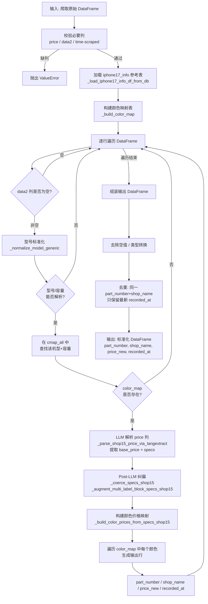

---

## 二、函数流程图

### 2.1 函数调用关系总览

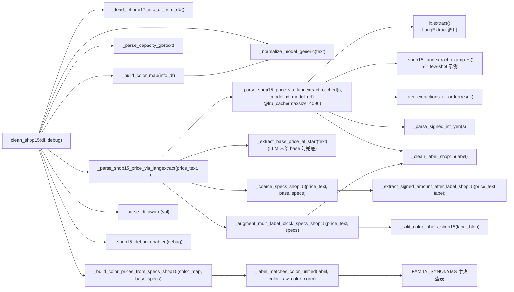

### 2.2 核心函数详细说明

#### `clean_shop15(df: pd.DataFrame, debug: bool = True) -> pd.DataFrame`
- **作用**: 清洗器主入口，将原始爬取数据转化为标准四列输出
- **输入**: 包含 `price`, `data2`, `time-scraped` 列的 DataFrame
- **输出**: 包含 `part_number`, `shop_name`("買取当番"), `price_new`, `recorded_at` 列的 DataFrame
- **去重策略**: 同一 `(part_number, shop_name)` 只保留最新 `recorded_at`

#### `_normalize_model_generic(text: str) -> str`
- **作用**: 将各种型号写法统一为标准格式
- **处理**: 日文别名转英文 (プロ→Pro) / 紧凑写法展开 (17pro→17 Pro) / 去噪 (容量/SIM信息)
- **输出**: 如 `"iPhone 17 Pro Max"`, `"iPhone Air"`, `"iPhone 16 Plus"`

#### `_parse_capacity_gb(text: str) -> Optional[int]`
- **作用**: 从文本中提取容量 (GB)
- **处理**: 支持 TB→GB 换算 (1TB=1024GB)，支持 `"256GB"`, `"1TB"` 等格式

#### `_parse_shop15_price_via_langextract(price_text, model_id, model_url, debug) -> Tuple[Optional[int], List[Tuple[str, str, int]]]`
- **作用**: 解析 price 列的调度函数，整合 LLM 结果 + 后处理纠偏
- **返回**: `(base_price, specs)` 其中 specs 为 `[(label, kind, yen_value), ...]`

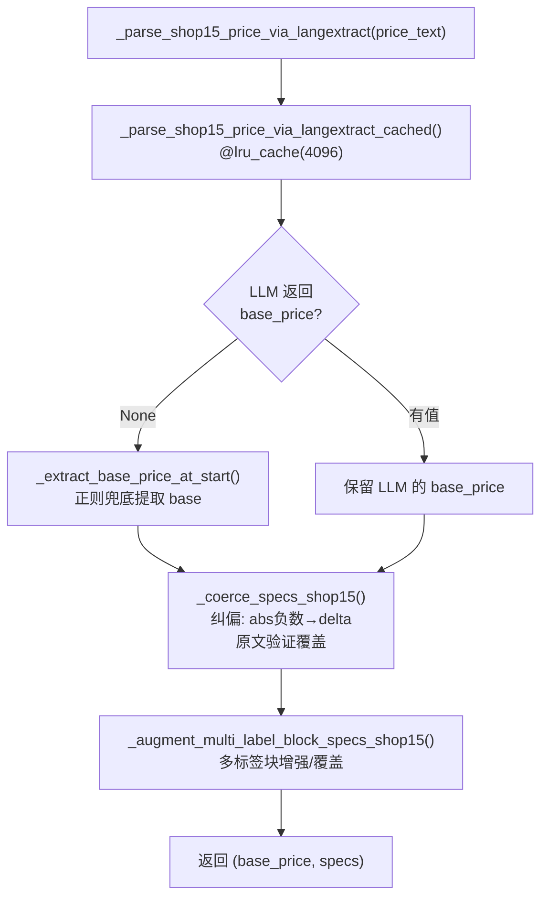

#### `_parse_shop15_price_via_langextract_cached(price_text, model_id, model_url) -> Tuple[Optional[int], List[Tuple[str, str, int]]]`
- **作用**: 带 LRU 缓存的 LangExtract 调用核心
- **缓存**: `@lru_cache(maxsize=4096)` 避免相同 price_text 重复调用 LLM
- **提取两类实体**:
  - `extraction_class="base_price"` → 基准价格
  - `extraction_class="color_spec"` → 颜色规格 (带 `kind` 属性: `"delta"` 或 `"abs"`)

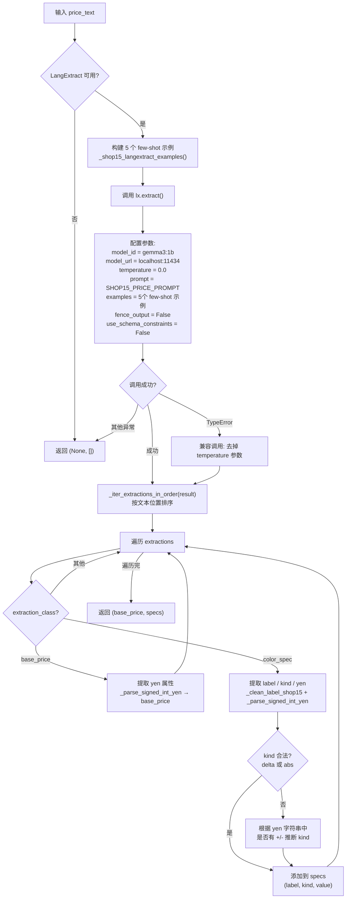

#### `_coerce_specs_shop15(price_text, base_price, specs, debug) -> List[Tuple[str, str, int]]`
- **作用**: 对 LLM 输出的 specs 做纠偏（针对小模型不稳定输出）
- **纠偏规则**:

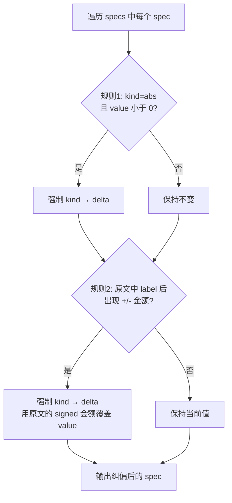

#### `_augment_multi_label_block_specs_shop15(price_text, specs, debug) -> List[Tuple[str, str, int]]`
- **作用**: 处理"多颜色共享一个差额"的表达模式
- **典型输入**: `"オレンジ、ブルー-1000円"`, `"シルバー、ブルー-3000円"`
- **流程**:

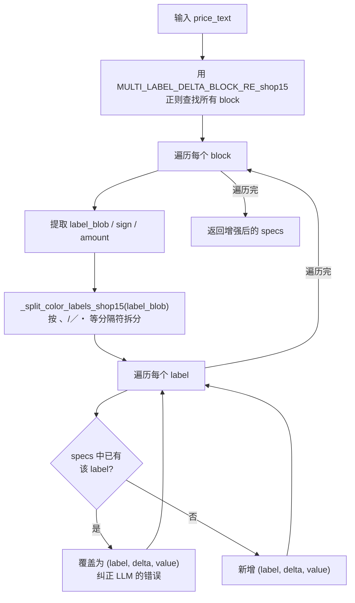

#### `_build_color_prices_from_specs_shop15(color_map, base_price, specs, debug) -> Tuple[Dict, List, List]`
- **作用**: 将 specs 映射到 info 表中的颜色，计算每个颜色的最终价格
- **价格计算逻辑**:

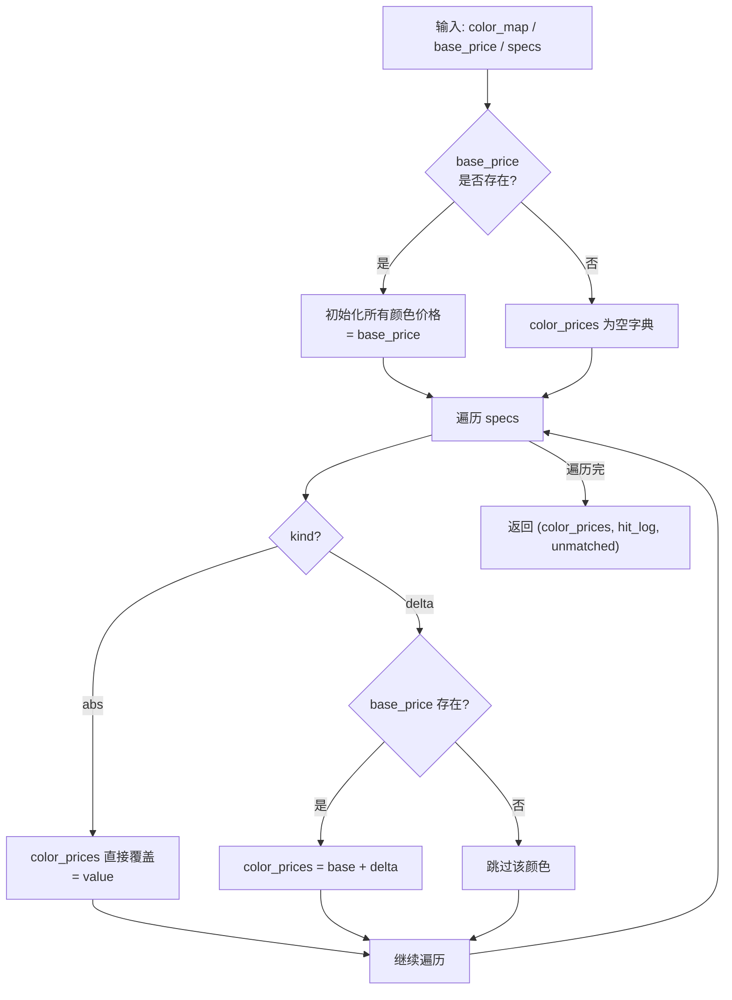

#### `_label_matches_color_unified(label_raw, color_raw, color_norm) -> bool`
- **作用**: 判断提取到的颜色标签是否匹配 info 表中的某个颜色
- **匹配策略** (三级宽松匹配):

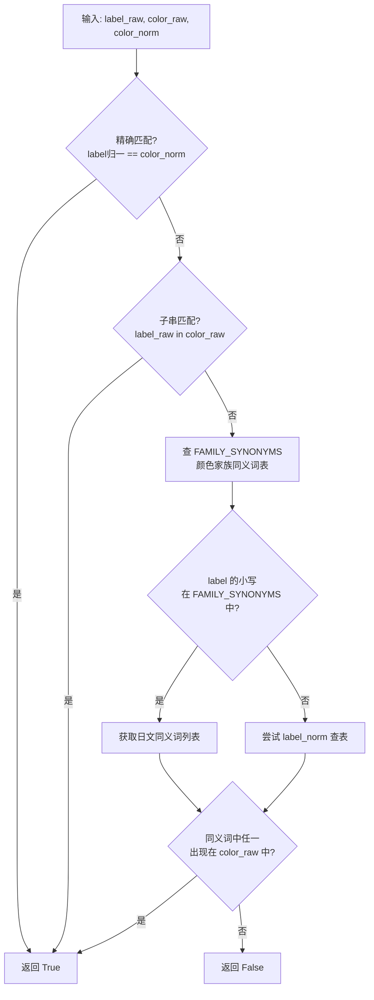

#### `_build_color_map(info_df) -> Dict[Tuple, Dict]`
- **作用**: 构建 `(model_norm, capacity_gb) -> {color_norm: (part_number, color_raw)}` 映射
- **数据源**: iphone17_info 参考表

#### `_clean_label_shop15(label: str) -> str`
- **作用**: 清理颜色标签文本
- **处理**: 全角空白→半角 / 多余空白合并 / 去掉粘着的分隔符 (`:：-/／、,，・` 等)

#### `_parse_signed_int_yen(s: object) -> Optional[int]`
- **作用**: 将各种格式的日元金额字符串解析为带符号整数
- **支持**: `'229,000'` / `'229,000円'` / `'-1000'` / `'-1,000円'` / `'+2000円'`
- **处理**: 全角符号→半角 (`＋→+`, `−→-`, `－→-`)

#### `_extract_base_price_at_start(text: object) -> Optional[int]`
- **作用**: 从文本开头提取基准价格 (正则兜底)
- **正则**: `_BASE_YEN_AT_START_RE` 只匹配开头位置，避免将颜色后的价格误识别为 base

#### `_iter_extractions_in_order(result) -> List`
- **作用**: 将 LangExtract 输出按文本位置排序
- **排序优先级**: `char_interval.start_pos` > `extraction_index` > 默认顺序

#### `_split_color_labels_shop15(label_blob: str) -> List[str]`
- **作用**: 将颜色标签串拆分为单个标签列表
- **分隔符**: `、` / `,` / `，` / `／` / `/` / `・` / `&` / `＆`

#### `_extract_signed_amount_after_label_shop15(price_text, label) -> Optional[int]`
- **作用**: 在原文中查找某颜色标签后紧跟的带符号金额
- **用途**: `_coerce_specs_shop15` 中用于从原文验证/覆盖 LLM 的输出

#### `_shop15_debug_enabled(debug: bool) -> bool`
- **作用**: 判断 debug 模式是否开启
- **来源**: 函数参数 `debug=True` 或环境变量 `SHOP15_DEBUG` 为 `1/true/yes/y/on`

---

## 三、数据流程图

### 3.1 整体数据流

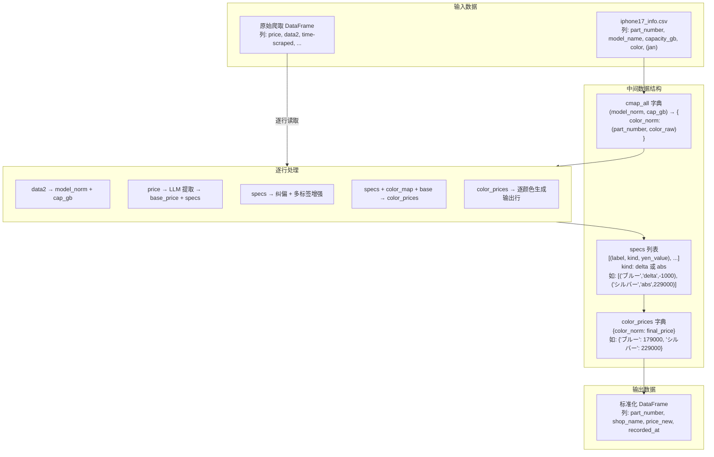

### 3.2 单行数据处理示例

以一行实际数据为例，展示完整的数据转换过程:

```
输入行:
  data2        = "iPhone17 Pro Max 256GB"
  price        = "207,000円　オレンジ、ブルー-1000円"
  time-scraped = "2025-06-01 12:00:00"
```

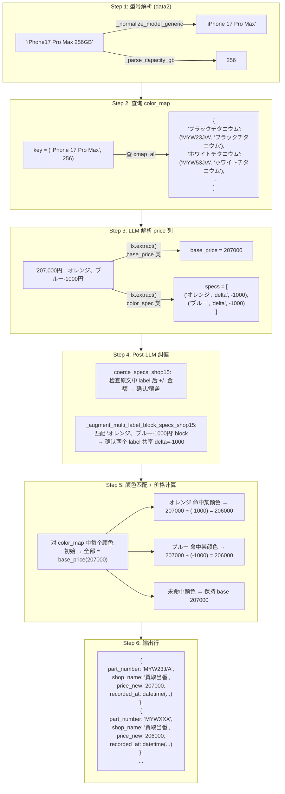

### 3.3 Price 列解析策略: LLM 提取 + 多层纠偏

shop15 的 `price` 列同时包含基准价和颜色规格信息，解析流程如下:

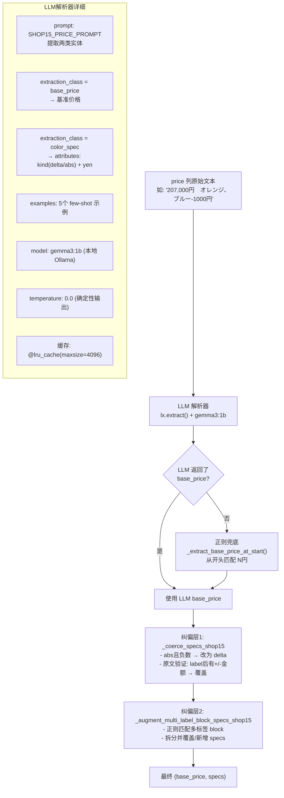

### 3.4 颜色家族匹配机制

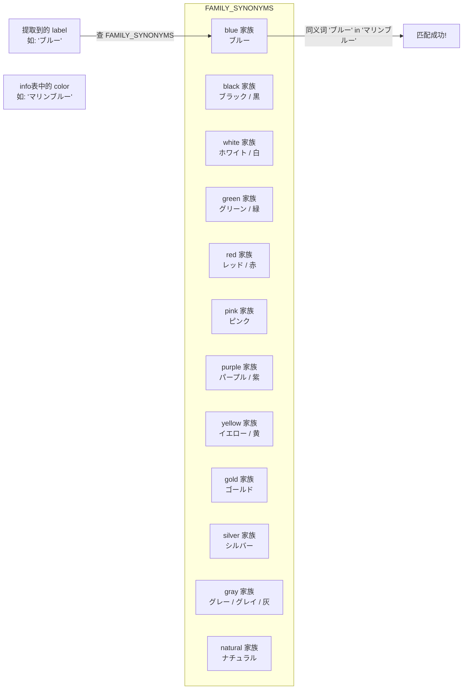

### 3.5 LLM 提取类对比: base_price vs color_spec

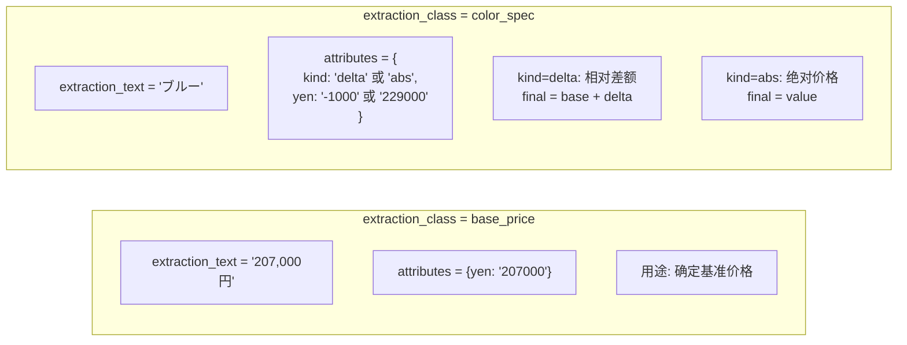

---

## 四、配置项说明

OLLAMA 与 EXTRACTION_MODE 配置已统一迁移至 `cleaner_tools.py`。

| 环境变量 | 默认值 | 说明 |
|---------|--------|------|
| `EXTRACTION_MODE` | `"regex"` | regex / llm / auto（cleaner_tools） |
| `OLLAMA_URL` | `"http://localhost:11434"` | Ollama 服务地址（cleaner_tools） |
| `OLLAMA_MODEL_ID` | `"gemma3:1b"` | Ollama 模型 ID（cleaner_tools） |
| `SHOP15_DEBUG` | `""` (关闭) | 是否启用 debug 输出 (`1/true/yes/y/on` 启用) |
| `IPHONE17_INFO_CSV` | 自动推断路径 | iphone17_info 参考文件路径 |

**LangExtract 调用参数**:

| 参数 | 值 | 说明 |
|------|-----|------|
| `model_id` | `gemma3:1b` | 本地 Ollama 小模型 |
| `model_url` | `http://localhost:11434` | Ollama 服务端口 |
| `temperature` | `0.0` | 确定性输出，减少随机性 |
| `fence_output` | `False` | 不使用 fence 输出格式 |
| `use_schema_constraints` | `False` | 不使用 schema 约束 |
| `@lru_cache maxsize` | `4096` | 缓存最多 4096 个不同的 price_text 调用结果 |

---

## 五、关键正则表达式

| 名称 | 模式 | 用途 | 示例匹配 |
|------|------|------|---------|
| `_BASE_YEN_AT_START_RE` | `^\s*(?:￥\|¥)?\s*(\d[\d,]*)\s*円?` | 从文本开头提取基准价格 (避免误抓颜色后的价格) | `207,000円`, `¥180,000` |
| `BASE_YEN_AT_START_RE_shop15` | `^\s*(?:￥\|¥)?\s*(\d[\d,]*)\s*円?` | 同上，shop15 专用别名 | `230,500円` |
| `FIRST_YEN_RE` | `(?:￥\|¥)?\s*(\d[\d,]*)\s*円?` | 抓取文本中第一个日元金额 (不限位置) | `207,000円` |
| `FIRST_YEN_RE_shop15` | `(\d[\d,]*)\s*円` | 抓取 price 中第一个 "N円" | `207,000円` |
| `COLOR_DELTA_IN_PRICE_RE_shop15` | `(?P<label>[^\d円¥]+?)\s*(?P<sep>[：:\-])?\s*(?P<sign>[+\-−－])?\s*(?P<amount>\d[\d,]*)\s*(?:円)?` | 匹配"颜色标签±金额"模式 | `ブルー-1000円`, `シルバー+2,000円` |
| `COLOR_ENTRY_RE_shop15` | 同 `COLOR_DELTA_IN_PRICE_RE_shop15` | 提取颜色条目 (区分 delta/abs) | `ブルー229,000円`, `シルバー-3,000円` |
| `MULTI_LABEL_DELTA_BLOCK_RE_shop15` | `(?P<label_blob>[^\d円¥]+?)\s*(?P<sign>[+\-−－])\s*(?P<amount>\d[\d,]*)\s*円?` | 匹配多颜色共享差额的 block | `オレンジ、ブルー-1000円` |
| `_LABEL_LIST_SPLIT_RE_shop15` | `\s*(?:、\|,\|，\|／\|/\|・\|&\|＆)\s*` | 拆分多颜色标签串 | `オレンジ、ブルー` → `['オレンジ','ブルー']` |
| `_NUM_MODEL_PAT` | `(iPhone)\s*(\d{2})(?:\s*(Pro\s*Max\|Pro\|Plus\|mini))?` | 匹配数字代号机型 | `iPhone 17 Pro Max` |
| `_AIR_PAT` | `(iPhone)\s*(Air)(?:\s*(Pro\s*Max\|Pro\|Plus\|mini))?` | 匹配 iPhone Air | `iPhone Air` |
