# Shop16 清洗器详细流程说明

> 文件路径: `AppleStockChecker/utils/external_ingest/shop_cleaners_split/shop16_cleaner.py`
> 店铺名称: 携帯空間

---

## 一、总流程图

整个 shop16 清洗器的核心入口是 `clean_shop16(df, debug)` 函数，从原始爬取的 DataFrame 到输出标准化的买取价格 DataFrame。

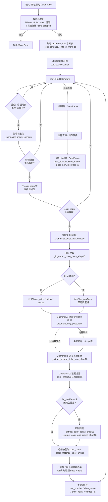

---

## 二、函数流程图

### 2.1 函数调用关系总览

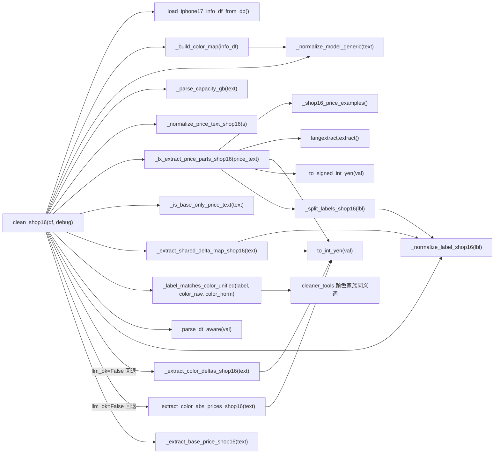

### 2.2 核心函数详细说明

#### `clean_shop16(df: pd.DataFrame, debug: bool = True) -> pd.DataFrame`
- **作用**: 清洗器主入口，将原始爬取数据转化为标准四列输出
- **输入**: 包含 `iPhone 17 Pro Max`, `説明1`, `買取価格`, `time-scraped` 列的 DataFrame
- **输出**: 包含 `part_number`, `shop_name`, `price_new`, `recorded_at` 列的 DataFrame
- **特殊逻辑**: 仅处理 `説明1` 或型号列中包含 `未開封` 的行

#### `_normalize_model_generic(text: str) -> str`
- **作用**: 将各种型号写法统一为标准格式
- **处理**: 日文别名转英文 (プロ→Pro) / 紧凑写法展开 (17pro→17 Pro) / 去噪 (容量/SIM信息)
- **输出**: 如 `"iPhone 17 Pro Max"`, `"iPhone Air"`, `"iPhone 16 Plus"`

#### `_parse_capacity_gb(text: str) -> Optional[int]`
- **作用**: 从文本中提取容量 (GB)
- **处理**: 支持 TB→GB 换算 (1TB=1024GB)，支持 `"256GB"`, `"1TB"` 等格式

#### `_normalize_price_text_shop16(s: object) -> str`
- **作用**: 统一价格文本格式
- **处理**: 全角空格/不间断空格→半角空格 / 换行符→` / ` / 压缩多余空白 / 合并重复分隔符

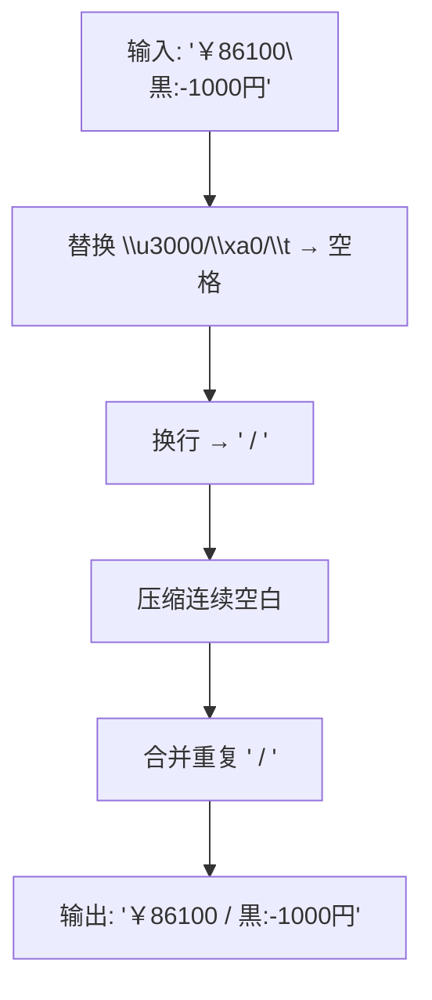

#### `_lx_extract_price_parts_shop16(price_text: str) -> Tuple`
- **作用**: 核心 LLM 抽取函数，使用 LangExtract + Ollama 从价格文本中提取结构化信息
- **装饰器**: `@lru_cache(maxsize=4096)` 缓存相同输入的结果
- **返回**: `(base_price, deltas, abs_prices, debug_extractions)`
- **三个抽取类**:
  - `base_price`: 基础价格（如 `"86,100円"`）
  - `color_delta`: 颜色差价（如 `"黒:-1000円"`）
  - `color_abs`: 颜色绝对价（如 `"黒￥86100"`）

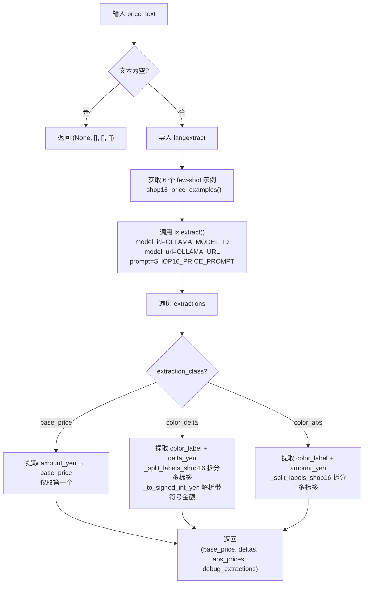

#### `_extract_color_deltas_shop16(text: str) -> List[Tuple[str, int]]`
- **作用**: 正则版颜色差额提取（LLM 失败时的回退方案）
- **流程**:

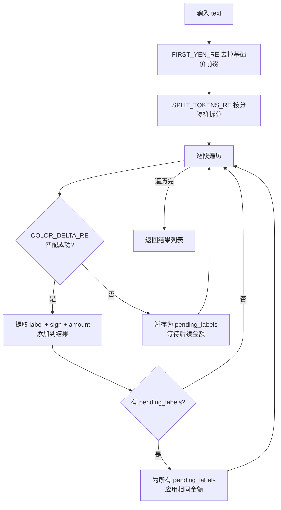

#### `_extract_color_abs_prices_shop16(text: str) -> List[Tuple[str, int]]`
- **作用**: 正则版颜色绝对价提取
- **匹配模式**: `COLOR_ABS_RE` 匹配 `"颜色名￥金额"` 格式

#### `_is_base_only_price_text(price_text_norm: str) -> bool`
- **作用**: Guardrail A - 检测文本是否仅包含一个基础价格（无颜色信息）
- **逻辑**: 正则匹配 `_BASE_ONLY_RE`，若整段文本只是 `"￥86100"` 或 `"86,100円"` 则返回 True
- **效果**: 丢弃所有 LLM 抽出的颜色信息（防止幻觉）

#### `_extract_shared_delta_map_shop16(price_text_norm: str) -> Dict[str, int]`
- **作用**: Guardrail B - 提取共享差价（如 `"オレンジ/青 -1500"`）用于纠正 LLM 错误
- **流程**:

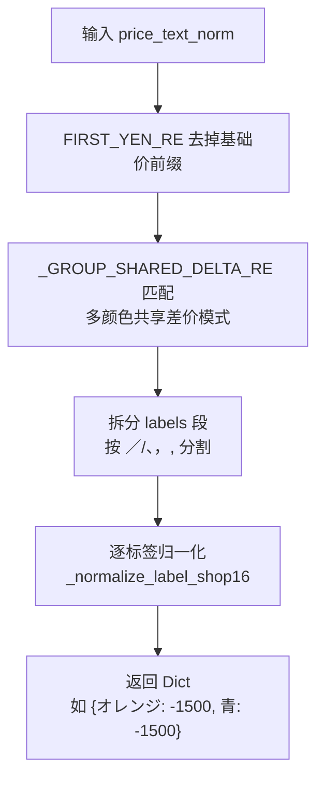

#### `_label_matches_color_unified(label_raw, color_raw, color_norm) -> bool`
- **作用**: 判断提取到的颜色标签是否匹配 info 表中的某个颜色
- **匹配策略** (三级宽松匹配):

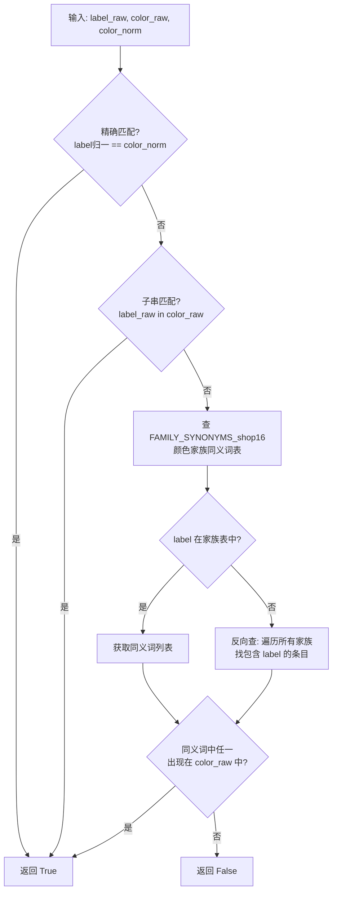

#### `_build_color_map(info_df) -> Dict`
- **作用**: 构建 `(model_norm, capacity_gb) -> {color_norm: (part_number, color_raw)}` 映射
- **数据源**: iphone17_info 参考表

#### `_normalize_label_shop16(lbl: str) -> str`
- **作用**: 归一化颜色标签
- **处理**: 去掉空白字符 / 去掉尾部 `カラー` `色` / 去掉黏在标签末尾的金额符号

#### `_split_labels_shop16(lbl: str) -> List[str]`
- **作用**: 拆分多标签字符串（如 `"青/オレンジ"` → `["青", "オレンジ"]`）

#### `_to_signed_int_yen(x: object) -> Optional[int]`
- **作用**: 将带符号的金额文本解析为有符号整数
- **优先级**: 先查找带符号数字（差价），再取最后一个无符号数字（兜底）

#### `_extract_base_price_shop16(text: str) -> Optional[int]`
- **作用**: 提取基础价格（LLM 抽取失败时的兜底）
- **逻辑**: 先用 `FIRST_YEN_RE` 匹配，失败则直接用 `to_int_yen` 兜底

#### `_shop16_price_examples() -> List[ExampleData]`
- **作用**: 提供 6 个 few-shot 示例用于 LangExtract 抽取
- **覆盖场景**:
  1. 基础价 + 多颜色差价（正负号）
  2. 基础价 + 多颜色共享差价（`青/オレンジ -5000円`）
  3. 纯颜色绝对价（`黒￥86100/青￥87100`）
  4. 基础价 + 差价为0 + 差价为负（`ホワイト +0円／ブラック -3000円`）
  5. 基础价 + 全角冒号差价（`ブルー：+2,000円`）
  6. 基础价 + 换行后差价（`￥197000\n\nオレンジ-1000`）

---

## 三、数据流程图

### 3.1 整体数据流

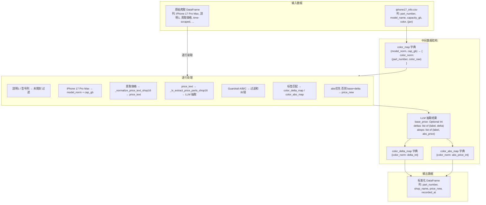

### 3.2 单行数据处理示例

以一行实际数据为例，展示完整的数据转换过程:

```
输入行:
  iPhone 17 Pro Max = "iPhone17 Pro Max 256GB SIMフリー"
  説明1            = "新品未開封"
  買取価格         = "￥186000\nオレンジ/青 -1500円"
  time-scraped     = "2025-06-01 12:00:00"
```

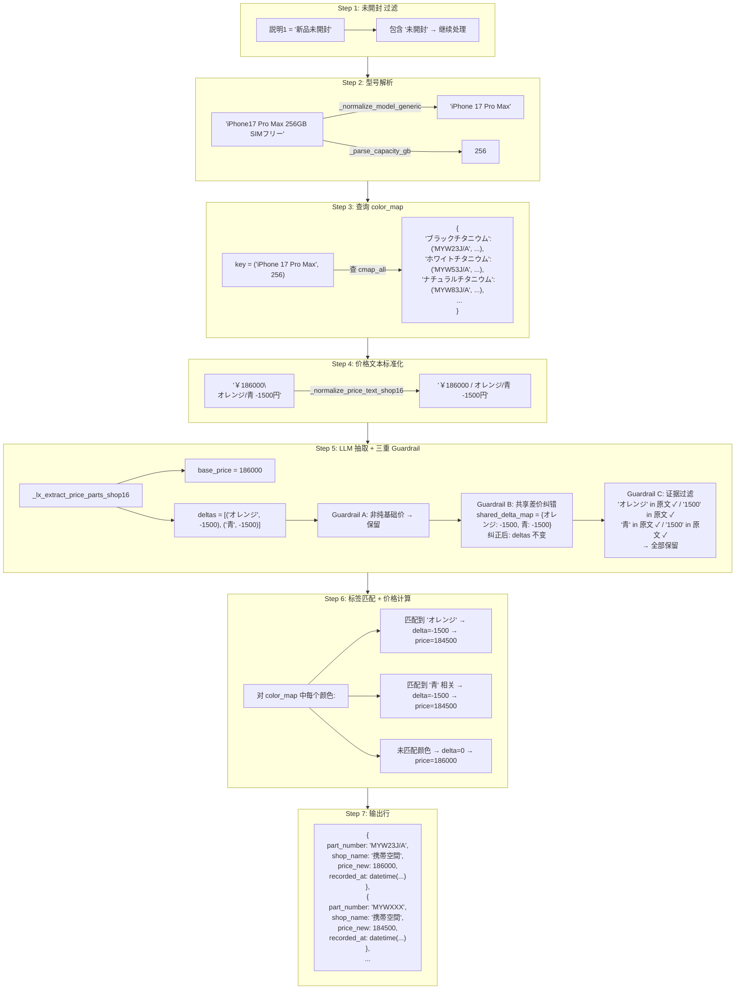

### 3.3 LLM 优先、正则回退策略

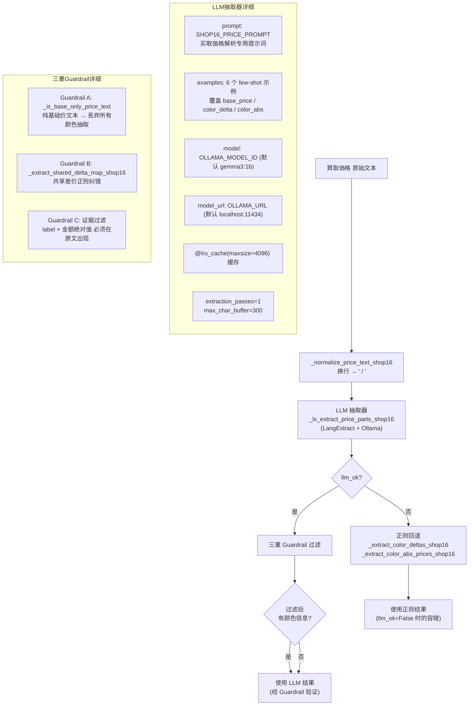

### 3.4 三重 Guardrail 防幻觉机制

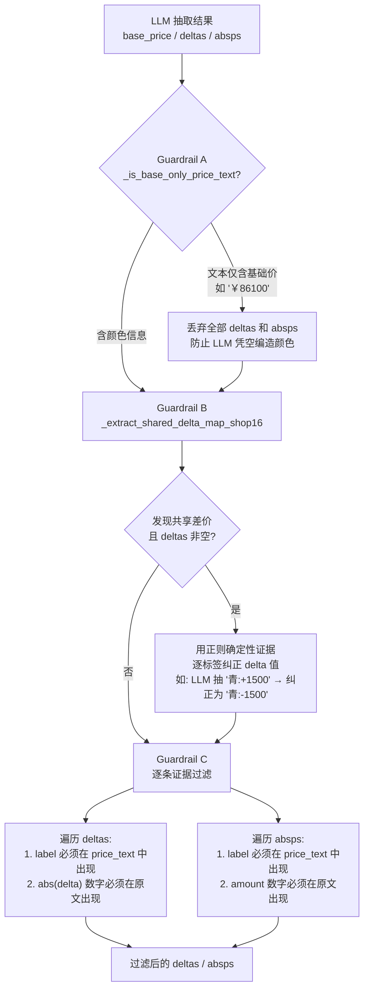

### 3.5 颜色家族匹配机制

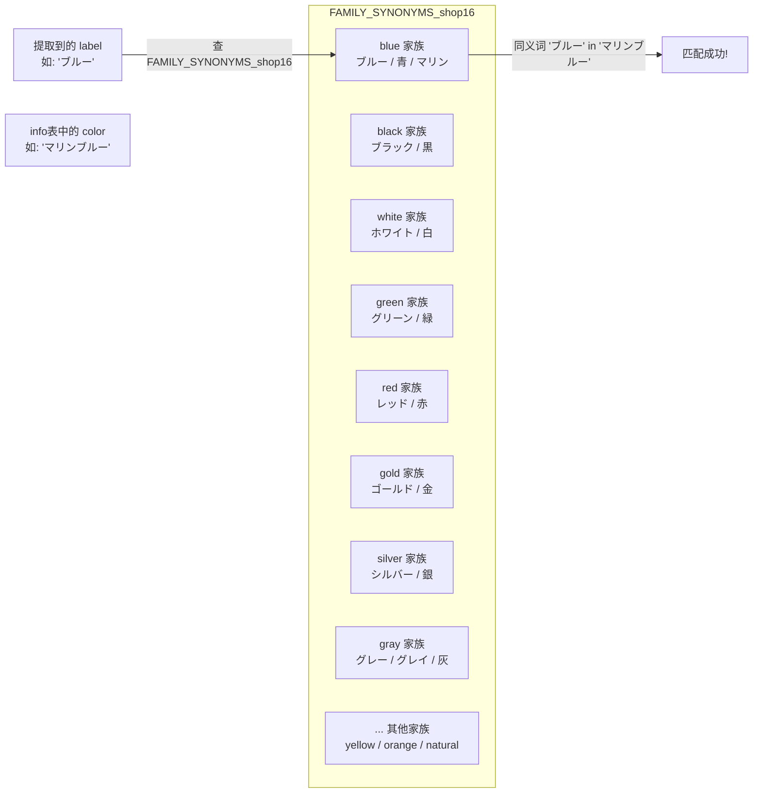

---

## 四、配置项说明

OLLAMA 与 EXTRACTION_MODE 配置已统一迁移至 `cleaner_tools.py`，各 shop 通用。

| 环境变量 / 常量 | 默认值 | 说明 |
|---------|--------|------|
| `OLLAMA_URL` / `OLLAMA_HOST` | `"http://localhost:11434"` | Ollama 服务地址（cleaner_tools） |
| `OLLAMA_MODEL_ID` / `OLLAMA_MODEL` | `"gemma3:1b"` | Ollama 模型 ID（cleaner_tools） |
| `EXTRACTION_MODE` | `"regex"` | 抽取模式：regex / llm / auto（cleaner_tools） |
| `MODEL_COL` | `"iPhone 17 Pro Max"` | 输入 DataFrame 的型号列名 |
| `DESC_COL` | `"説明1"` | 输入 DataFrame 的描述/备注列名 |
| `PRICE_COL` | `"買取価格"` | 输入 DataFrame 的价格列名 |
| `IPHONE17_INFO_CSV` | 自动推断路径 | iphone17_info 文件路径（环境变量 `IPHONE17_INFO_CSV`） |
| `lru_cache maxsize` | `4096` | `_lx_extract_price_parts_shop16` 的缓存大小 |
| `extraction_passes` | `1` | LangExtract 抽取轮数 |
| `max_char_buffer` | `300` | LangExtract 最大字符缓冲 |
| `fence_output` | `False` | LangExtract 是否使用 fence 输出 |
| `use_schema_constraints` | `False` | LangExtract 是否使用 schema 约束 |

---

## 五、关键正则表达式

| 名称 | 模式 | 用途 | 示例匹配 |
|------|------|------|---------|
| `COLOR_DELTA_RE` | `label[：:\-]\s*[+\-−－]?\s*amount円` | 匹配"颜色±金额"差价 | `黒:-1,000円`, `青:+500円` |
| `COLOR_ABS_RE` | `label\s*￥\s*amount` | 匹配"颜色￥绝对价" | `黒￥86100`, `青￥87100` |
| `FIRST_YEN_RE` | `(?:￥\|¥)?\s*(\d[\d,]*)\s*円?` | 提取第一个日元金额（基础价） | `￥86100`, `86,100円` |
| `SPLIT_TOKENS_RE` | `[／/、，,]\|(?:\s*;\s*)` | 拆分多个颜色条目 | `黒:-1000／青:+500` |
| `_BASE_ONLY_RE` | `^\s*(?:￥\|¥)?\s*\d[\d,]*\s*(?:円)?\s*$` | 检测纯基础价文本（Guardrail A） | `￥86100`, `86,100円` |
| `_GROUP_SHARED_DELTA_RE` | `labels\s*[+\-−－]\s*amount(?:円)?` | 匹配多颜色共享差价（Guardrail B） | `オレンジ/青 -1500円` |
| `_TRAILING_AMOUNT_IN_LABEL_RE` | `[：:]?\s*￥?\s*[+\-−－]?\s*\d[\d,]*\s*(?:円)?\s*$` | 去掉标签末尾黏附的金额 | `ブルー:-1000円` → `ブルー` |
| `_NUM_MODEL_PAT` | `(iPhone)\s*(\d{2})(?:\s*(Pro\s*Max\|Pro\|Plus\|mini))?` | 匹配数字代号机型 | `iPhone 17 Pro Max` |
| `_AIR_PAT` | `(iPhone)\s*(Air)(?:\s*(Pro\s*Max\|Pro\|Plus\|mini))?` | 匹配 iPhone Air | `iPhone Air` |
