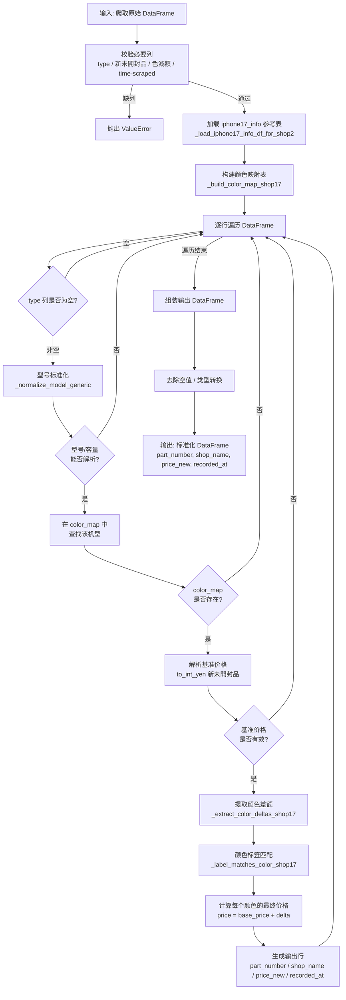
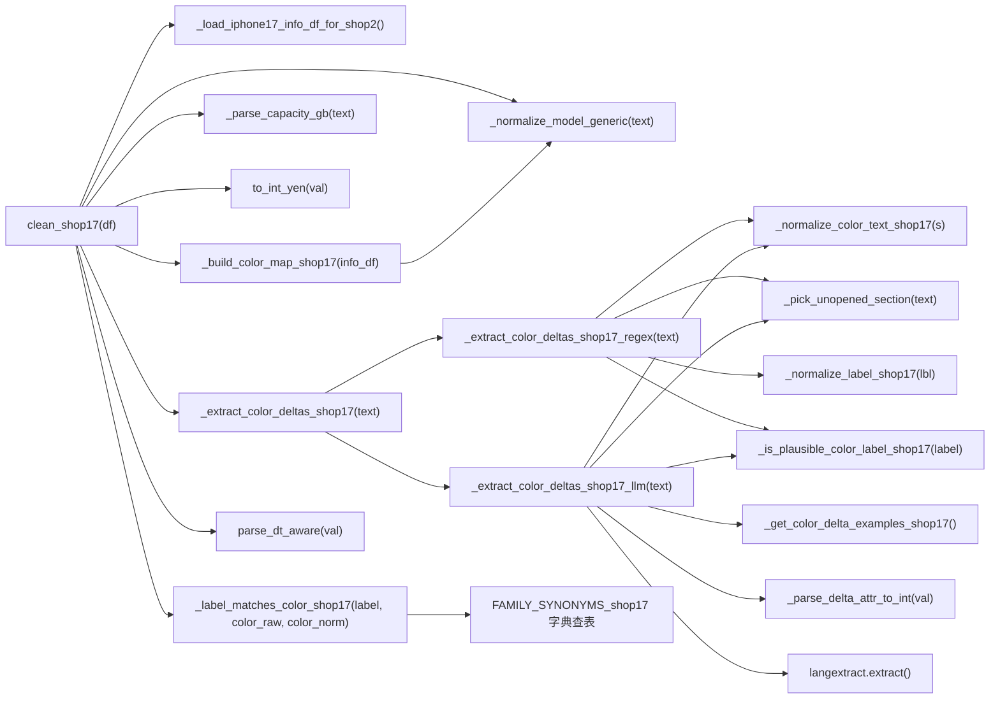
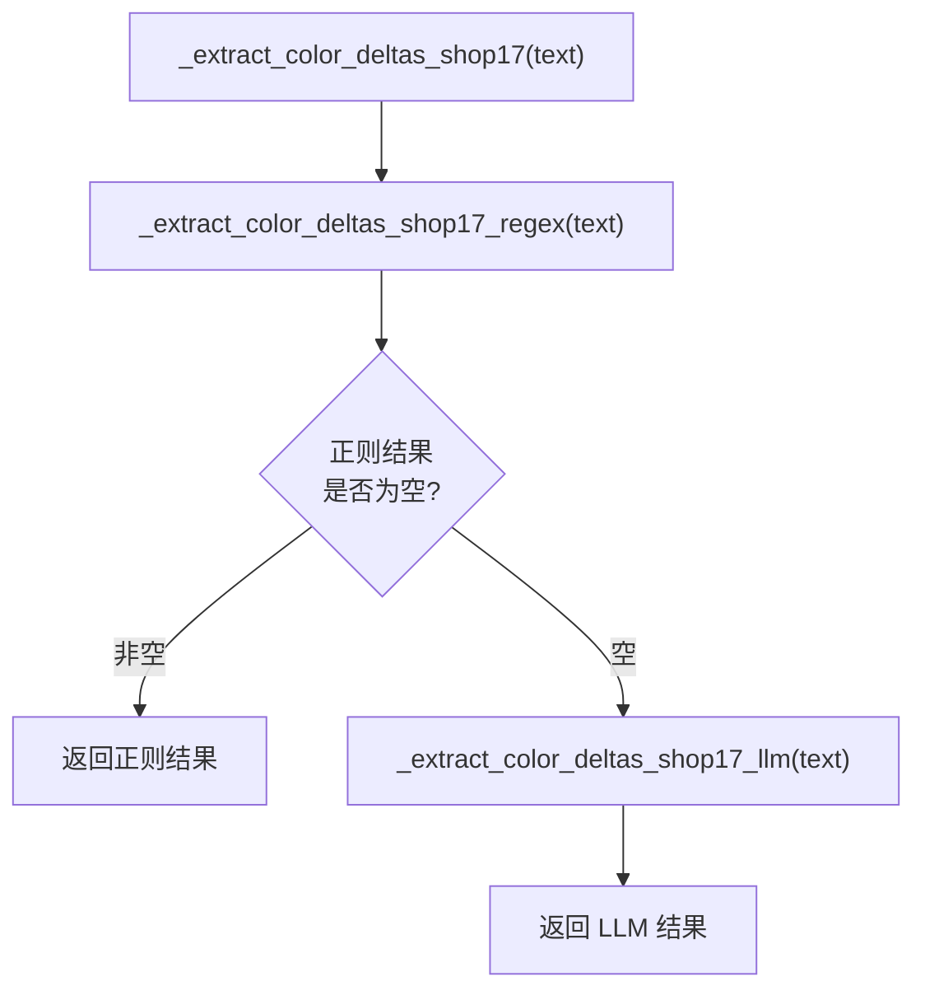
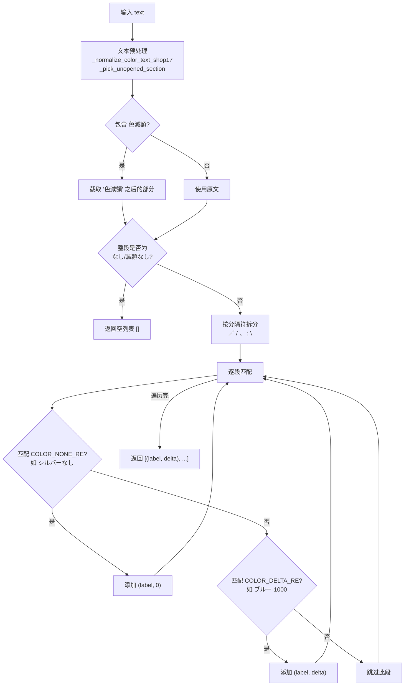
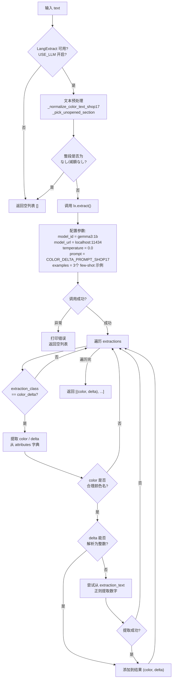
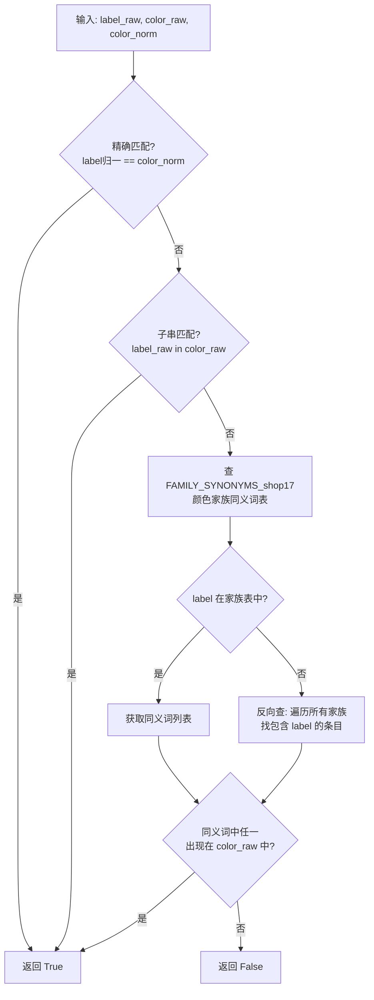
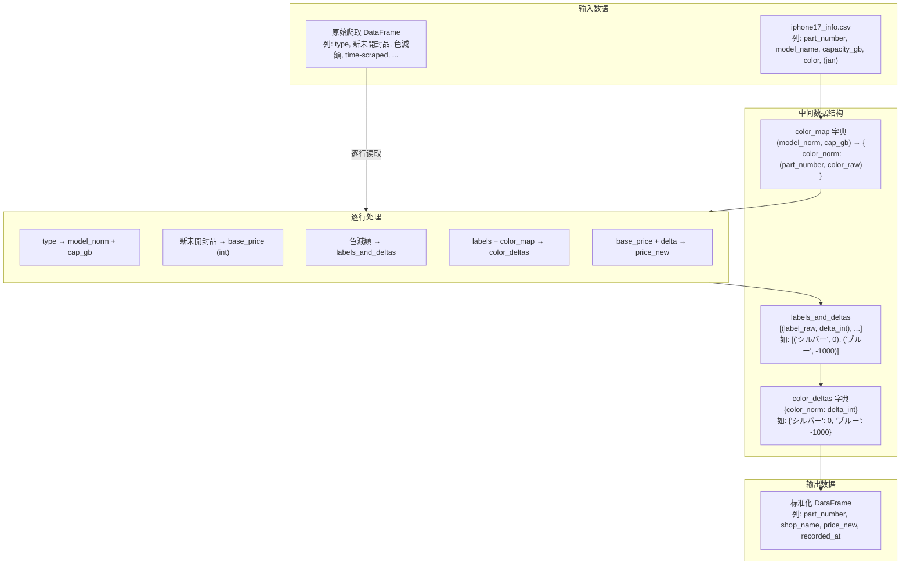
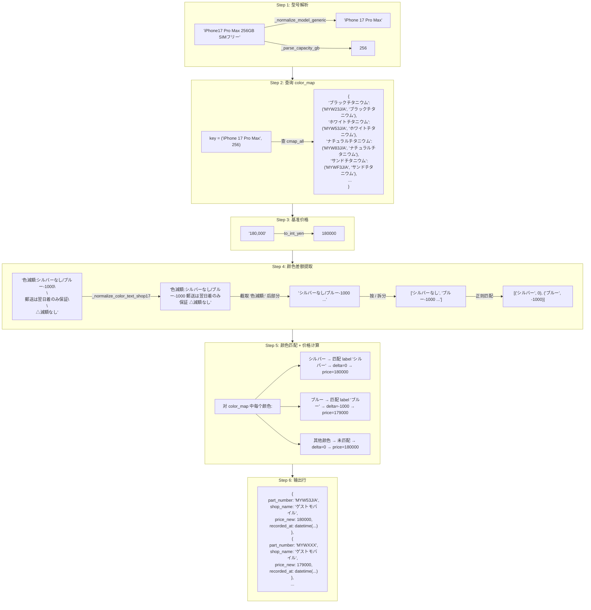
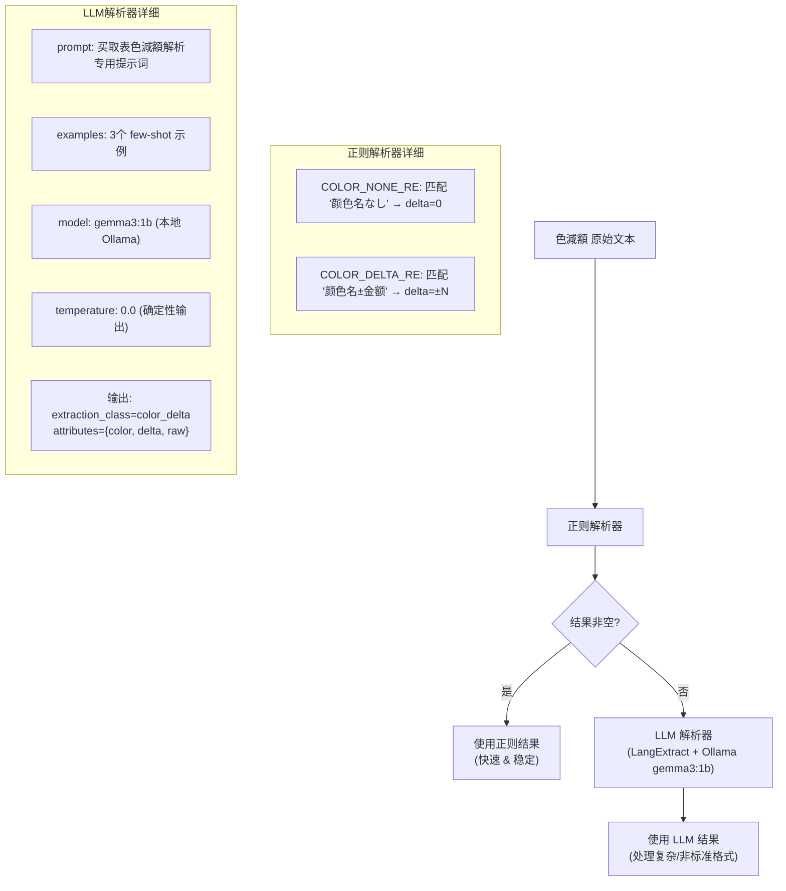
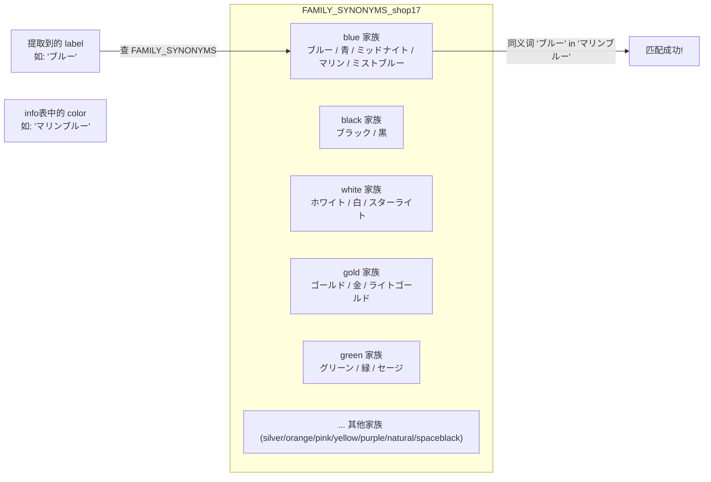

# Shop17 清洗器详细流程说明

> 文件路径: `AppleStockChecker/utils/external_ingest/shop_cleaners_split/shop17_cleaner.py`
> 店铺名称: ゲストモバイル (Guest Mobile)

---

## 一、总流程图

整个 shop17 清洗器的核心入口是 `clean_shop17(df)` 函数，从原始爬取的 DataFrame 到输出标准化的买取价格 DataFrame。



---

## 二、函数流程图

### 2.1 函数调用关系总览



### 2.2 核心函数详细说明

#### `clean_shop17(df: pd.DataFrame) -> pd.DataFrame`
- **作用**: 清洗器主入口，将原始爬取数据转化为标准四列输出
- **输入**: 包含 `type`, `新未開封品`, `色減額`, `time-scraped` 列的 DataFrame
- **输出**: 包含 `part_number`, `shop_name`, `price_new`, `recorded_at` 列的 DataFrame

#### `_normalize_model_generic(text: str) -> str`
- **作用**: 将各种型号写法统一为标准格式
- **处理**: 日文别名转英文 (プロ→Pro) / 紧凑写法展开 (17pro→17 Pro) / 去噪 (容量/SIM信息)
- **输出**: 如 `"iPhone 17 Pro Max"`, `"iPhone Air"`, `"iPhone 16 Plus"`

#### `_parse_capacity_gb(text: str) -> Optional[int]`
- **作用**: 从文本中提取容量 (GB)
- **处理**: 支持 TB→GB 换算 (1TB=1024GB)，支持 `"256GB"`, `"1TB"` 等格式

#### `_extract_color_deltas_shop17(text: str) -> List[Tuple[str, int]]`
- **作用**: 提取颜色差额的调度函数，采用 **正则优先、LLM 兜底** 策略



#### `_extract_color_deltas_shop17_regex(text: str) -> List[Tuple[str, int]]`
- **作用**: 正则版颜色差额提取
- **流程**:



#### `_extract_color_deltas_shop17_llm(text: str) -> List[Tuple[str, int]]`
- **作用**: LLM 版颜色差额提取 (正则失败时的后备方案)
- **流程**:



#### `_label_matches_color_shop17(label_raw, color_raw, color_norm) -> bool`
- **作用**: 判断提取到的颜色标签是否匹配 info 表中的某个颜色
- **匹配策略** (三级宽松匹配):



#### `_build_color_map_shop17(info_df) -> Dict`
- **作用**: 构建 `(model_norm, capacity_gb) -> {color_norm: (part_number, color_raw)}` 映射
- **数据源**: iphone17_info 参考表

#### `_normalize_color_text_shop17(s: str) -> str`
- **作用**: 统一色減額文本中的特殊字符
- **处理**: 全角数字→半角 / 全角逗号→半角 / 各种 dash 统一为 `-` / 全角斜杠→半角 / 多余空白清理

#### `_is_plausible_color_label_shop17(label: str) -> bool`
- **作用**: 过滤非颜色名标签
- **排除规则**: 以 △/▲ 开头 / 包含数字 / 长度 >16 / 包含关键词 (利用制限, 保証, 郵送 等)

#### `_pick_unopened_section(text: str) -> str`
- **作用**: 如果文本中包含 `【未開封】`，则只取该段内容

---

## 三、数据流程图

### 3.1 整体数据流



### 3.2 单行数据处理示例

以一行实际数据为例，展示完整的数据转换过程:

```
输入行:
  type         = "iPhone17 Pro Max 256GB SIMフリー"
  新未開封品    = "180,000"
  色減額       = "色減額:シルバーなし/ブルー-1000\n\n郵送は翌日着のみ保証\n\n△減額なし"
  time-scraped = "2025-06-01 12:00:00"
```



### 3.3 颜色差额提取 - 正则 vs LLM 策略



### 3.4 颜色家族匹配机制



---

## 四、配置项说明

| 环境变量 | 默认值 | 说明 |
|---------|--------|------|
| `SHOP17_USE_LLM` | `"1"` (启用) | 是否启用 LLM 兜底 |
| `SHOP17_LX_MODEL_ID` | `"gemma3:1b"` | Ollama 模型 ID |
| `SHOP17_LX_MODEL_URL` | `"http://localhost:11434"` | Ollama 服务地址 |
| `DEBUG_SHOP17_MAX_ROWS` | `20` | Debug 输出最大行数 |
| `DEBUG_SHOP17_SHOW_ALL_COLORS` | `""` (关闭) | 是否显示所有颜色的 debug 信息 |
| `IPHONE17_INFO_CSV` | 自动推断路径 | iphone17_info 文件路径 |

---

## 五、关键正则表达式

| 名称 | 模式 | 用途 | 示例匹配 |
|------|------|------|---------|
| `COLOR_NONE_RE_shop17` | `label...なし` | 匹配"颜色无减额" | `シルバーなし`, `クラウドホワイト：なし` |
| `COLOR_DELTA_RE_shop17` | `label[：:-]?[+-]?amount` | 匹配"颜色±金额" | `ブルー-1000`, `スカイブルー: -3,000` |
| `SPLIT_TOKENS_RE_shop17` | `[／/、;\n]` | 拆分多个颜色条目 | `シルバーなし／ブルー-1000` |
| `_NUM_MODEL_PAT` | `iPhone\s*\d{2}...` | 匹配数字代号机型 | `iPhone 17 Pro Max` |
| `_AIR_PAT` | `iPhone\s*Air...` | 匹配 iPhone Air | `iPhone Air` |
