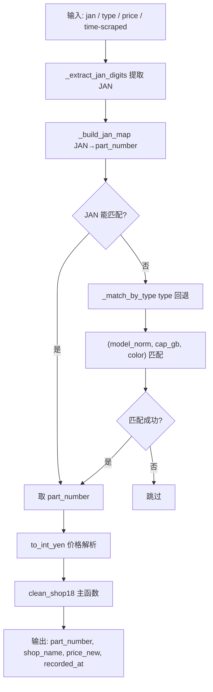

# Shop18 清洗器详细流程说明

> 文件路径: `AppleStockChecker/utils/external_ingest/shop_cleaners_split/shop18_cleaner.py`
> 店铺名称: 買取オク

---

## 一、总流程图

整个 shop18 清洗器以 JAN 为主要映射依据，无法匹配时通过 type 文本（如 'iPhone 17 Pro 256GB ディープブルー'）回退匹配。

---

## 二、核心函数说明

| 函数 | 作用 |
|------|------|
| `_extract_jan_digits(s)` | JAN 提取（cleaner_tools） |
| `_build_jan_map(info_df)` | JAN → part_number 映射（cleaner_tools） |
| `_match_by_type(type_text, info_df)` | JAN 无法匹配时，用 type 文本 (model/cap/color) 回退匹配 |
| `_load_iphone17_info_df_from_db()` | 机型信息（cleaner_tools） |

---

## 三、配置项说明

shop18 无 OLLAMA / EXTRACTION_MODE 配置。
