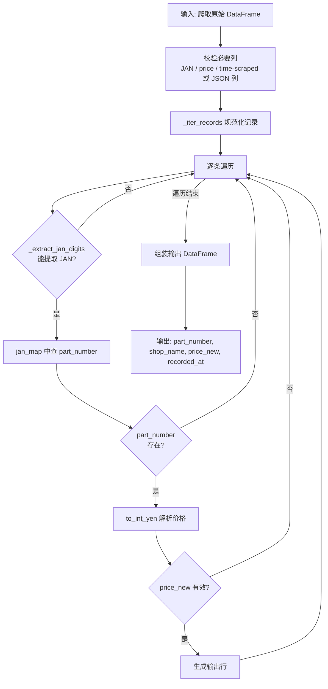

# Shop1 清洗器详细流程说明

> 文件路径: `AppleStockChecker/utils/external_ingest/shop_cleaners_split/shop1_cleaner.py`
> 店铺名称: 買取商店

---

## 一、总流程图

整个 shop1 清洗器的核心入口是 `clean_shop1(df)` 函数，从原始爬取的 DataFrame 到输出标准化的买取价格 DataFrame。以 JAN 码为主要映射依据。

---

## 二、核心函数说明

| 函数 | 作用 |
|------|------|
| `_iter_records(df)` | 产出规范化记录，兼容直列（JAN/price/time-scraped）与 JSON 列两种输入格式 |
| `_extract_jan_digits(s)` | 从 JAN 字段提取 13 位数字（cleaner_tools） |
| `_build_jan_map(info_df)` | 构建 JAN → part_number 映射（cleaner_tools） |
| `clean_shop1(df)` | 主入口，仅输出 `_load_iphone17_info_df_from_db()` 中存在的机型 |

---

## 三、配置项说明

shop1 无独立 OLLAMA/EXTRACTION_MODE 配置，机型信息来自 `cleaner_tools._load_iphone17_info_df_from_db()`。
