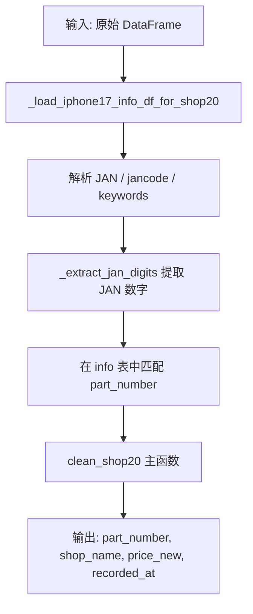

# Shop20 清洗器详细流程说明

> 文件路径: `AppleStockChecker/utils/external_ingest/shop_cleaners_split/shop20_cleaner.py`

---

## 一、总流程图

整个 shop20 清洗器从原始 DataFrame 解析 JAN / jancode / keywords 等字段，通过 `_load_iphone17_info_df_for_shop20()` 匹配 part_number。

---

## 二、核心函数说明

| 函数 | 作用 |
|------|------|
| `_load_iphone17_info_df_for_shop20()` | 读取机型信息（含 part_number, model, capacity, color, jan） |
| `_extract_jan_digits(s)` | 提取 8+ 位连续数字作为 JAN |

---

## 三、配置项说明

shop20 使用独立的 `_load_iphone17_info_df_for_shop20()`，数据源为 `IPHONE17_INFO_CSV` 或 `EXTERNAL_IPHONE17_INFO_PATH`。无 OLLAMA / EXTRACTION_MODE 配置。
