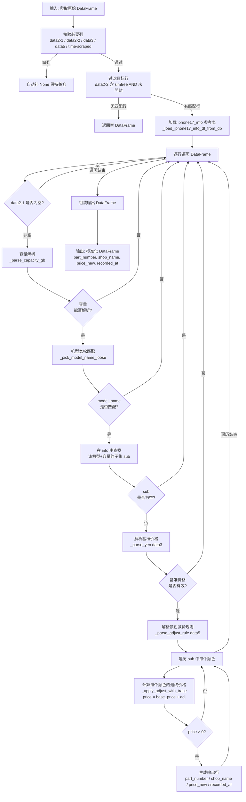
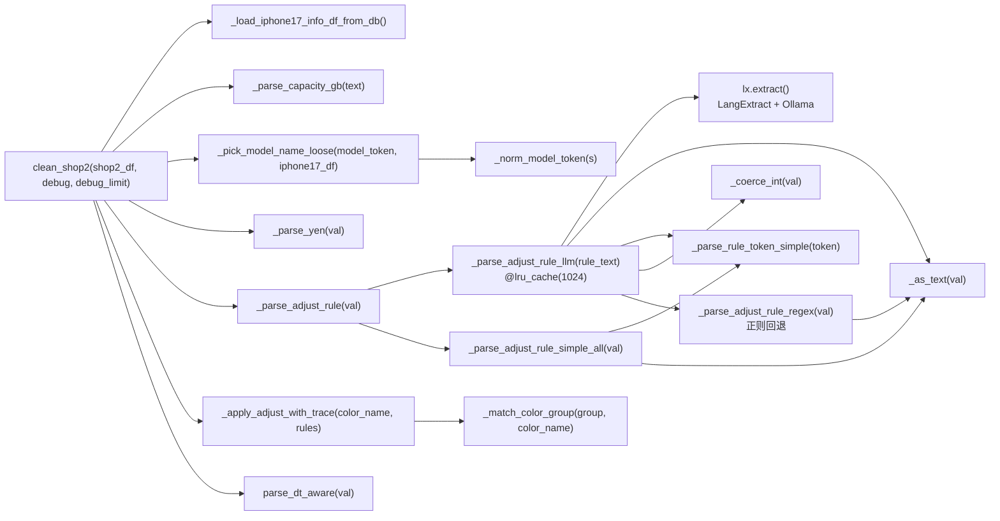
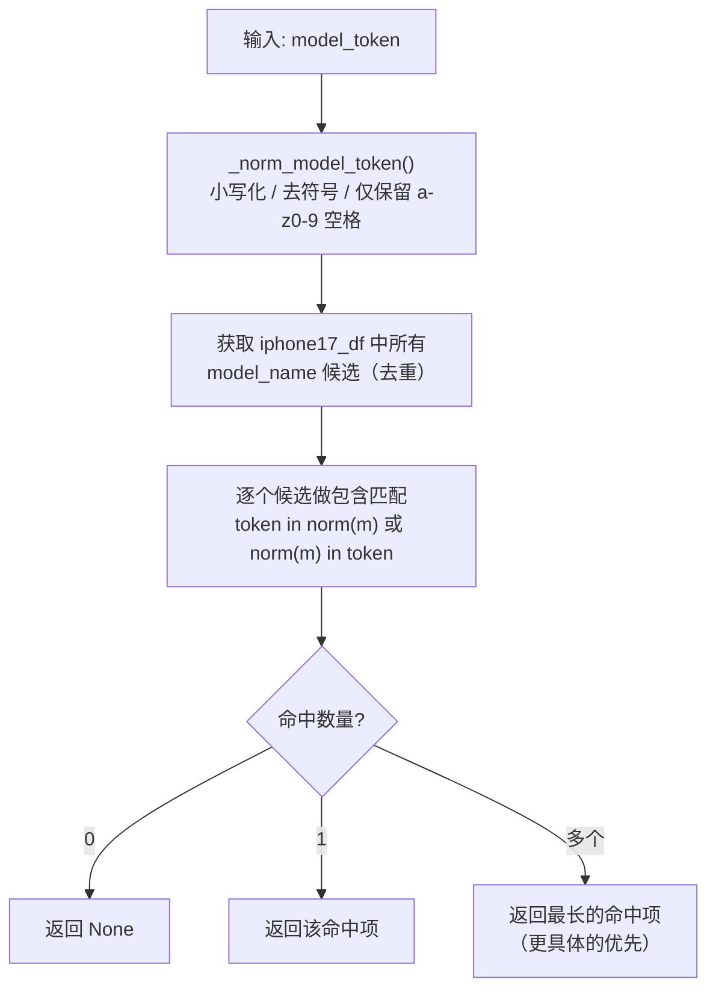
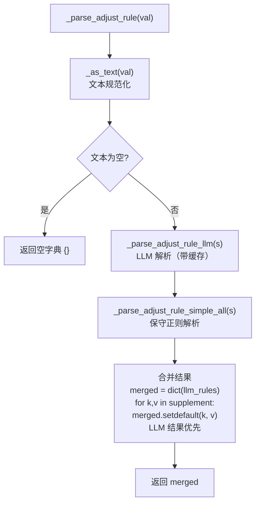
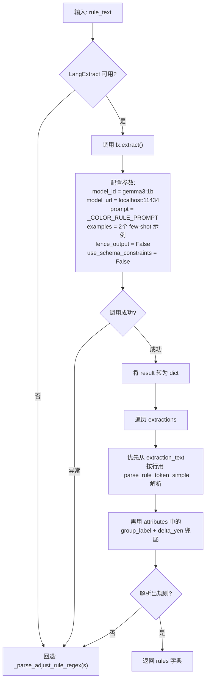
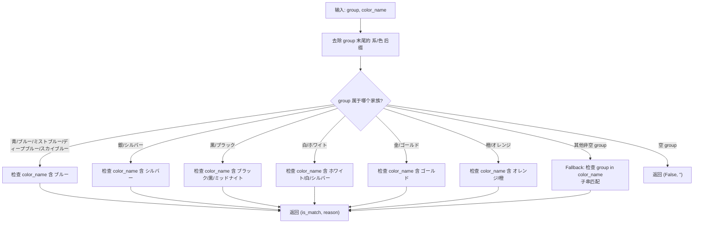
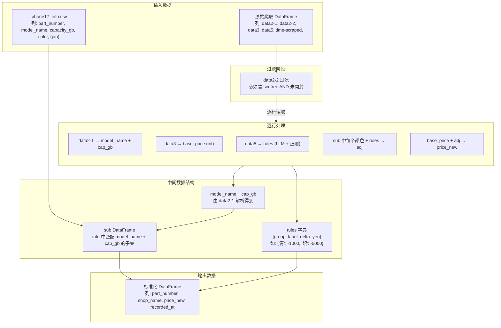
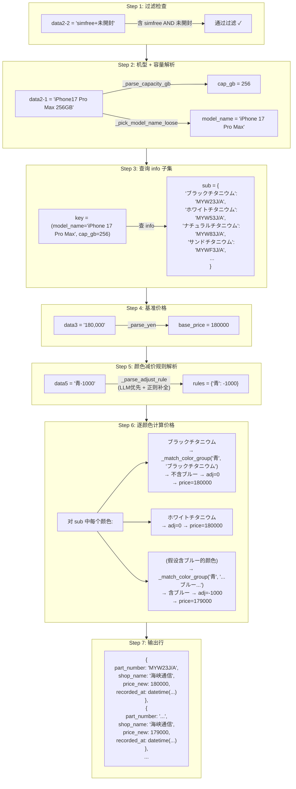
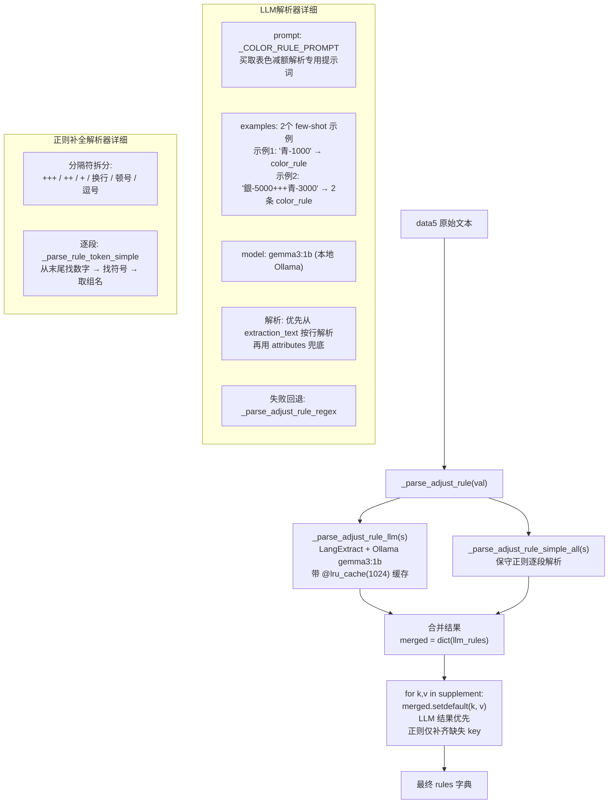
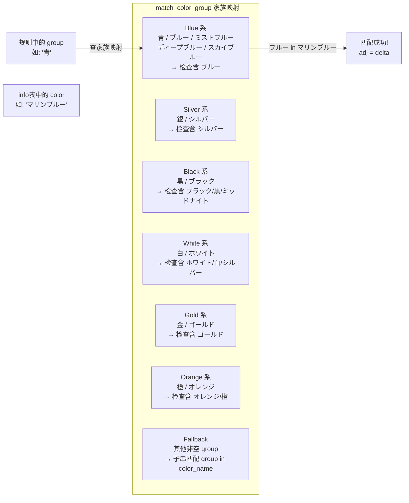

# Shop2 清洗器详细流程说明

> 文件路径: `AppleStockChecker/utils/external_ingest/shop_cleaners_split/shop2_cleaner.py`
> 店铺名称: 海峡通信

---

## 一、总流程图

整个 shop2 清洗器的核心入口是 `clean_shop2(shop2_df, debug, debug_limit)` 函数，从原始爬取的 DataFrame 到输出标准化的买取价格 DataFrame。



---

## 二、函数流程图

### 2.1 函数调用关系总览



### 2.2 核心函数详细说明

#### `clean_shop2(shop2_df: pd.DataFrame, debug: bool = True, debug_limit: int = 30) -> pd.DataFrame`
- **作用**: 清洗器主入口，将原始爬取数据转化为标准四列输出
- **输入**: 包含 `data2-1`, `data2-2`, `data3`, `data5`, `time-scraped` 列的 DataFrame
- **输出**: 包含 `part_number`, `shop_name`, `price_new`, `recorded_at` 列的 DataFrame
- **过滤条件**: data2-2 必须同时包含 `"simfree"` 和 `"未開封"`
- **debug 模式**: 选出含颜色减价规则的行，输出对照信息（最多 debug_limit 行）

#### `_pick_model_name_loose(model_token: str, iphone17_df: pd.DataFrame) -> Optional[str]`
- **作用**: 在 iphone17_info 的 model_name 列中宽松匹配输入的机型文本
- **匹配策略**:



#### `_parse_adjust_rule(val) -> dict`
- **作用**: 解析颜色减价规则的调度函数，采用 **LLM 优先、正则补全** 策略



#### `_parse_adjust_rule_llm(rule_text: str) -> dict`
- **作用**: 使用 LangExtract + Ollama 本地 LLM 解析颜色减价规则
- **缓存**: `@lru_cache(maxsize=1024)`，对相同 rule_text 避免重复调用 LLM
- **流程**:



#### `_parse_adjust_rule_simple_all(val) -> dict`
- **作用**: 保守补全解析，按分隔符拆开后逐段用 `_parse_rule_token_simple` 解析
- **用途**: 补齐 LLM 可能漏掉的规则；不覆盖 LLM 已有的 key（通过 `setdefault` 合并）
- **分隔符**: `+++`, `++`, `+`, 全角加号, 换行, 顿号, 逗号

#### `_parse_rule_token_simple(token: str) -> Optional[Tuple[str, int]]`
- **作用**: 解析单条规则 token，如 `'黒-2000'` -> `('黒', -2000)`
- **流程**: 从末尾向前找数字串 -> 找符号 (+/-) -> 取出组名 (group)

#### `_parse_adjust_rule_regex(val) -> dict`
- **作用**: 旧版纯正则解析（fallback），用于 LLM 不可用或 LLM 解析为空时的回退
- **处理**: 按 `+++`, 逗号, 空格拆分，逐段正则匹配 `(.+?)-(\d+)`

#### `_match_color_group(group: str, color_name: str) -> Tuple[bool, str]`
- **作用**: 判断减价规则中的"组名"是否匹配 info 表中的某个颜色名
- **前处理**: 去除组名末尾的"系"/"色"后缀
- **匹配策略** (家族映射):



#### `_apply_adjust_with_trace(color_name: str, rules: dict) -> Tuple[int, list[dict]]`
- **作用**: 对指定颜色名应用所有减价规则，返回调整总额和 trace 信息
- **输出**: `(adjust_sum, [{"group": "青", "delta": -1000, "reason": "contains ブルー"}, ...])`
- **特点**: 累加所有命中规则的 delta 值，trace 记录每条命中的详细信息

#### `_parse_yen(val) -> Optional[int]`
- **作用**: 将各种日元价格写法转为整数
- **处理**: `'¥177,000'` / `'177,000円'` / `'177000'` -> `177000`

#### `_parse_capacity_gb(text: str) -> Optional[int]`
- **作用**: 从文本中提取容量 (GB)
- **处理**: 支持 TB->GB 换算 (1TB=1024GB)，支持 `"256GB"`, `"1TB"` 等格式

#### `_load_iphone17_info_df_from_db() -> pd.DataFrame`
- **作用**: 读取 iphone17_info 参考表
- **数据源**: Django settings / 环境变量 `IPHONE17_INFO_CSV` / 自动推断路径
- **输出列**: `part_number`, `model_name`, `capacity_gb`, `color`，若检测到 jan 列则额外返回

#### `_as_text(val) -> str`
- **作用**: 将可能为 NaN/None/数字/字符串的输入统一规范为字符串
- **排除**: `nan`, `none`, `null` 均返回空字符串

#### `_coerce_int(val) -> Optional[int]`
- **作用**: 将 int/float/str 数字（含日元符号、逗号、全角符号）稳健转为 int
- **处理**: 去除逗号/円/¥，全角符号转半角，正则提取数字

---

## 三、数据流程图

### 3.1 整体数据流



### 3.2 单行数据处理示例

以一行实际数据为例，展示完整的数据转换过程:

```
输入行:
  data2-1      = "iPhone17 Pro Max 256GB"
  data2-2      = "simfree+未開封"
  data3        = "180,000"
  data5        = "青-1000"
  time-scraped = "2025-06-01 12:00:00"
```



### 3.3 颜色减价规则解析 - LLM 优先 + 正则补全策略



### 3.4 颜色家族匹配机制



---

## 四、配置项说明

OLLAMA 与 EXTRACTION_MODE 配置已统一迁移至 `cleaner_tools.py`。

| 配置项 | 值 | 类型 | 说明 |
|--------|-----|------|------|
| `OLLAMA_MODEL_ID` | `"gemma3:1b"` | cleaner_tools | Ollama 本地 LLM 模型名 |
| `OLLAMA_URL` | `"http://localhost:11434"` | cleaner_tools | Ollama 服务地址 |
| `EXTRACTION_MODE` | `"regex"` | cleaner_tools | regex / llm / auto |
| `@lru_cache(maxsize=1024)` | 1024 | 硬编码 | `_parse_adjust_rule_llm` 的缓存大小 |
| `SHOP` | `"海峡通信"` | 硬编码 | 输出 DataFrame 的 shop_name 值 |
| `debug` | `True` | 函数参数 | 是否输出调试信息 |
| `debug_limit` | `30` | 函数参数 | Debug 输出最大行数 |
| `IPHONE17_INFO_CSV` | 自动推断路径 | 环境变量 | iphone17_info 文件路径（优先 Django settings） |
| `lx.extract` 参数 `fence_output` | `False` | 硬编码 | LangExtract 不使用 fence 输出 |
| `lx.extract` 参数 `use_schema_constraints` | `False` | 硬编码 | LangExtract 不使用 schema 约束 |

---

## 五、关键正则表达式

| 名称 | 模式 | 用途 | 示例匹配 |
|------|------|------|---------|
| `_YEN_RE` | `[^\d]+` | 去除价格中的非数字字符 | `'¥177,000'` → `'177000'` |
| `_norm_model_token` 内 | `iphone\s*` → `iphone ` | 规范化 iPhone 前缀的空格 | `iPhone17` → `iphone 17` |
| `_norm_model_token` 内 | `[^0-9a-z\s+]` → `""` | 仅保留字母数字和空格 | 去除 `フリー` 等日文 |
| `_parse_capacity_gb` TB | `(\d+(?:\.\d+)?)\s*TB` | 匹配 TB 容量 | `1TB` → `1024` |
| `_parse_capacity_gb` GB | `(\d{2,4})\s*GB` | 匹配 GB 容量 | `256GB` → `256` |
| `_parse_adjust_rule_regex` 分隔 | `\+{1,3}\|[,、，\s]+` | 拆分多条减价规则 | `銀-5000+++青-3000` |
| `_parse_adjust_rule_regex` 规则 | `(.+?)-(\d+)` | 匹配单条"组名-金额"规则 | `青-1000` → `('青', -1000)` |
| `_RULE_PAT` (debug) | `(青\|銀\|黒\|白\|橙\|ブルー\|シルバー\|ブラック\|ホワイト\|オレンジ).{0,6}-\d+` | Debug 模式: 检测 data5 是否含颜色减价规则 | `青-1000`, `シルバー-5000` |
| `_INT_RE` | `[+-]?\d+` | 从字符串中提取整数 | `'-1000円'` → `-1000` |
| `_match_color_group` 后缀清理 | `(系\|色)$` | 去除组名末尾的"系"/"色" | `青系` → `青`, `黒色` → `黒` |
| iphone17_info 文件扩展名 | `\.(xlsx\|xlsm\|xls\|ods)$` | 判断参考表是否为 Excel 格式 | `iphone17_info.xlsx` |
