# Shop3 清洗器详细流程说明

> 文件路径: `AppleStockChecker/utils/external_ingest/shop_cleaners_split/shop3_cleaner.py`
> 店铺名称: 買取一丁目

---

## 一、总流程图

整个 shop3 清洗器的核心入口是 `clean_shop3(df, debug, debug_limit)` 函数，从原始爬取的 DataFrame 到输出标准化的买取价格 DataFrame。

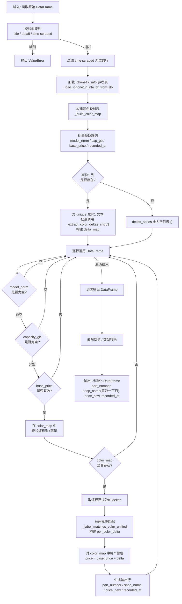

---

## 二、函数流程图

### 2.1 函数调用关系总览

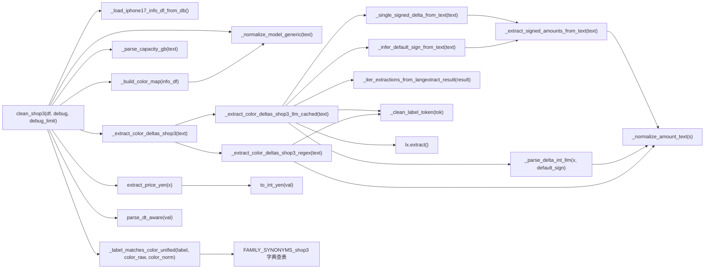

### 2.2 核心函数详细说明

#### `clean_shop3(df: pd.DataFrame, debug: bool = True, debug_limit: int = 30) -> pd.DataFrame`
- **作用**: 清洗器主入口，将原始爬取数据转化为标准四列输出
- **输入**: 包含 `title`, `data5`, `time-scraped` 列的 DataFrame（可选列 `减价1`）
- **输出**: 包含 `part_number`, `shop_name`, `price_new`, `recorded_at` 列的 DataFrame
- **debug 模式**: 仅对"减价1"中可抽出颜色差额的行打印对照信息（最多 debug_limit 条）

#### `_normalize_model_generic(text: str) -> str`
- **作用**: 将各种型号写法统一为标准格式
- **处理**: 日文别名转英文 (プロ→Pro) / 紧凑写法展开 (17pro→17 Pro) / 去噪 (容量/SIM信息)
- **输出**: 如 `"iPhone 17 Pro Max"`, `"iPhone Air"`, `"iPhone 16 Plus"`

#### `_parse_capacity_gb(text: str) -> Optional[int]`
- **作用**: 从文本中提取容量 (GB)
- **处理**: 支持 TB→GB 换算 (1TB=1024GB)，支持 `"256GB"`, `"1TB"` 等格式

#### `extract_price_yen(x: object) -> Optional[int]`
- **作用**: 将 data5 列的原始价格文本转为整数 (JPY)
- **处理**: 预期形如 `'¥177,000'`；兼容 `'～177,000円'` / `'10.5万'` 等；去除修饰词（"新品/未開封"等），然后调用 `to_int_yen` 取区间最大值

#### `_extract_color_deltas_shop3(text: str) -> List[Tuple[str, int]]`
- **作用**: 提取颜色差额的调度函数，采用 **LLM 优先、正则兜底** 策略

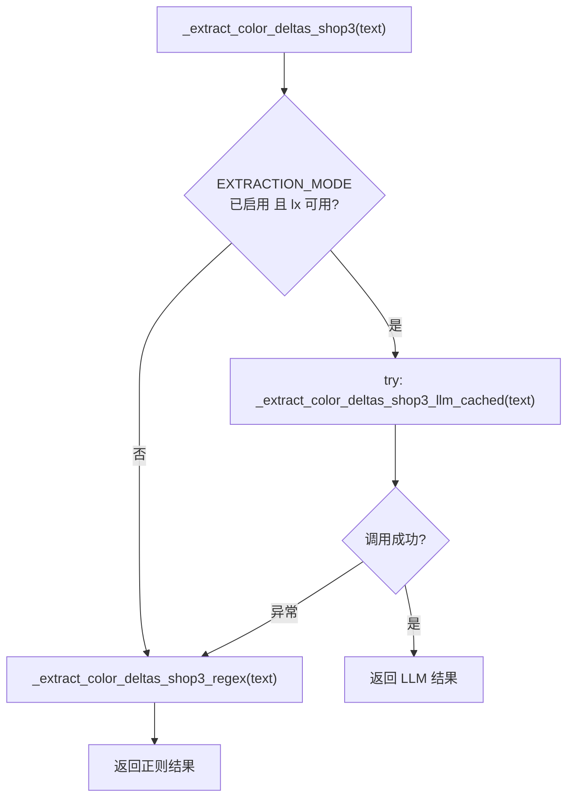

#### `_extract_color_deltas_shop3_llm_cached(text: str) -> Tuple[Tuple[str, int], ...]`
- **作用**: LLM 版颜色差额提取（带 `@lru_cache(maxsize=4096)` 缓存）
- **流程**:

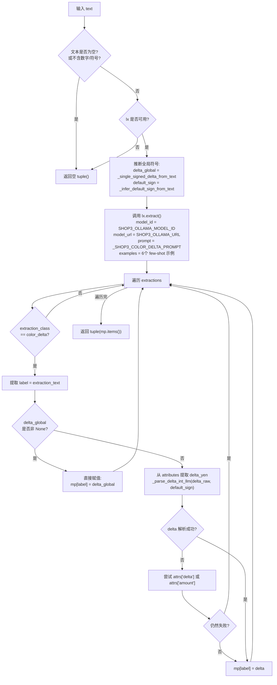

#### `_extract_color_deltas_shop3_regex(text: str) -> List[Tuple[str, int]]`
- **作用**: 正则版颜色差额提取（LLM 失败或不可用时的后备方案）
- **流程**:

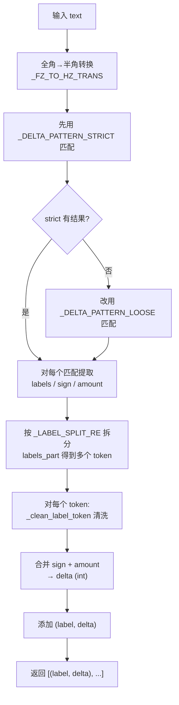

#### `_label_matches_color_unified(label_raw, color_raw, color_norm) -> bool`
- **作用**: 判断提取到的颜色标签是否匹配 info 表中的某个颜色
- **匹配策略** (三级宽松匹配):

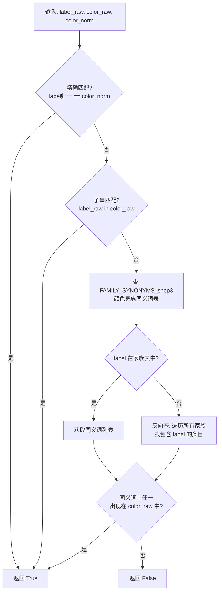

#### `_build_color_map(info_df) -> Dict`
- **作用**: 构建 `(model_norm, capacity_gb) -> {color_norm: (part_number, color_raw)}` 映射
- **数据源**: iphone17_info 参考表
- **处理**: 对 model_name 做 `_normalize_model_generic`，对 color 做 `_norm`

#### `extract_price_yen(x: object) -> Optional[int]`
- **作用**: 从 data5 列解析基准价格
- **处理**: 去除修饰词 (新品/未開封 等)，然后调用 `to_int_yen`

#### `_infer_default_sign_from_text(text: str) -> Optional[int]`
- **作用**: 分析原文中所有带符号金额，若全为负返回 `-1`，全为正返回 `+1`，混合返回 `None`
- **用途**: 为 LLM 解析的 delta 提供默认符号方向

#### `_single_signed_delta_from_text(text: str) -> Optional[int]`
- **作用**: 若原文只出现一种带符号金额（可能重复），返回该值；否则返回 `None`
- **用途**: 当原文只有一个 delta 值时，直接覆盖所有 label 的 delta（delta_global）

#### `_parse_delta_int_llm(x: object, default_sign: Optional[int]) -> Optional[int]`
- **作用**: 解析 LLM 输出的 delta 值，支持 int / float / 字符串
- **特殊逻辑**: 若无显式符号则按 `default_sign` 赋符号；若显式符号与 `default_sign` 冲突则以 `default_sign` 为准

#### `_clean_label_token(tok: str) -> str`
- **作用**: 清洗标签文本，去除括号内内容

#### `_normalize_amount_text(s: str) -> Optional[int]`
- **作用**: 把全角数字/标点转半角，提取数字部分转为 int

---

## 三、数据流程图

### 3.1 整体数据流

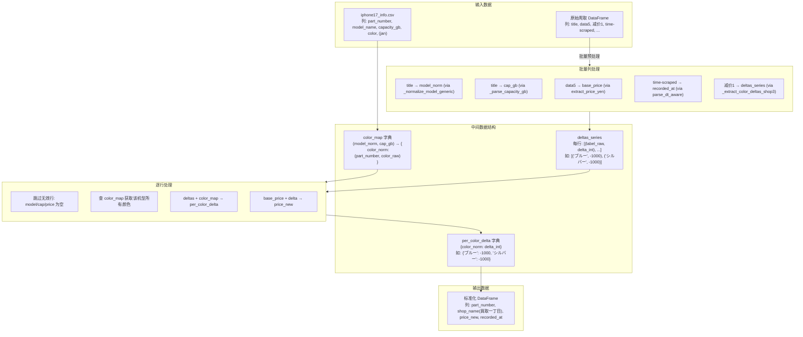

### 3.2 单行数据处理示例

以一行实际数据为例，展示完整的数据转换过程:

```
输入行:
  title        = "iPhone17 Pro Max 256GB SIMフリー"
  data5        = "¥177,000"
  减价1        = "ブルー、シルバー　-1000"
  time-scraped = "2025-06-01 12:00:00"
```

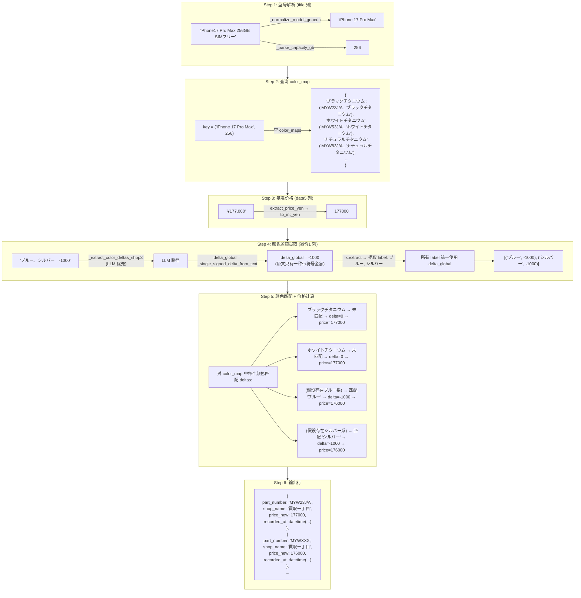

### 3.3 颜色差额提取 - LLM vs 正则 策略

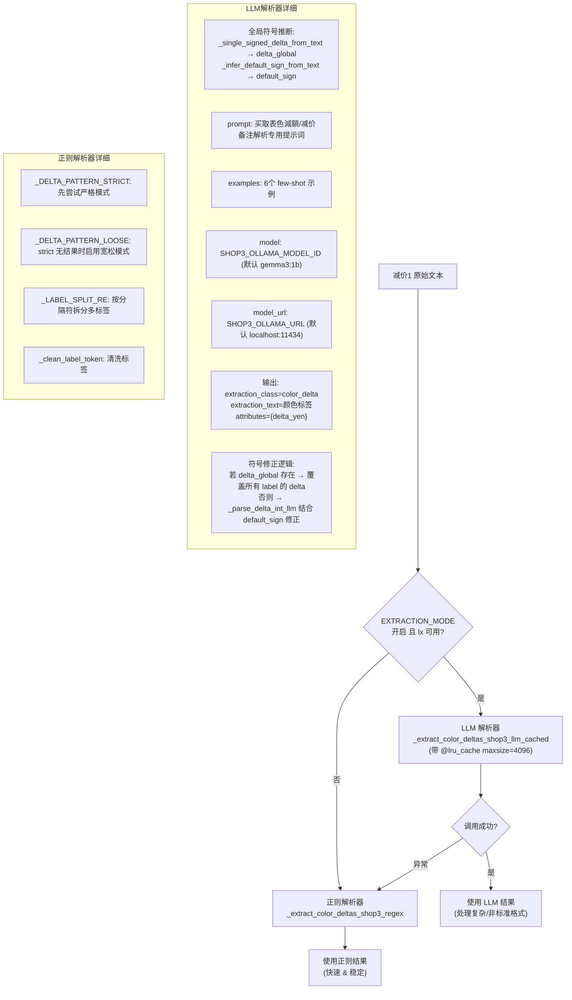

### 3.4 全局符号修正机制 (delta_global / default_sign)

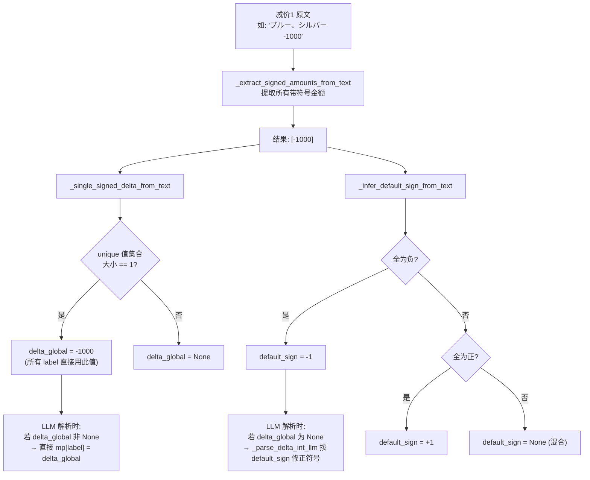

### 3.5 颜色家族匹配机制

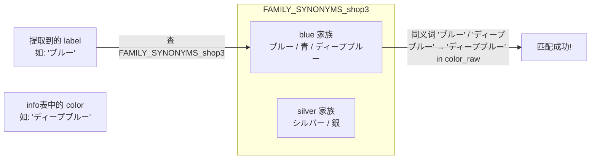

---

## 四、配置项说明

| 环境变量 | 默认值 | 说明 |
|---------|--------|------|
| `EXTRACTION_MODE` | `"regex"` | regex / llm / auto（cleaner_tools） |
| `OLLAMA_MODEL_ID` | `"gemma3:1b"` | Ollama 模型 ID（cleaner_tools） |
| `OLLAMA_URL` | `"http://localhost:11434"` | Ollama 服务地址（cleaner_tools） |
| `IPHONE17_INFO_CSV` | 自动推断路径 (`data/iphone17_info.csv`) | iphone17_info 参考文件路径 |

| 函数参数 | 默认值 | 说明 |
|---------|--------|------|
| `clean_shop3(debug=)` | `True` | 是否启用 debug 打印 |
| `clean_shop3(debug_limit=)` | `30` | debug 打印最大行数 |
| `@lru_cache(maxsize=)` | `4096` | LLM 调用缓存大小（`_extract_color_deltas_shop3_llm_cached`） |

---

## 五、关键正则表达式

| 名称 | 模式 | 用途 | 示例匹配 |
|------|------|------|---------|
| `_DELTA_PATTERN_STRICT` | `(?P<labels>[^+\-−－\d¥￥円]+?)(?P<sign>[+\-−－])\s*(?P<amount>[０-９0-9][０-９0-9,，]*)\s*(?:円)?` | 严格模式：匹配"颜色标签±金额"（标签中不含数字/符号） | `ブルー-1000`, `シルバー-3,000` |
| `_DELTA_PATTERN_LOOSE` | `(?P<labels>[\u3000\u30A0-\u30FF\u4E00-\u9FFF\w\-\s\/、，,・]+?)(?P<sign>[+\-−－])\s*(?P<amount>[０-９0-9][０-９0-9,，]*)\s*(?:円)?` | 宽松模式：标签允许包含片假名/汉字/空格等（strict 无结果时启用） | `ディープブルー-3,000`, `ブラック、ブルー-4000` |
| `_LABEL_SPLIT_RE` | `[／/、，,・\s；;]+` | 拆分多标签共用金额的标签部分 | `ブルー、シルバー` → `['ブルー', 'シルバー']` |
| `_SIGNED_AMOUNT_PAT` | `([+\-−－])\s*([0-9０-９][0-9０-９,，]*)` | 从原文中提取所有带符号金额（用于 delta_global/default_sign 推断） | `-1000`, `−3,000`, `＋２,０００` |
| `_NUM_MODEL_PAT` | `(iPhone)\s*(\d{2})(?:\s*(Pro\s*Max\|Pro\|Plus\|mini))?` | 匹配数字代号机型 | `iPhone 17 Pro Max`, `iPhone16Plus` |
| `_AIR_PAT` | `(iPhone)\s*(Air)(?:\s*(Pro\s*Max\|Pro\|Plus\|mini))?` | 匹配 iPhone Air | `iPhone Air` |
| `_FZ_TO_HZ_TRANS` | 全角→半角映射表 | 统一全角数字/标点为半角 | `０`→`0`, `，`→`,`, `－`→`-`, `＋`→`+` |
