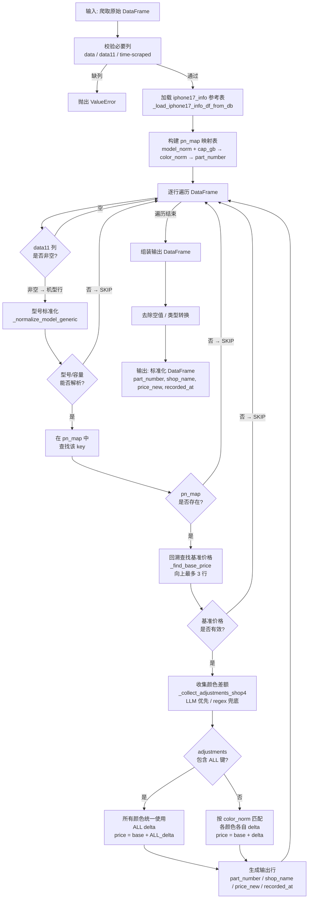
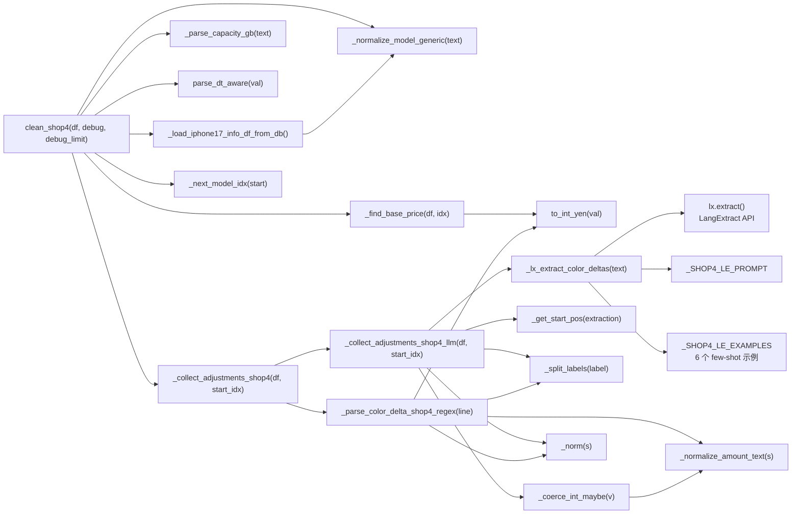
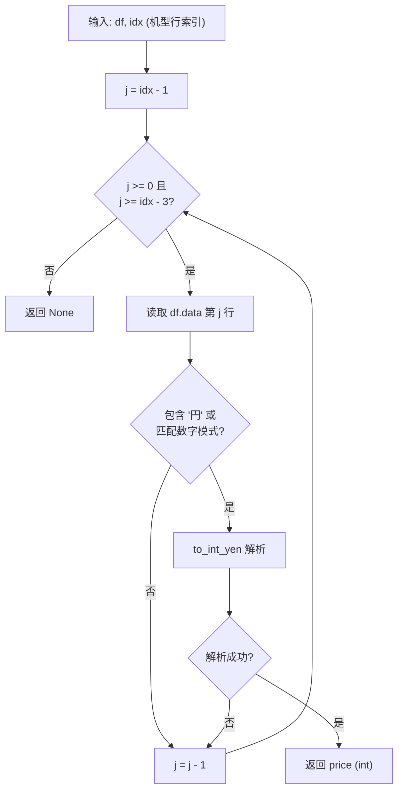
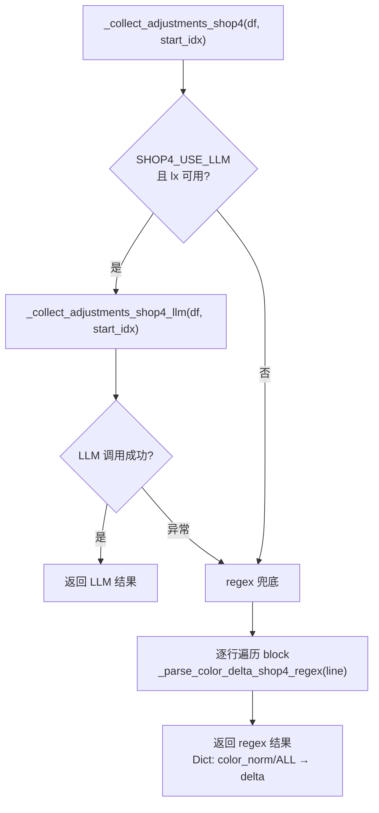
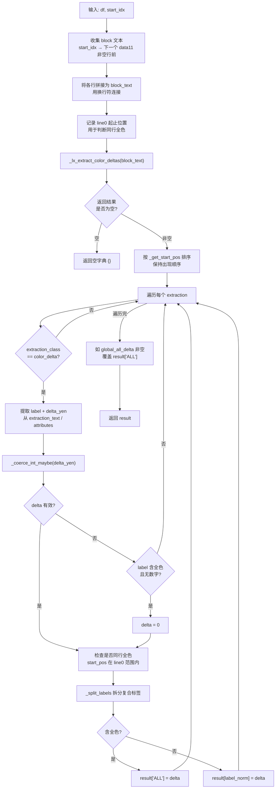
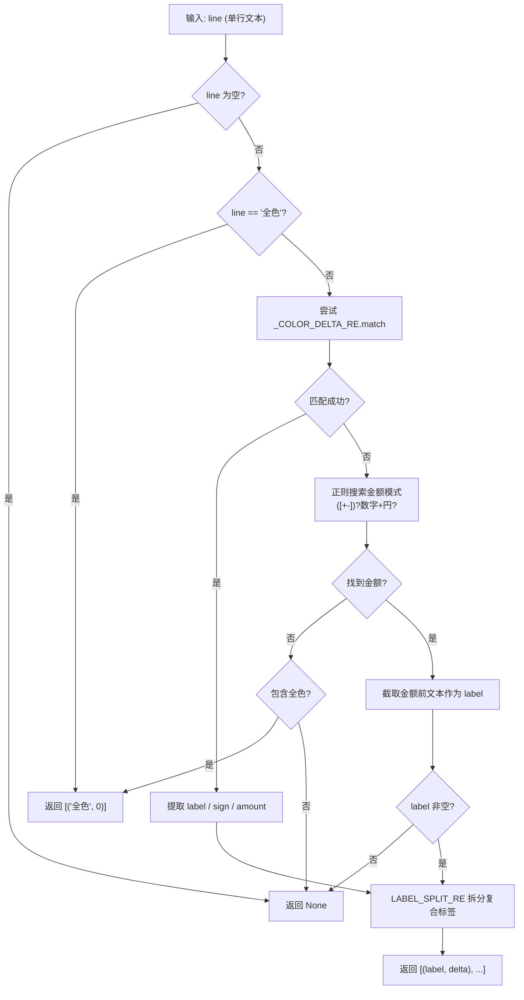
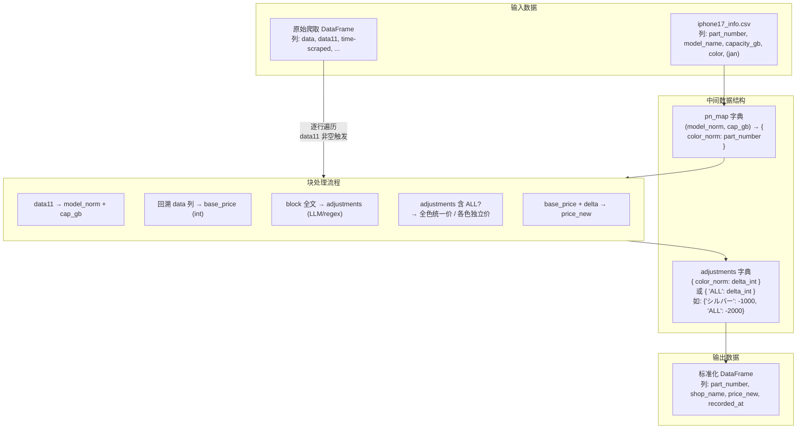
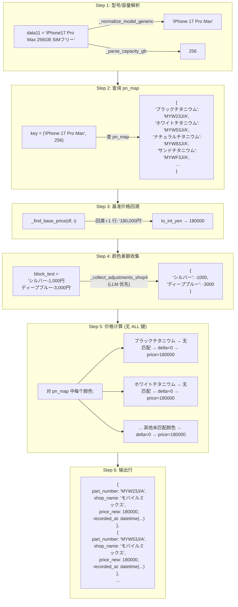
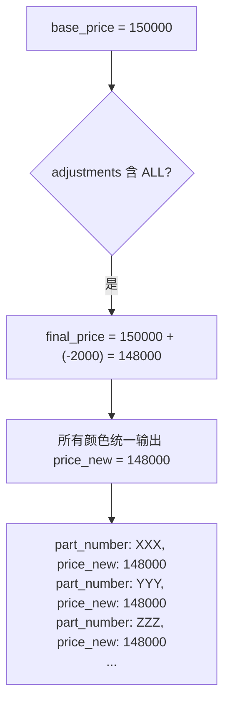
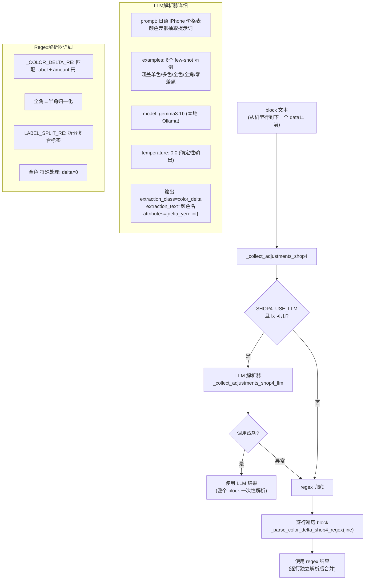

# Shop4 清洗器详细流程说明

> 文件路径: `AppleStockChecker/utils/external_ingest/shop_cleaners_split/shop4_cleaner.py`
> 店铺名称: モバイルミックス (Mobile Mix)

---

## 一、总流程图

整个 shop4 清洗器的核心入口是 `clean_shop4(df, debug, debug_limit)` 函数，从原始爬取的 DataFrame 到输出标准化的买取价格 DataFrame。

shop4 采用 **块（block）处理** 模式：`data11` 列非空的行标记一个新机型块的开始，后续行直到下一个 `data11` 非空行之前均属于同一块。基准价格通过向上回溯（而非当前行）获取，颜色差额则从整个块中提取。



---

## 二、函数流程图

### 2.1 函数调用关系总览



### 2.2 核心函数详细说明

#### `clean_shop4(df: pd.DataFrame, debug: bool = True, debug_limit: int = 30) -> pd.DataFrame`
- **作用**: 清洗器主入口，将原始爬取数据转化为标准四列输出
- **输入**: 包含 `data`, `data11`, `time-scraped` 列的 DataFrame
- **输出**: 包含 `part_number`, `shop_name`("モバイルミックス"), `price_new`, `recorded_at` 列的 DataFrame
- **处理流程**:
  1. 校验必要列是否存在
  2. 加载 iphone17_info 并构建 `pn_map` (型号+容量 → 颜色→品番) 映射
  3. 逐行遍历，仅在 `data11` 非空时触发处理（标识一个新的机型块）
  4. 对每个机型块：解析型号/容量 → 查 pn_map → 回溯基准价 → 收集颜色差额 → 输出行

#### `_find_base_price(df: pd.DataFrame, idx: int) -> Optional[int]`
- **作用**: 向上回溯查找基准价格
- **流程**:



#### `_normalize_model_generic(text: str) -> str`
- **作用**: 将各种型号写法统一为标准格式
- **处理**: 日文别名转英文 (プロ→Pro) / 紧凑写法展开 (17pro→17 Pro) / 去噪 (容量/SIM信息)
- **输出**: 如 `"iPhone 17 Pro Max"`, `"iPhone Air"`, `"iPhone 16 Plus"`

#### `_parse_capacity_gb(text: str) -> Optional[int]`
- **作用**: 从文本中提取容量 (GB)
- **处理**: 支持 TB→GB 换算 (1TB=1024GB)，支持 `"256GB"`, `"1TB"` 等格式

#### `_collect_adjustments_shop4(df: pd.DataFrame, start_idx: int) -> Dict[str, int]`
- **作用**: 颜色差额提取的统一入口，采用 **LLM 优先、regex 兜底** 策略



#### `_collect_adjustments_shop4_llm(df: pd.DataFrame, start_idx: int) -> Dict[str, int]`
- **作用**: 用 LangExtract 一次性解析整个机型块的所有颜色±金额
- **返回**: `{ color_norm | "ALL" : delta_int }`
- **流程**:



#### `_lx_extract_color_deltas(text: str) -> List`
- **作用**: 对文本做一次 LangExtract 抽取，返回 extractions 列表
- **配置参数**:
  - `model_id`: SHOP4_OLLAMA_MODEL_ID (默认 gemma3:1b)
  - `model_url`: SHOP4_OLLAMA_URL (默认 localhost:11434)
  - `temperature`: 0.0 (确定性输出)
  - `prompt`: _SHOP4_LE_PROMPT (专用日语 iPhone 价格表解析提示词)
  - `examples`: 6 个 few-shot 示例
  - `extraction_passes`: 1
  - `max_char_buffer`: 1500

#### `_parse_color_delta_shop4_regex(line: str) -> Optional[List[Tuple[str, int]]]`
- **作用**: 正则版单行颜色差额提取（regex 兜底时逐行调用）
- **流程**:



#### `_get_start_pos(extraction) -> int`
- **作用**: 从 LangExtract 的 extraction 对象中提取 `char_interval` 的起始位置
- **兼容性**: 支持属性访问 (`start_pos`/`start`/`begin`) 和字典访问两种方式

#### `_split_labels(label: str) -> List[str]`
- **作用**: 按分隔符 (`／ / 、 ， , ・ 空格`) 拆分复合颜色标签
- **示例**: `"シルバー/ディープブルー"` → `["シルバー", "ディープブルー"]`

#### `_coerce_int_maybe(v) -> Optional[int]`
- **作用**: 宽容地将各种类型值转为 int（支持全角负号/半角负号/字符串数字）
- **处理链**: 判断类型 → 提取符号 → `_normalize_amount_text` 解析数字部分 → 返回带符号整数

#### `_normalize_amount_text(s: str) -> Optional[int]`
- **作用**: 将含全角数字/逗号/货币符号的金额文本转为半角纯数字 int
- **处理**: 先做全角→半角转换表 (`_FZ_TO_HZ_TRANS`)，再正则提取数字串

#### `_norm(s: str) -> str`
- **作用**: 简单文本归一化，strip 空白
- **返回**: `(s or "").strip()`

---

## 三、数据流程图

### 3.1 整体数据流



### 3.2 块（Block）结构示意

shop4 的数据以"块"为单位组织。`data11` 列非空标记一个新机型块的开始，基准价格在机型行 **上方** 回溯获取。

```
行号  data11              data
───── ──────────────────  ─────────────────────────
 i-2  (空)                "150,000円"          ← 基准价格（回溯找到）
 i-1  (空)                "..."
 i    "iPhone17 Pro 256"  "シルバー/ブルー-1,000円"  ← 机型行（block 起点）
 i+1  (空)                "ディープブルー-3,000円"    ← block 内容行
 i+2  (空)                "全色-2,000円"            ← block 内容行
 i+3  "iPhone17 Plus 128" "..."                     ← 下一个 block 起点
```

### 3.3 单行数据处理示例

以一个实际机型块为例，展示完整的数据转换过程:

```
输入块:
  行 i-1: data = "180,000円"           (基准价格行)
  行 i  : data11 = "iPhone17 Pro Max 256GB SIMフリー"
           data  = "シルバー-1,000円"
  行 i+1: data  = "ディープブルー-3,000円"
  time-scraped = "2025-06-01 12:00:00"
```



### 3.4 含"全色/ALL"的处理示例

当 adjustments 中包含 `"ALL"` 键时，所有颜色统一使用该 delta：

```
输入块:
  行 i-1: data = "150,000円"
  行 i  : data11 = "iPhone17 Plus 128GB"
           data  = "全色-2,000円"

adjustments = {"ALL": -2000}
```



### 3.5 颜色差额提取 - LLM vs Regex 策略



---

## 四、配置项说明

OLLAMA 与 EXTRACTION_MODE 配置已统一迁移至 `cleaner_tools.py`。

| 环境变量 | 默认值 | 说明 |
|---------|--------|------|
| `EXTRACTION_MODE` | `"regex"` | regex / llm / auto（cleaner_tools） |
| `OLLAMA_MODEL_ID` | `"gemma3:1b"` | Ollama 模型 ID（cleaner_tools） |
| `OLLAMA_URL` | `"http://localhost:11434"` | Ollama 服务地址（cleaner_tools） |
| `IPHONE17_INFO_CSV` | 自动推断路径 (`data/iphone17_info.csv`) | iphone17_info 参考表文件路径 |

> **注**: `debug` 和 `debug_limit` 为函数参数（非环境变量），分别控制是否打印调试信息和最大打印机型数（默认 30）。

---

## 五、关键正则表达式

| 名称 | 模式 | 用途 | 示例匹配 |
|------|------|------|---------|
| `_COLOR_DELTA_RE` | `^\s*(?P<label>全色\|[\S　 ]*?[^\s　])\s*(?P<sign>[+\-−－])?\s*(?P<amount>\d[\d,]*)\s*円?\s*$` | 匹配"颜色标签±金额"格式的完整行 | `シルバー-1,000円`, `全色+0円`, `ディープブルー-3000` |
| `LABEL_SPLIT_RE` | `[／/、，,・\s]+` | 拆分复合颜色标签 | `シルバー/ディープブルー` → `["シルバー", "ディープブルー"]` |
| `_NUM_MODEL_PAT` | `(iPhone)\s*(\d{2})(?:\s*(Pro\s*Max\|Pro\|Plus\|mini))?` | 匹配数字代号 iPhone 机型 | `iPhone 17 Pro Max`, `iPhone17Pro` |
| `_AIR_PAT` | `(iPhone)\s*(Air)(?:\s*(Pro\s*Max\|Pro\|Plus\|mini))?` | 匹配 iPhone Air 机型 | `iPhone Air` |
| `_FZ_TO_HZ_TRANS` | 全角→半角转换表 | 将全角数字/符号/货币符号统一为半角 | `０` → `0`, `－` → `-`, `￥` → (删除) |
| `_DEBUG_HINT_PAT` | `(全色\|シルバー\|ブルー\|...\|[+-]\s*\d\|[\d,]+\s*円)` | 调试用：判断行是否包含颜色/价格相关内容 | `シルバー-1,000円`, `全色`, `150,000円` |
| 金额回退正则 (内联) | `([+\-−－])?\s*([０-９0-9][０-９0-9,，]*)\s*円?` | `_parse_color_delta_shop4_regex` 中 `_COLOR_DELTA_RE` 不匹配时的回退金额搜索 | `＋０円`, `-3,000円` |
| 基准价格行检测 (内联) | `\d[\d,]*` | `_find_base_price` 中判断回溯行是否含金额 | `180,000`, `150000円` |
