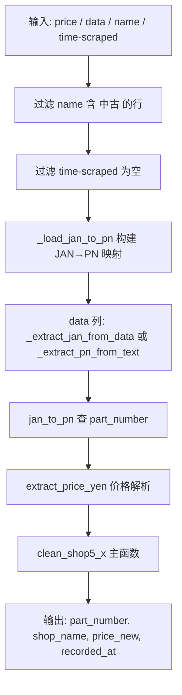

# Shop5 清洗器（森森買取系列）详细流程说明

> 文件路径: `AppleStockChecker/utils/external_ingest/shop_cleaners_split/shop5_cleaner.py`（统一实现，shop5_1～4 多注册）
> 店铺名称: 森森買取（shop5_1～shop5_4 为同一店铺不同数据源变体）

---

## 一、总流程图

shop5_1～shop5_4 为结构相似的四个清洗器，均从 data 列解析 JAN 或 PN，通过 `_load_jan_to_pn()` 映射到 part_number。

---

## 二、各子模块说明

| 模块 | 主函数 | 输入列 | 说明 |
|------|--------|--------|------|
| shop5_1 | `clean_shop5_1` | price, data, name, time-scraped | JAN 从 data 提取 |
| shop5_2 | `clean_shop5_2` | 同上 | 同上 |
| shop5_3 | `clean_shop5_3` | 同上 | 同上 |
| shop5_4 | `clean_shop5_4` | 同上 | 同上 |

---

## 三、核心函数说明

| 函数 | 作用 |
|------|------|
| `_load_jan_to_pn()` | 从 iphone17_info CSV 构建 JAN → part_number 映射 |
| `_extract_jan_from_data(x)` | 从 data 文本提取 13 位 JAN（如 'JAN:4549995648300'） |
| `_extract_pn_from_text(text)` | 从文本提取 part_number（shop6 系列） |
| `extract_price_yen(raw)` | 价格解析（cleaner_tools） |

---

## 四、配置项说明

shop5 系列无 OLLAMA / EXTRACTION_MODE 配置。机型信息来自 `IPHONE17_INFO_CSV` 或 `EXTERNAL_IPHONE17_INFO_PATH`。
