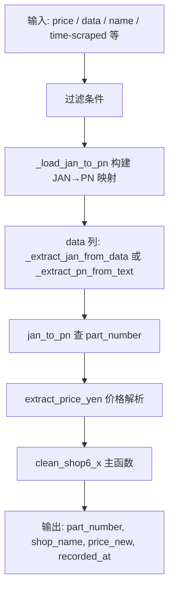

# Shop6 清洗器系列详细流程说明

> 文件路径: `AppleStockChecker/utils/external_ingest/shop_cleaners_split/shop6_1_cleaner.py` ～ `shop6_4_cleaner.py`

---

## 一、总流程图

shop6_1～shop6_4 为结构相似的四个清洗器，从 data 列解析 JAN 或 PN，通过 `_load_jan_to_pn()` 映射到 part_number。

---

## 二、各子模块说明

| 模块 | 主函数 | 说明 |
|------|--------|------|
| shop6_1 | `clean_shop6_1` | JAN/PN 解析子模块 |
| shop6_2 | `clean_shop6_2` | 同上 |
| shop6_3 | `clean_shop6_3` | 同上 |
| shop6_4 | `clean_shop6_4` | 同上 |

---

## 三、核心函数说明

| 函数 | 作用 |
|------|------|
| `_load_jan_to_pn()` | 从 iphone17_info CSV 构建 JAN → part_number 映射 |
| `_extract_pn_from_text(text)` | PN_REGEX 提取型番 |
| `extract_price_yen(raw)` | 价格解析（cleaner_tools） |

---

## 四、配置项说明

shop6 系列无 OLLAMA / EXTRACTION_MODE 配置。
