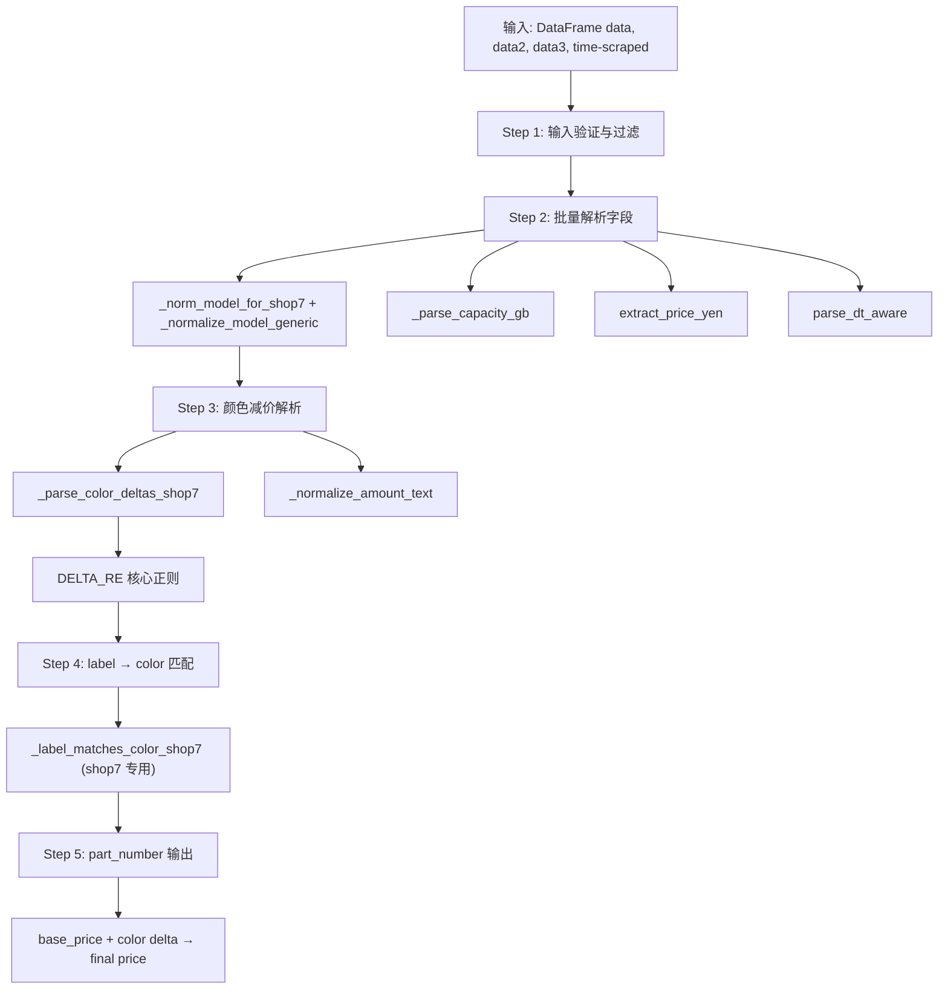

# Shop7 清洗器详细流程说明

> 文件路径: `AppleStockChecker/utils/external_ingest/shop_cleaners_split/shop7_cleaner.py`
> 店铺名称: 買取ホムラ

---

## 一、总流程图

整个 shop7 清洗器的核心入口是 `clean_shop7(df)` 函数，采用纯正则解析（无 LLM  dispatch）。

---

## 二、核心函数说明

| 函数 | 作用 |
|------|------|
| `_norm_model_for_shop7(text)` | 短写扩展 + _normalize_model_generic（cleaner_tools） |
| `_parse_capacity_gb(text)` | 容量解析（cleaner_tools） |
| `extract_price_yen(raw)` | 基础价提取（cleaner_tools） |
| `_parse_color_deltas_shop7(text)` | 下一行检测 + DELTA_RE 正则提取颜色差价 |
| `_label_matches_color_shop7(label_raw, col_raw, col_norm)` | 精确 | 子串匹配（shop7 专用，非 cleaner_tools 统一） |
| `_build_color_map(info_df)` | 构建颜色映射（cleaner_tools） |

---

## 三、配置项说明

shop7 无 EXTRACTION_MODE / OLLAMA 配置，采用纯正则流程。机型信息来自 `_load_iphone17_info_df_from_db()`。
