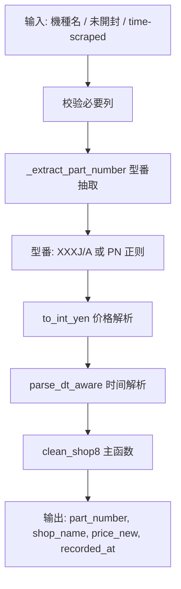

# Shop8 清洗器详细流程说明

> 文件路径: `AppleStockChecker/utils/external_ingest/shop_cleaners_split/shop8_cleaner.py`
> 店铺名称: 買取wiki

---

## 一、总流程图

整个 shop8 清洗器流程简单，无 LLM、无颜色拆解，直接映射型番与价格。

---

## 二、核心函数说明

| 函数 | 作用 |
|------|------|
| `_extract_part_number(text)` | 优先显式「型番: XXXXXJ/A」，兜底 PN 正则 |
| `to_int_yen(val)` | 价格解析 |
| `parse_dt_aware(val)` | 时间解析 |
| `normalize_text_basic(text)` | 全角→半角（cleaner_tools） |

---

## 三、配置项说明

shop8 无 OLLAMA / EXTRACTION_MODE 配置。
