# Shop9 清洗器详细流程说明

> 文件路径: `AppleStockChecker/utils/external_ingest/shop_cleaners_split/shop9_cleaner.py`
> 店铺名称: アキモバ

---

## 一、总流程图

整个 shop9 清洗器的核心入口是 `clean_shop9(df, debug, debug_limit)` 函数，从原始爬取的 DataFrame 到输出标准化的买取价格 DataFrame。与 shop17 不同，shop9 采用 **LLM 优先、正则兜底** 策略，且区分绝对价格 (abs) 和差额 (delta) 两种提取结果。

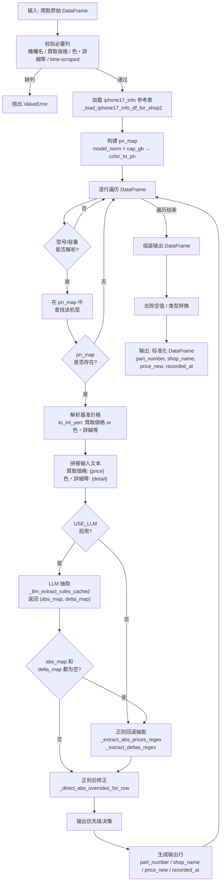

---

## 二、函数流程图

### 2.1 函数调用关系总览

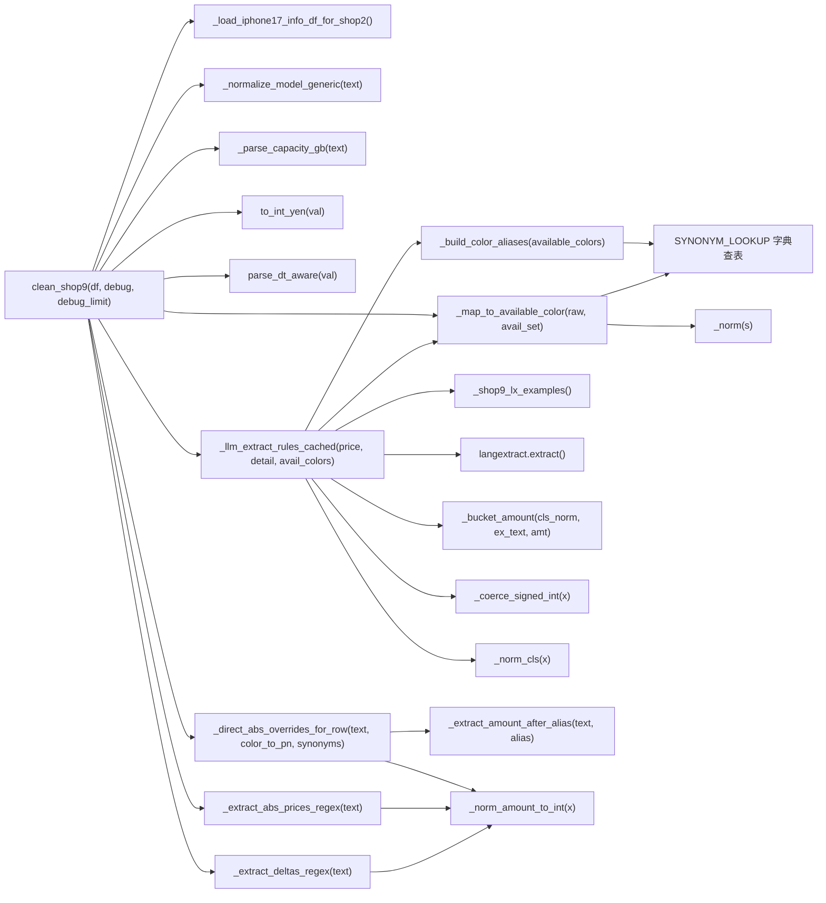

### 2.2 核心函数详细说明

#### `clean_shop9(df: pd.DataFrame, debug: bool, debug_limit: int) -> pd.DataFrame`
- **作用**: 清洗器主入口，将原始爬取数据转化为标准四列输出
- **输入**: 包含 `機種名`, `買取価格`, `色・詳細等`, `time-scraped` 列的 DataFrame
- **输出**: 包含 `part_number`, `shop_name`("アキモバ"), `price_new`, `recorded_at` 列的 DataFrame
- **debug 模式**: 通过 COLOR_PAT / DISCOUNT_PAT / ABS_PRICE_PAT 三个正则筛选"疑似有颜色价格信息"的行，最多打印 debug_limit 行

#### `_normalize_model_generic(text: str) -> str`
- **作用**: 将各种型号写法统一为标准格式
- **处理**: 日文别名转英文 (プロ→Pro) / 紧凑写法展开 (17pro→17 Pro) / 去噪 (容量/SIM信息)
- **输出**: 如 `"iPhone 17 Pro Max"`, `"iPhone Air"`, `"iPhone 16 Plus"`

#### `_parse_capacity_gb(text: str) -> Optional[int]`
- **作用**: 从文本中提取容量 (GB)
- **处理**: 支持 TB→GB 换算 (1TB=1024GB)，支持 `"256GB"`, `"1TB"` 等格式

#### `_llm_extract_rules_cached(price_text, detail_text, avail_colors_key) -> Tuple[Dict, Dict]`
- **作用**: LLM 核心抽取函数，带 `@lru_cache(maxsize=4096)` 缓存
- **返回**: `(abs_map, delta_map)` 双映射字典
- **流程**:

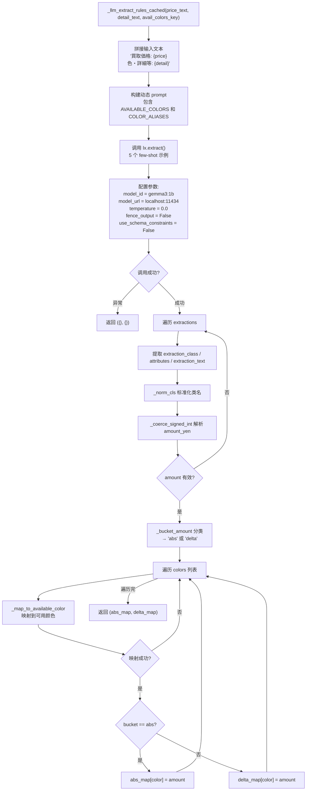

#### `_bucket_amount(cls_norm: str, ex_text: str, amt: int) -> str`
- **作用**: 将 LLM 提取结果分类为 "abs"（绝对价）或 "delta"（差额）
- **判定逻辑**:

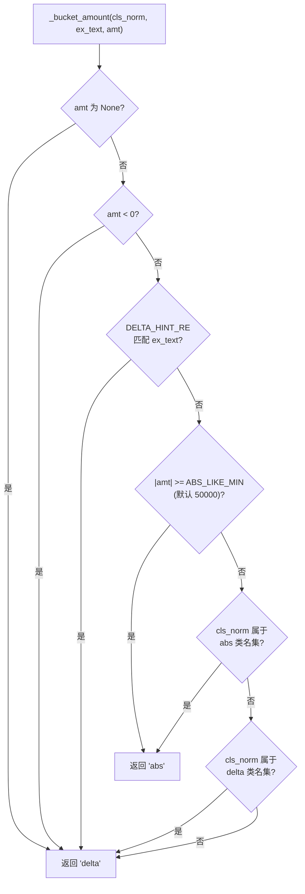

#### `_map_to_available_color(raw_color: str, available_set: set) -> Optional[str]`
- **作用**: 将 LLM/正则提取到的颜色标签映射到 pn_map 中的可用颜色
- **匹配策略** (四级宽松匹配):

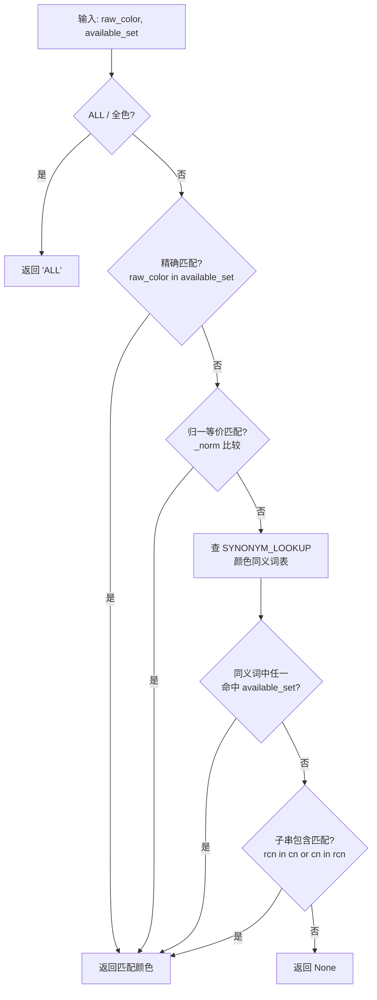

#### `_direct_abs_overrides_for_row(raw_color_text, color_to_pn, synonym_lookup) -> Dict[str, int]`
- **作用**: 正则后修正层，直接扫描原始文本中"颜色别名 + 紧随数字"模式，覆盖 abs_map
- **流程**:

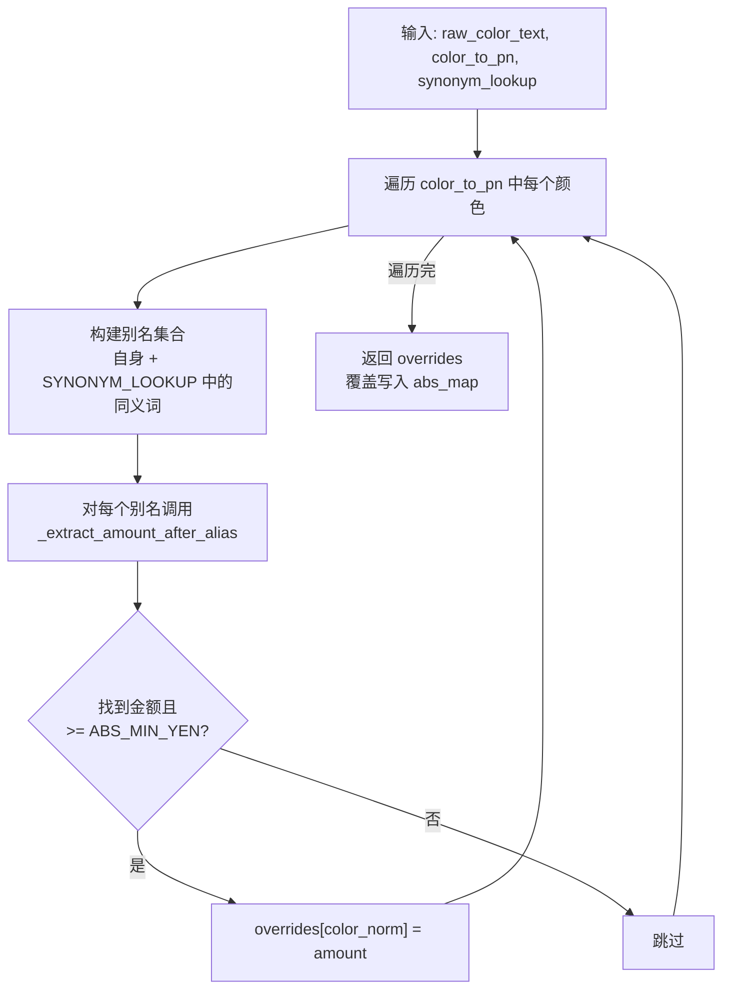

#### `_shop9_lx_examples() -> List[ExampleData]`
- **作用**: 返回 5 个 few-shot 示例，带 `@lru_cache(maxsize=1)` 缓存
- **示例场景覆盖**:
  1. 多颜色共享一个绝对价 + 另一颜色不同绝对价
  2. 每颜色独立 delta (正/负)
  3. 全色 delta ("全色-500円")
  4. 纯绝对价无基准价 ("買取価格: -")
  5. 紧凑格式多颜色多价格 ("橙,銀230,500/青229,000")

#### `_build_color_aliases(available_colors) -> Dict[str, List[str]]`
- **作用**: 为当前行的可用颜色列表构建别名映射，注入到 LLM prompt 中
- **数据源**: SYNONYM_LOOKUP (由 FAMILY_SYNONYMS_SHOP9 展开)

#### `_coerce_signed_int(x) -> Optional[int]`
- **作用**: 将各种格式的数字文本转为带符号整数
- **处理**: 全角→半角 / 千分位忽略 / 正负号识别 / 容错终止

#### `_extract_abs_prices_regex(text) -> List[Tuple[str, int]]`
- **作用**: 正则回退版绝对价提取
- **正则**: ABS_PRICE_RE 匹配 "标签 + 金额" 模式

#### `_extract_deltas_regex(text) -> List[Tuple[str, int]]`
- **作用**: 正则回退版差额提取
- **正则**: DELTA_RE 匹配 "标签 +/- 金额" 模式
- **特殊**: "全色" 关键词触发 ALL delta 回退

#### `_norm(s: str) -> str` (内部版)
- **作用**: 局部文本归一化 (全角→半角数字、空白统一、小写化)

#### `_norm_cls(x: str) -> str`
- **作用**: 标准化 extraction_class 名称 (小写 + 分隔符统一为下划线)

---

## 三、数据流程图

### 3.1 整体数据流

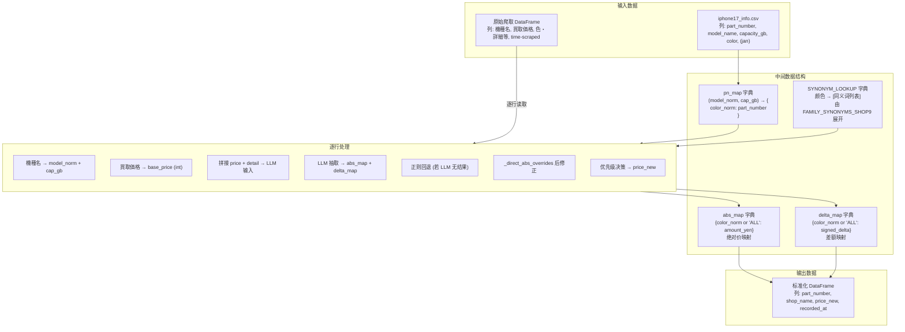

### 3.2 单行数据处理示例

以一行实际数据为例，展示完整的数据转换过程:

```
输入行:
  機種名       = "iPhone17 Pro Max 256GB SIMフリー"
  買取価格     = "195,500円"
  色・詳細等   = "未開 橙194,500/青,銀195,500"
  time-scraped = "2025-06-01 12:00:00"
```

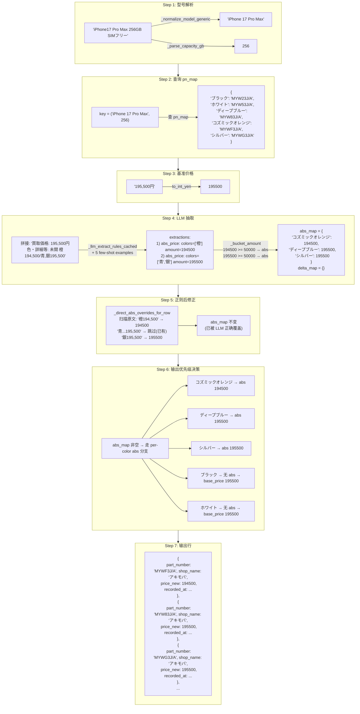

### 3.3 LLM 优先 + 正则兜底 + 后修正 策略

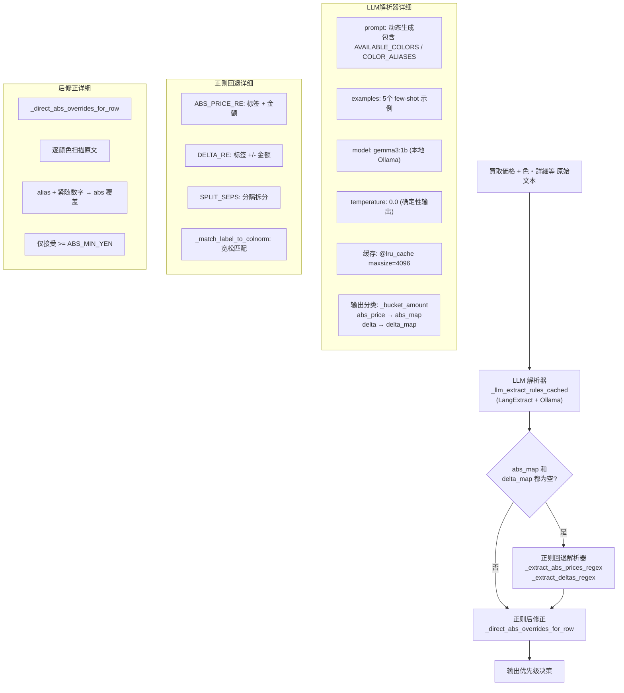

### 3.4 输出优先级决策

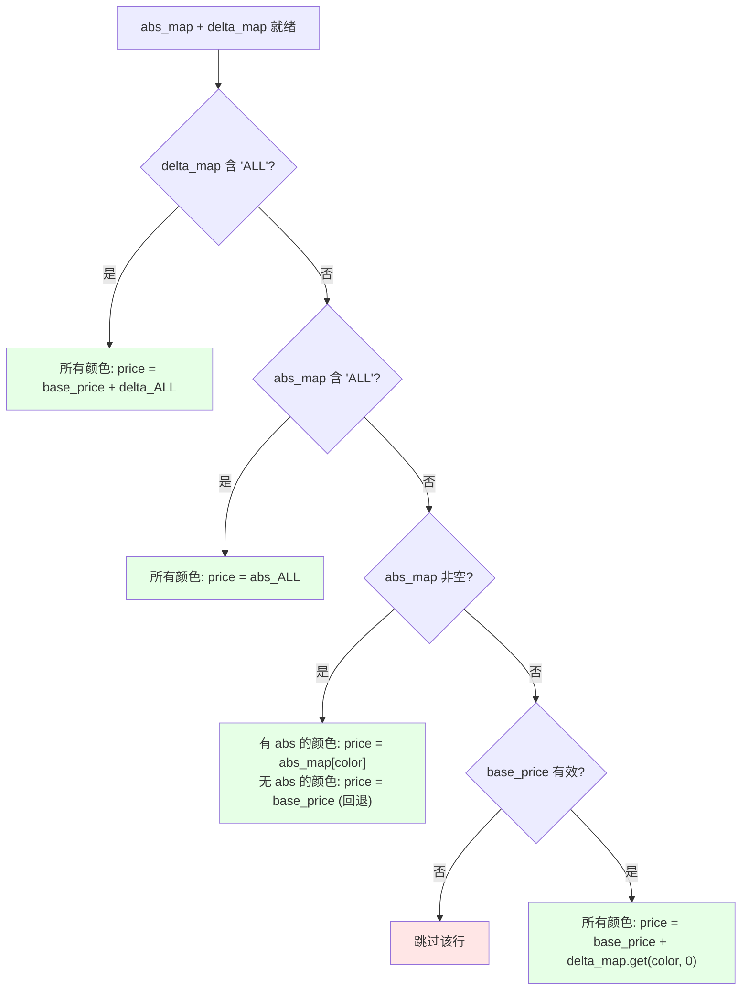

### 3.5 颜色家族匹配机制

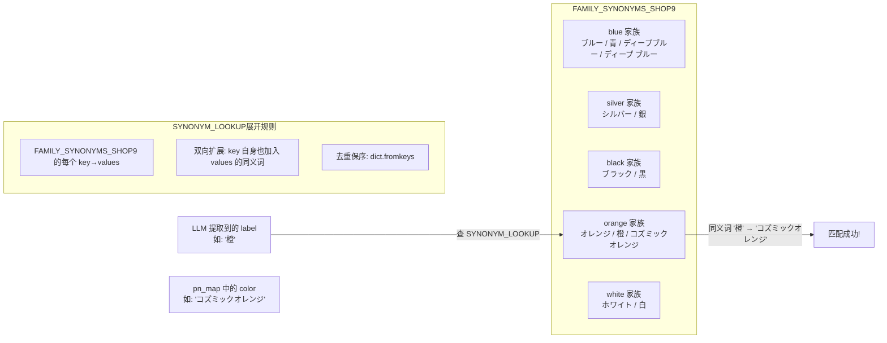

---

## 四、配置项说明

| 环境变量 | 默认值 | 说明 |
|---------|--------|------|
| `SHOP9_USE_LLM` | `"1"` (启用) | 是否启用 LLM 抽取；设为 `"0"` / `"false"` / `"no"` 则关闭 |
| `SHOP9_OLLAMA_HOST` | `"http://localhost:11434"` | Ollama 服务地址 (回退到 `OLLAMA_HOST`) |
| `SHOP9_LX_MODEL_ID` | `"gemma3:1b"` | LangExtract 使用的 Ollama 模型 ID (回退到 `SHOP9_LLM_MODEL_ID`) |
| `SHOP9_LLM_TEMPERATURE` | `"0.0"` | LLM 温度参数，0.0 为确定性输出 |
| `SHOP9_ABS_LIKE_MIN` | `"50000"` | 绝对价量级阈值：金额 >= 此值且无 delta 线索则分类为 abs |
| `SHOP9_ALLOW_REGEX_FALLBACK` | `"1"` (启用) | LLM 无结果时是否允许正则回退；设为 `"0"` / `"false"` 则禁用 |
| `IPHONE17_INFO_CSV` | 自动推断路径 | iphone17_info 文件路径 |

---

## 五、关键正则表达式

| 名称 | 模式 | 用途 | 示例匹配 |
|------|------|------|---------|
| `_NUM_MODEL_PAT` | `(iPhone)\s*(\d{2})(?:\s*(Pro\s*Max\|Pro\|Plus\|mini))?` | 匹配数字代号机型 | `iPhone 17 Pro Max`, `iPhone17ProMax` |
| `_AIR_PAT` | `(iPhone)\s*(Air)(?:\s*(Pro\s*Max\|Pro\|Plus\|mini))?` | 匹配 iPhone Air | `iPhone Air` |
| `DELTA_HINT_RE` | `(?:[+\-−－]\|値下げ\|値引\|割引\|円引\|OFF\|オフ\|減額)` | 判断文本是否含 delta 线索 | `値下げ`, `-2000`, `OFF` |
| `ABS_PRICE_RE` | `(?P<labels>[^0-9...]+?)\s*(?:¥\|￥)?\s*(?P<amount>[0-9...][0-9,]*)\s*(?:円)?` | 正则回退：匹配"标签 + 绝对金额" | `青 229,000円`, `ブルー：229000` |
| `DELTA_RE` | `(?P<labels>...)\s*[：:\-]?\s*(?P<sign>[+\-−－])\s*(?:¥\|￥)?\s*(?P<amount>...)\s*(?:円)?` | 正则回退：匹配"标签 +/- 差额" | `ブラック -2,000円`, `シルバー:+1000` |
| `SPLIT_SEPS` | `[/／、，,;；\s]+` | 拆分多个颜色条目 | `橙194,500/青195,500` |
| `_extract_amount_after_alias` (内部) | `{alias}\s*(?:¥\|￥)?\s*([0-9][0-9,]*)` | 后修正：在别名后提取紧随的绝对价 | `橙194,500`, `シルバー 195500` |
| `COLOR_PAT` (debug) | `(ブラック\|ホワイト\|ブルー\|...\|Titanium)` | Debug 模式：筛选含颜色关键词的行 | `ブラック`, `Silver` |
| `DISCOUNT_PAT` (debug) | `(値下げ\|値引\|割引\|円引\|OFF\|オフ\|[+\-]\s*[0-9])` | Debug 模式：筛选含折扣关键词的行 | `値下げ`, `-500` |
| `ABS_PRICE_PAT` (debug) | `(?:¥\|￥)?\s*[0-9]{2,3}(?:[0-9,]{3,})\s*(?:円)?` | Debug 模式：筛选含绝对价格式的行 | `¥195,500円`, `230000` |
