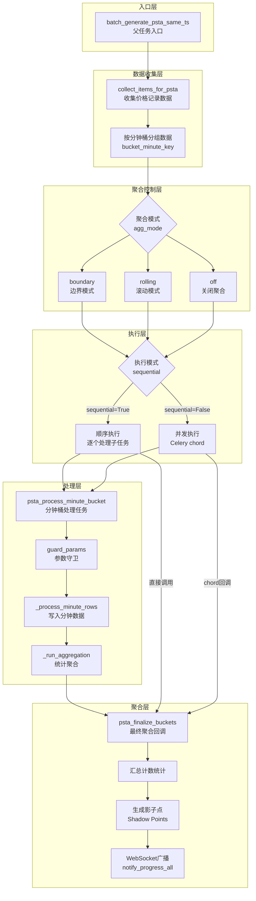
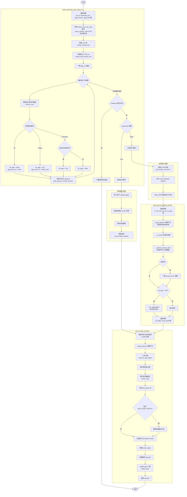
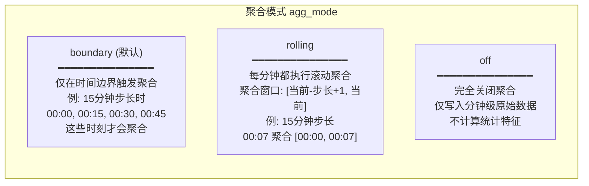
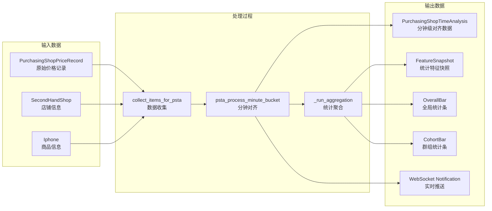
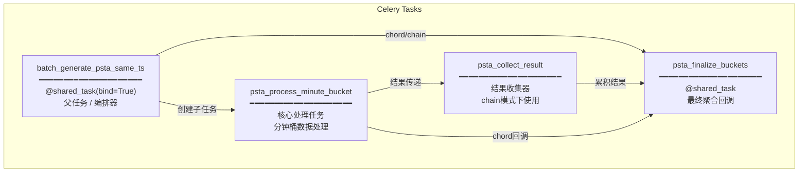
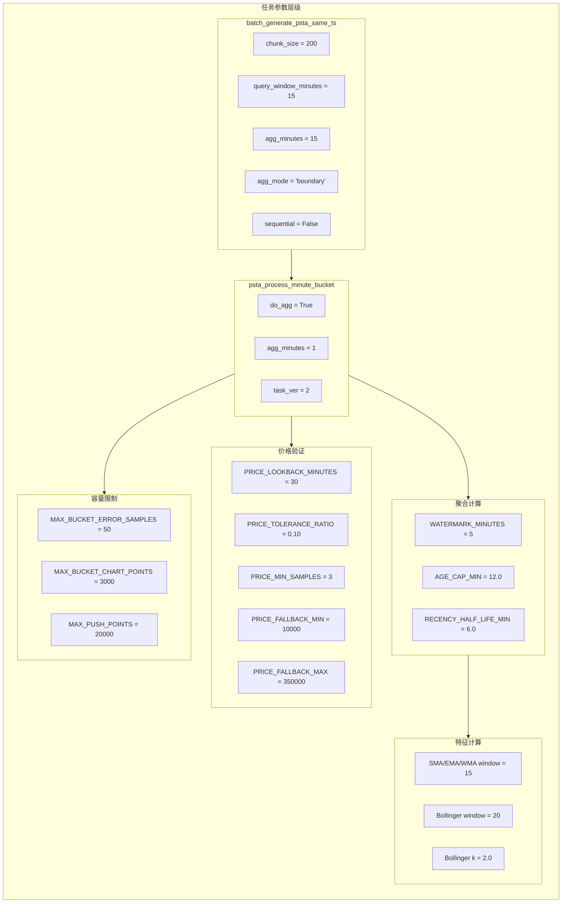

# Timestamp Alignment Task 流程图

本文档描述 `timestamp_alignment_task.py` 中的任务执行流程。

## 整体架构图

## 详细流程图

## 聚合模式详解

## 数据流图

## 任务关系图

## 关键函数说明

| 函数名 | 位置 | 说明 |
|--------|------|------|
| `batch_generate_psta_same_ts` | L3518 | 父任务入口，负责数据收集、分桶、任务编排 |
| `psta_process_minute_bucket` | L1988 | 核心处理任务，写入分钟数据并可选执行聚合 |
| `psta_collect_result` | L3287 | chain模式下累积子任务结果 |
| `psta_finalize_buckets` | L3320 | 最终聚合回调，汇总结果并广播通知 |
| `guard_params` | L67 | 参数守卫，类型校验、版本检查、别名迁移 |
| `_process_minute_rows` | L1690 | 处理并写入分钟级数据 |
| `_run_aggregation` | L1838 | 执行统计聚合计算 |
| `collect_items_for_psta` | (collectors) | 从数据库收集待处理的价格记录 |

## 执行模式对比

| 特性 | 顺序执行 (sequential=True) | 并发执行 (sequential=False) |
|------|---------------------------|---------------------------|
| 执行方式 | `subtask.apply().get()` | Celery `chord` |
| 资源占用 | 低，单worker | 高，多worker并行 |
| 执行速度 | 较慢 | 较快 |
| 错误处理 | 逐个捕获，继续执行 | chord失败可能中断 |
| 进度通知 | 每个桶完成后通知 | 仅最终结果通知 |
| 适用场景 | 调试、资源受限环境 | 生产环境、大数据量 |

---

## 默认数字参数汇总

### 1. 任务版本控制

| 参数名 | 默认值 | 说明 | 位置 |
|--------|--------|------|------|
| `TASK_VER_PSTA` | `2` | 当前任务版本号，用于参数握手校验 | L1687 |
| `MIN_ACCEPTED_TASK_VER` | `0` | 最低可接受的任务版本（可通过环境变量 `PSTA_MIN_ACCEPTED_VER` 配置） | L30 |

### 2. 父任务入口参数 (`batch_generate_psta_same_ts`)

| 参数名 | 默认值 | 说明 |
|--------|--------|------|
| `chunk_size` | `200` | 分块大小 |
| `query_window_minutes` | `15` | 数据查询窗口（分钟） |
| `agg_minutes` | `15` | 聚合步长（分钟） |
| `agg_mode` | `"boundary"` | 聚合模式：`boundary` / `rolling` / `off` |
| `force_agg` | `False` | 强制聚合开关（已废弃，仅向后兼容） |
| `sequential` | `False` | 顺序执行模式（默认并发） |

### 3. 子任务参数 (`psta_process_minute_bucket`)

| 参数名 | 默认值 | 说明 |
|--------|--------|------|
| `do_agg` | `True` | 是否执行聚合 |
| `agg_minutes` | `1` | 聚合窗口（分钟） |

### 4. 数据容量限制

| 常量名 | 默认值 | 说明 | 位置 |
|--------|--------|------|------|
| `MAX_BUCKET_ERROR_SAMPLES` | `50` | 单桶保留的错误明细条数上限 | L1552 |
| `MAX_BUCKET_CHART_POINTS` | `3000` | 单桶打包给回调聚合用的图表点上限 | L1553 |
| `MAX_PUSH_POINTS` | `20000` | 本次广播给前端的真实点总上限（超过则截断保留最近N条） | L1554 |

### 5. 价格验证参数

| 常量名 | 默认值 | 说明 | 位置 |
|--------|--------|------|------|
| `PRICE_MIN` | `10000` | 固定价格下限（后备值，已废弃） | L1557 |
| `PRICE_MAX` | `350000` | 固定价格上限（后备值，已废弃） | L1558 |
| `PRICE_LOOKBACK_MINUTES` | `30` | 动态价格区间：向前查询的时间窗口（分钟） | L1561 |
| `PRICE_TOLERANCE_RATIO` | `0.10` | 动态价格区间：容差比例（±10%） | L1562 |
| `PRICE_MIN_SAMPLES` | `3` | 动态价格区间：计算参考价格所需的最少样本数 | L1563 |
| `PRICE_FALLBACK_MIN` | `10000` | 动态价格区间：数据不足时的后备最小值 | L1564 |
| `PRICE_FALLBACK_MAX` | `350000` | 动态价格区间：数据不足时的后备最大值 | L1565 |

### 6. 聚合计算参数

| 参数名 | 默认值 | 说明 | 来源 |
|--------|--------|------|------|
| `WATERMARK_MINUTES` | `5` | 水位线（分钟）：超过此时间的数据标记为 `is_final=True` | L1864 |
| `AGE_CAP_MIN` | `12.0` | 时效权重：超过此分钟数的数据不计入加权（可通过 `settings.PSTA_AGE_CAP_MIN` 配置） | L809 |
| `RECENCY_HALF_LIFE_MIN` | `6.0` | 时效权重：指数半衰期（分钟）（可通过 `settings.PSTA_RECENCY_HALF_LIFE_MIN` 配置） | L810 |
| `RECENCY_DECAY` | `"exp"` | 时效衰减模式：`exp`（指数） / `linear`（线性）（可通过 `settings.PSTA_RECENCY_DECAY` 配置） | L811 |

### 7. 时间序列特征参数 (SMA/EMA/WMA)

| 参数名 | 默认值 | 说明 |
|--------|--------|------|
| `window` | `15` | 移动平均窗口大小 |
| `min_count` / `min_periods` | `1` | 计算所需的最小样本数 |
| `weights` | `"linear"` | WMA 权重模式 |
| `alpha` (EMA) | `2.0 / (window + 1.0)` | EMA 平滑系数（若未指定，由 window 推导） |

### 8. Bollinger Bands 参数

| 参数名 | 默认值 | 说明 |
|--------|--------|------|
| `window` | `20` | 布林带窗口大小 |
| `k` | `2.0` | 标准差倍数（上下轨距离） |
| `min_periods` | `= window` | 计算所需的最小样本数 |
| `center_mode` | `"sma"` | 中轨计算模式：`sma` / `ema` / `sma60` 等 |

### 9. 安全 Upsert 参数

| 参数名 | 默认值 | 说明 |
|--------|--------|------|
| `max_retries` | `2` | `safe_upsert_feature_snapshot` 重试次数 |

---

## 参数配置示意图

## 环境变量配置

以下参数可通过环境变量或 Django settings 进行配置：

| 环境变量 / Settings | 默认值 | 说明 |
|---------------------|--------|------|
| `PSTA_PARAM_STRICT` | `"warn"` | 参数严格度：`ignore` / `warn` / `error` |
| `PSTA_MIN_ACCEPTED_VER` | `0` | 最低可接受的任务版本 |
| `settings.PSTA_AGE_CAP_MIN` | `12.0` | 时效权重年龄上限（分钟） |
| `settings.PSTA_RECENCY_HALF_LIFE_MIN` | `6.0` | 时效衰减半衰期（分钟） |
| `settings.PSTA_RECENCY_DECAY` | `"exp"` | 时效衰减模式 |
| `settings.IPHONE_OFFICIAL_PRICES` | `{}` | iPhone 官方价格字典（用于 log 溢价计算） |
